Benutzer / -gruppen Verwaltung
==============================

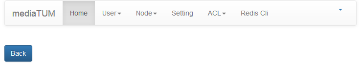

Nach dem Login erweitert sich die Menüleiste um:

-  User

 -  User
 -  User Group
 -  Authenticator Info

-  Node

 -  Node
 -  File

-  Setting
-  ACL

 -  Access Rule
 -  Access Ruleset
 -  Access Ruleset To Rule

-  Redis Cli

Ganz rechts ist ein kleines Dreieck in der Menüleist, über das man den
Logout erreicht.

Benutzer anlegen/verwalten
--------------------------

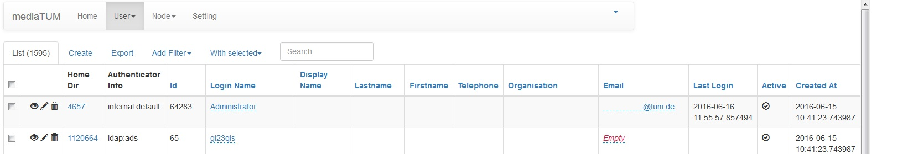

Zunächst werden die Nutzer aufgelistet und man kann grobe Informationen
in tabellarischer Sicht einsehen. Es ist ein Suchschlitz vorhanden und
es kann nach Spalten auf-/absteigend sortiert werden. Mit Add Filter
kann man die Suche eingrenzen und mit "With Selected" ausgewählte Nutzer
z.B. löschen. Das Löschen funktioniert ebenfalls über die Liste mit dem
Mülleimersymbol.

.. warning::

    **Achtung:** Hat ein Nutzer sich jemals eingeloggt, ist
    das Löschen nicht mehr möglich! In diesem Fall müssen sämtliche
    Gruppen des Nutzers entfernt werden. So wird der Account deaktiviert!

Blau unterlegte Felder lassen sich in der Liste direkt anklicken und
bearbeiten.

In der Übersicht:

-  Das Augensymbol oder Create zeigt einen einzigen Benutzer an:
   |BenutzerAuge|
-  Der Stift oder Edit führt zur Ansicht für die Bearbeitung eines
   Benutzers: |BenutzerStift|
-  In dem Feld "Groups" kann man die Benutzergruppe aus einem
   Dropdownmenü auswählen.
-  Export stellt eine CSV Datei zum Download der Benutzer zur Verfügung.

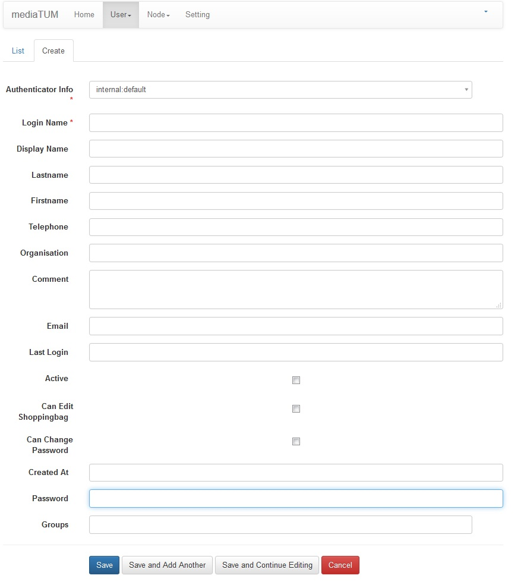

**Vor der Benutzererstellung soll immer geprüft werden, ob dieser Nutzer
bereits einen Account hat.**

-  **Kurzinfos zu Benutzertyp**
-  Interne Nutzer:
-  internal: default - mit dieser Auswahl wird ein interner Nutzer
   angelegt, das Passwort muss ebenso, wie sämtliche Felder händisch
   eingetragen werden. Es gilt: Informationen einzutragen, die vorhanden
   sind.

+--------------------+--------------------------+-----------------------------------------------------+
| Feldbezeichnung    | Beschreibung             | Interner Nutzer                                     |
+====================+==========================+=====================================================+
| **Home Dir:**      | Gibt ID des              | wird nach erstem Öffnen des Editbereichs angelegt   |
|                    | Homeverzeichnisses an    |                                                     |
+--------------------+--------------------------+-----------------------------------------------------+
| **Authenticator    |Legt die Art des          | internal: default                                   |
| Info:**            |Accounts fest             |                                                     |
+--------------------+--------------------------+-----------------------------------------------------+
| **ID:**            | Gibt ID des Benutzers an.| wird automatisch angelegt                           |
+--------------------+--------------------------+-----------------------------------------------------+
| **Login Name:**    | Kennung zum einloggen.   | händisch eintragen                                  | 
+--------------------+--------------------------+-----------------------------------------------------+
| **Distplay Name:** | Name der nach dem Login  | kann optional ausgefüllt werden.                    |
|                    | angezeigt wird, z.B.     |                                                     |
|                    | Rechercheansichten neben |                                                     |
|                    | "Logut".                 |                                                     |
+--------------------+--------------------------+-----------------------------------------------------+
| **Lastname:**      | Nachname                 | Nach vorhandenen Informationen ausfüllen            |
+--------------------+--------------------------+-----------------------------------------------------+
| **Firstname:**     | Vorname                  | Nach vorhandenen Informationen ausfüllen            |
+--------------------+--------------------------+-----------------------------------------------------+
| **Telephone:**     | Telefonnr.               | Nach vorhandenen Informationen ausfüllen            |
+--------------------+--------------------------+-----------------------------------------------------+
| **Organisation:**  | Organisation / Lehrstuhl | Nach vorhandenen Informationen ausfüllen            |
+--------------------+--------------------------+-----------------------------------------------------+
| **Comment:**       | Zusätzliche Informationen| Kann optional ausgefüllt werden                     |
|                    | zum Nutzer               |                                                     |
+--------------------+--------------------------+-----------------------------------------------------+
| **Email:**         | Email-Adresse            | Nach vorhanden Informationen ausfüllen              |
+--------------------+--------------------------+-----------------------------------------------------+
| **Passwort Hash:** | Passwort wird zum        | Wird automatisch ausgefüllt,  nach dem Anlegen des  |
|                    | abspeichern in Hash      | Nutzers                                             |
|                    | umgewandelt              |                                                     |
+--------------------+--------------------------+-----------------------------------------------------+
| **Salt:**          | Gehört als Ergänzung zum | Wird automatisch ausgefüllt,  nach dem ersten Login |
|                    | Feld "Passwort-Hash"     |                                                     |
+--------------------+--------------------------+-----------------------------------------------------+
| **Last Login:**    | gibt den Zeitpunkt des   | wird automatisch angelegt,  frühestens nach dem     |
|                    | letzten Logins des       | ersten Login                                        |
|                    | Nutzers an               |                                                     |
+--------------------+--------------------------+-----------------------------------------------------+
| **Active:**        | Noch nicht implementiert | siehe links                                         |
+--------------------+--------------------------+-----------------------------------------------------+
| **Cand Edit**      | Noch nicht implementiert | siehe Links                                         |
| **Shoppingbag:**   |                          |                                                     |
+--------------------+--------------------------+-----------------------------------------------------+
| **Can Change       | Nutzer kann selbst       | Aktiviert Zugriff auf die Funktion                  |
| Password:**        | Passwort verändern       |                                                     |
+--------------------+--------------------------+-----------------------------------------------------+
| **Password:**      | Passwort festlegen       | Bei Internen Benutzern muss ein Passwort händisch   |
|                    |                          | angegeben werden.                                   |
+--------------------+--------------------------+-----------------------------------------------------+
| **Created At:**    | Ersstellungsdatum des    | Wird automatisch ausgefüllt,                        |
|                    | Nutzeraccounts           |  nach dem Anlegen des Nutzers                       |
+--------------------+--------------------------+-----------------------------------------------------+
| **Groups:**        | Benutzergruppen, zu denen| Eintragen der ersten Buchstaben, dann erscheint eine| 
|                    | der Nutzer gehören soll  | Liste der verfügbaren Gruppen zur Eintragung        |
|                    |                          | (Mehrfachauswahl).                                  |
+--------------------+--------------------------+-----------------------------------------------------+

Überprüfung der Nutzerberechtigungen
^^^^^^^^^^^^^^^^^^^^^^^^^^^^^^^^^^^^

Sie können die Berechtigungen eines Nutzers prüfen, indem Sie sich mediaTUM aus der Sicht einer bestimmten Kennung anzeigen lassen können.
Ergänzen Sie hinter der URL zu mediaTUM ``/admin/_become/<Kennung>``, so wechseln Sie quasi in den Account des entsprechenden Nutzers.
Nach der Überprüfung müssen Sie sich ausloggen und mit Ihrer Adminkennung wieder einloggen, damit Sie diesen Befehl erneut ausführen können.

Beispiel: ``https://mediatum.ub.tum.de/admin/_become/User01``

Benutzergruppe anlegen/verwalten
--------------------------------

Die Benutzergruppe hat analoge Funktionen wie bei den Nutzern, hier nur
die Unterschiede:

-  Erstellen einer neuen Benutzergruppe |GruppeCreate|

-  **Name:** Dieser Name muss immer vergeben werden und muss eindeutig
   sein.
-  **Description:** Die Beschreibung sollte ein paar Informationen über
   die Gruppe bereitstellen, wie zum Beispiel, der Lehrstuhl, für den
   diese Gruppe erstellt wurde.
-  **Hidden Edit Functions:** Der bisherige "eidentifier" wurde nun
   umbenannt zu "identifier" - Standardmäßig sollen nun folgende
   Funktionen ausgeblendet werden: identifier - bis weiteres in Ticket
   #950 geklärt ist
-  **Is Editor / Workflow Editor / Admin Group:** hier werden jeweils
   die Rechte bei vorhandenem Haken hinzugefügt.
-  **Created At:** Wird automatisch nach erstellen der Gruppe
   ausgefüllt.
-  **Versions:** Ein Dropdown Menü ist verfügbar.
-  **Users:** Benutzer können mit dem Dropown Menü gefunden werden. Das
   eingeben von Zeichen führt zu einer Eingrenzung der Liste.

Menüpunkt Authenticatior Info
-----------------------------

Hier werden die verschiedene Benutzertypen von der Datenbank
aufgelistet.

-  Internal = Interne Benutzer
-  Weitere, falls mediaTUM entsprechend ergänzt wurde

Node, File, Setting
-------------------

Die Menüpunkte Node, File und Setting beinhalten Anzeigen, die die
tieferen Ebenen der Datenbank darstellen. Diese sollen von den Admins
zunächst nicht weiter berücksichtigt werden. Diese Punkte sollen
demnächst ausgeblendet werden.

System-Einstellungen
==============================

Menü Konfiguration
------------------

In der Menü Konfiguration können Sie definieren, welche Optionen im
Edit- und Administrationsbereich verfügbar sind. Die jeweilige
Reihenfolge der Buttons ist ebenfalls individuell veränderbar.

Im ersten Reiter sehen Sie die Konfiguration des Adminbereichs:

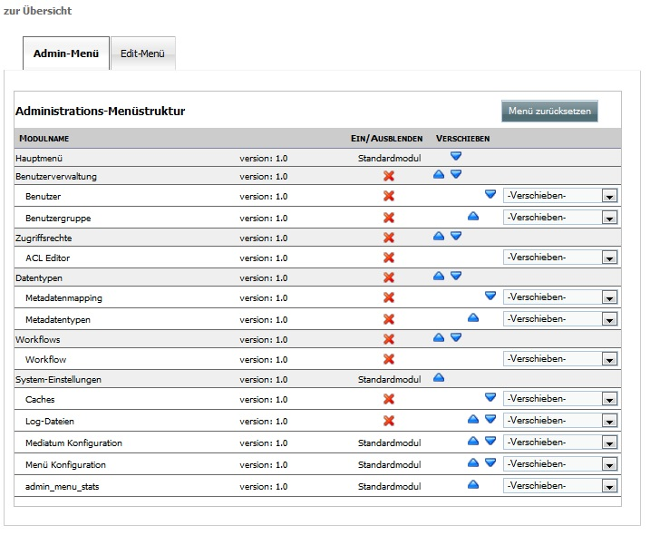

   

Wählen Sie den 2. Reiter aus, damit der Editbereich angezeigt wird.
Zuerst müssen Sie einen Datentyp aus dem Dropdownmenü auswählen, da die
Ansicht für jeden Datentyp unterschiedlich eingerichtet werden kann.

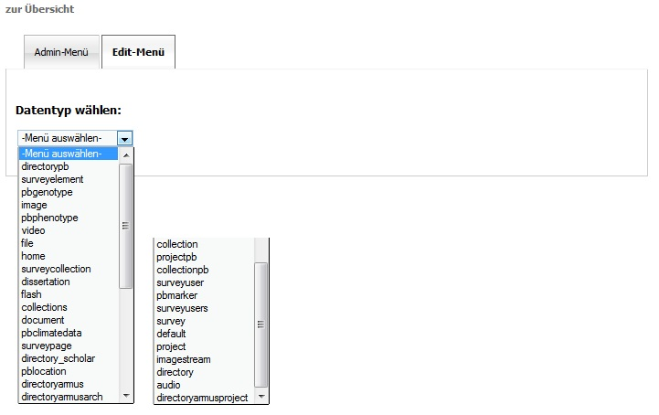

Im nächsten Bild dient der Datentyp Dokument als Beispiel, die Ansicht
ähnelt der Konfiguration des Adminbereichs. 

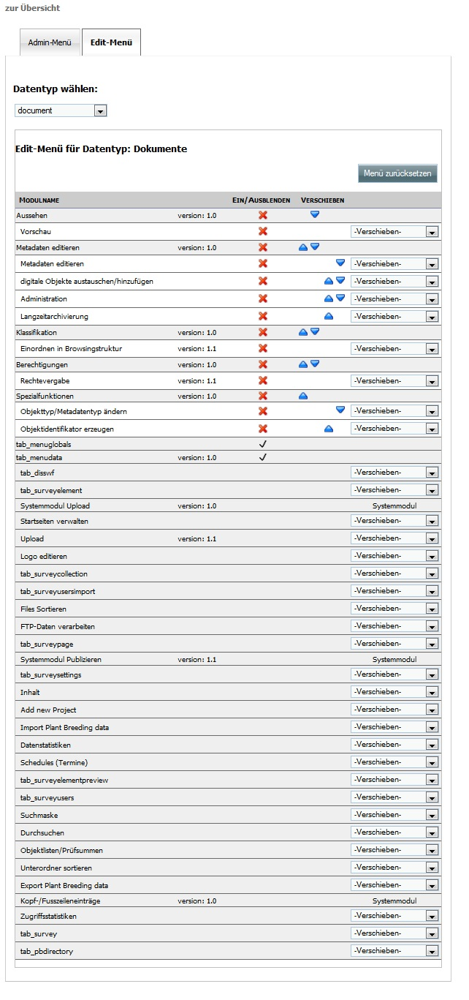
   
   
-  Blenden Sie die Option wieder ein, indem Sie im rechten Dropdownmenü
   auf -Verschieben- klicken und eine Oberkategorie auswählen, zu der
   die Option hinzugefügt werden soll.

Hier das Dropdownmenü:

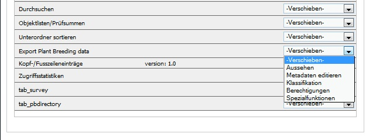

Editor für Admins
==============================

Symbole
-------

+--------------------+------------------------------------+
| **Symbol**         | **Bedeutung**                      |
+====================+====================================+
| |Pfeil|            | Einzelheiten anzeigen              |
+--------------------+------------------------------------+
| |Neu|              | Neues Element erstellen            |
+--------------------+------------------------------------+
| |Maske|            | Anzeigen und Bearbeiten            |
+--------------------+------------------------------------+
| |Lupe|             | Gesamte Übersicht                  |
+--------------------+------------------------------------+
| |Bearbeiten|       | Datensatz bearbeiten               |
+--------------------+------------------------------------+
| |Pfeile|           | Nach oben bzw. unten verschieben   |
+--------------------+------------------------------------+
| |Export|           | Auswahl exportieren                |
+--------------------+------------------------------------+

.. _Sortieren:

Metadatentyp / Metadatenschema
------------------------------

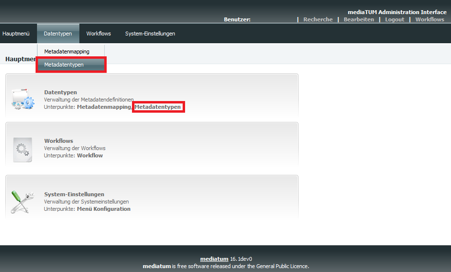

Metadatentypen sind die verschiedenen Eingabemasken zum Anlegen Ihrer 
individuellen Objekttypen. Ein Metadatentyp kann zum Beispiel ein Buch, 
Zeitschriftenaufsatz etc. sein. Der Metadatentyp legt fest, welche 
Felder eingetragen werden können. Des Weiteren gehören diverse Masken 
zu diesem Bereich. So können Sie z.B. eine Vollansicht für die spätere 
Trefferanzeige einzelner Dokumente und eine Kurzansicht innerhalb der 
Trefferliste anzeigen lassen. Oder auch das Aussehen der Eingabemaske 
einrichten.

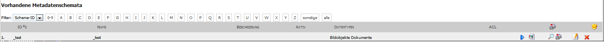

   

   
Ihre Metadatentypen werden in einer Liste aufgeführt, diese können Sie 
nach „Schema-ID“ oder „Name“ filtern lassen. Oder sich alle Schemata die 
mit einem bestimmten Buchstaben beginnen anzeigen lassen, indem Sie auf 
den entsprechenden Button klicken.

* **ID:** Der Inhalt dieses Feldes muss eindeutig sein, es darf kein anderes Metadatenschema mit der gleichen ID existieren.
* **Name:** Der Name des Metadatenschemas darf frei gewählt werden.
* **Beschreibung:** Die Beschreibung sollte deutlich machen, für welche Art Objekt das Metadatenschema gedacht ist.
* **Aktiv:** Zeigt an, ob das Metadatenschema für den Upload von Dokumenten freigeschaltet wurde.
* **Datentypen:** Beschreibt den Datentyp genauer, ist auswählbar aus einer Liste.
* **ACL:** Für diesen Metadatentyp wurde bereits eine ACL-Regel angelegt und somit für Benutzergruppen verfügbar ist.
* |Neu|: Erzeuge ein neues Metadatenschema. Als erstes sind die Metadaten zum Schema anzugeben.
* |Pfeil|: Hinzufügen neuer Felder, bearbeiten von vorhandenen Feldern und Anzeige aller Felder des Metadatenschemas.
* |Maske|: Hinzufügen neuer Masken, bearbeiten von vorhandenen Masken und Anzeige aller Masken des Metadatenschemas.
* |Lupe|: Erzeugt eine Tabelle aller Felder und Details zur Ansicht und bei Bedarf zum Ausdruck.
* |Export|: Exportiert das vollständige Metadatenschema im XML-Format. Kann anschließend in ein anderes mediaTUM importiert werden.
* |Bearbeiten|: Bearbeiten der Metadaten des Metadatenschemas.
* |Loeschen|: Löscht das gesamte Metadatenschema. 

.. figure:: images_metadata/ImportMetadatenschema.png
   :alt: ImportMetadatenschema.png
   
   
Diese Importfunktion finden Sie unter der Liste Ihrer Metadatentypen. Wenn 
Sie eine XML-Datei eines Metadatentyps aus einem anderen mediaTUM haben, 
können Sie dieses über diese Funktion importieren. Der Name des Originals 
erhält das Präfix „Import-“ und kann daraufhin weiterbearbeitet werden. Sie 
können so auch eine Kopie Ihres Metadatenschemas anlegen, wenn Sie ein weiteres 
ähnliches Metadatenschema erstellen möchten – Sie müssen also nur noch Änderungen
vornehmen und nicht das Vollständige Metadatenschema einrichten.

Neues Metadatenschema anlegen (oder bearbeiten)
^^^^^^^^^^^^^^^^^^^^^^^^^^^^^^^^^^^^^^^^^^^^^^^

Klicken Sie in der Liste der vorhandenen Metadatenschemata auf |Neu| oder |Bearbeiten|. Anschließend 
erscheint diese Ansicht zur Eingabe der Metadaten Ihres neuen Metadatentyps:

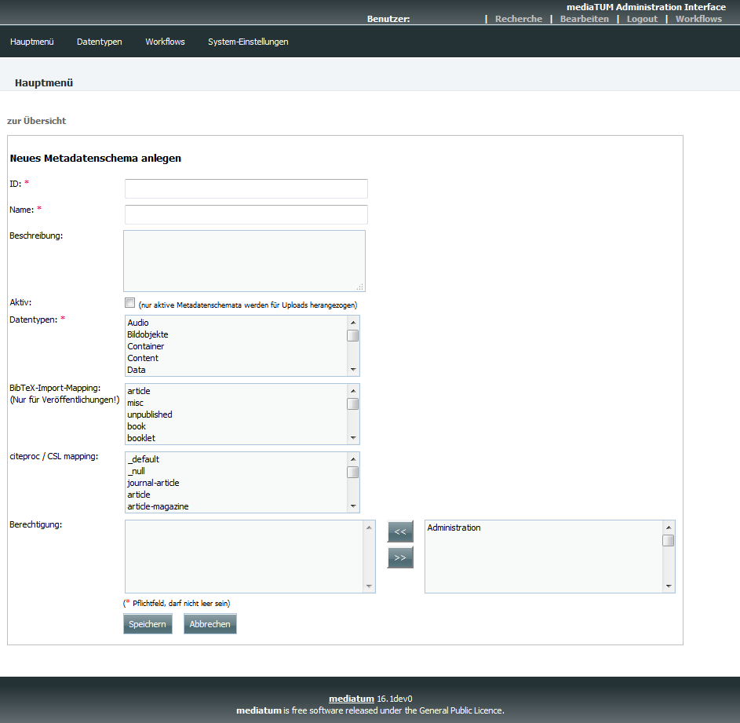
   
Diese Ansicht ist leer, bei neuen Metadatentypen und ausgefüllt, wenn Sie ein Metadatenschema bearbeiten.
   
* **ID:** Vergeben Sie eine eindeutige ID, nach dieser kann gefiltert werden. Diese ID darf noch nicht vorhanden sein.
* **Name:** Vergeben Sie einen Namen, nach diesem kann gefiltert werden.
* **Beschreibung:** Beschreiben Sie optional, für welche Objekte dieses Metadatenschema gedacht ist.
* **Aktiv:** 

 * |Checked| Upload von Inhalten zum Objekt ist möglich.
 * |Unchecked| Upload von Inhalten zum Objekt wird verhindert.

* **Datentypen:** Wählen Sie aus der Liste aus, welcher Datentyp Ihr Metadatenschema darstellen soll.

* **BibTeX-Import-Mapping:**

.. #####################################

* **citeproc / CSL mapping:** 

.. ####################################

* **Berechtigung:** Ordnen Sie dem Mapping Benutzergruppen zu, die dieses Metadatenschema verwenden dürfen. Es ist auch andersherum möglich: Jeder Benutzergruppe kann ein Metadatenschema zugeordnet werden. 

.. ############################ Link zu Flask Usergroups Metadatentyp zuordnen.############################

* **Speichern:** Nach dem Ausfüllen dieser Maske speichern Sie Ihre Eingaben ab. Sie gelangen in die Übersicht aller Metadatentypen.

Neue Felder anlegen (oder bearbeiten)
^^^^^^^^^^^^^^^^^^^^^^^^^^^^^^^^^^^^^

Navigieren Sie von der Übersicht der Metadatentypen mit |Pfeil| zur Liste aller Felder des Metadatenschemas.

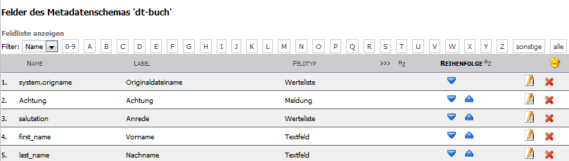
  
  
Sind bereits Felder vorhanden, werden alle aufgelistet und lassen sich wie 
Metadatentypen sortieren und filtern (Vgl. :ref:`Sortieren`).  

Legen Sie mit |Neu| ein neues Feld an oder bearbeiten Sie vorhandene Felder mit |Bearbeiten|.
Sie erhalten jeweils diese Ansicht:

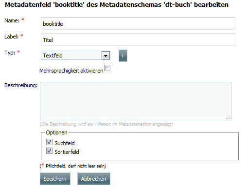

   
Wenn das Feld neu ist, sehen Sie hier zunächst eine leere Maske, oder wie im Beispiel 
die eingetragenen Werte des vorhandenen Feldes.

* **Name:** Der eindeutige Name dieses Feldes, wird hier eingetragen.
* **Label:** Das Label kann frei gewählt werden, es handelt sich hierbei um die Standardbeschreibung in der Maske vor dem Feld in dem Metadaten später eingetragen werden.
* **Typ:** Wählen Sie den Typ aus, in dem später die Metadaten eingetragen werden. Nähere Informationen zu den unterschiedlichen Typen finden Sie in dem Button "i" daneben.
* **Mehrsprachigkeit aktivieren:** So aktivieren Sie die möglichkeit der Darstellung auch auf Englisch.
* **Beschreibung:** Hier können Sie einen beliebigen Text eintragen. 
* **Optionen:**

 * **Suchfeld:** In der Recherche wird dieses Feld bei |Checked| in der einfachen Suche berücksichtigt, bzw. bei |Unchecked| ignoriert.
 * **Sortierfeld:** In der Trefferliste nach einer Suche kann bei |Checked| eine Sortierung dieses Feldes durchgeführt werden bzw. ist dies bei |Unchecked| nicht möglich.

* **Speichern:** Speichern Sie Ihre Änderungen ab und gelangen Sie dadurch wieder zur Übersicht aller Felder.
 

Neue Maske anlegen (oder bearbeiten) 
^^^^^^^^^^^^^^^^^^^^^^^^^^^^^^^^^^^^

Masken definieren sowohl die Darstellung von Eingabe-, Ausgabe-, Import- und Exportmasken. 

Navigieren Sie von der Übersicht der Metadatentypen mit |Maske| zur Liste aller Masken 
des Metadatenschemas.

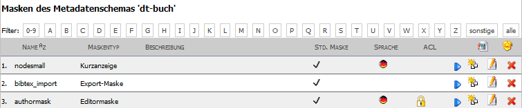
   
   
Existieren bereits Masken, werden alle hier aufgelistet, ansonsten ist diese Liste leer. 
Das Sortieren und Filtern dieser Masken ist analog zu :ref:`Sortieren`. Neu dagegen sind 
die Spalten STD. Maske und Sprache. Die Bedeutungen dieser Felder werden gleich genauer 
erklärt.

* |Pfeil|: Hier kann das Aussehen der Maske bestimmt werden.
* |Klonen|: Legen Sie eine Kopie dieser Maske an.
* |Bearbeiten|: Bearbeiten Sie die Metadaten der Maske.
* |Loeschen|: Löschen Sie die Maske vollständig.
 

 
Metadaten zur Maske
"""""""""""""""""""

Legen Sie mit |Neu| eine leere Maske an oder bearbeiten sie eine Maske mit |Bearbeiten|.
Sie erhalten diese Ansicht (leer oder ausgefüllt):

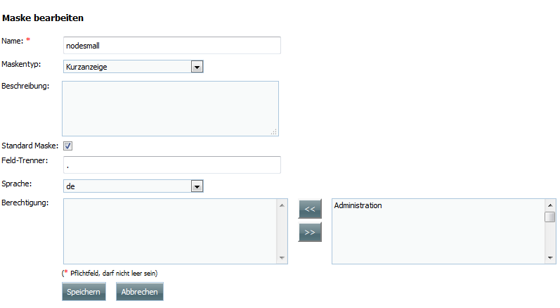
	

* **Name:** Geben Sie Ihrer Maske einen eindeutigen Namen.
* **Maskentyp:**

 * **Vollansicht:** Zur Darstellung sämtlicher Felder, z.B. in der Einzelansicht eines Objekts.
 * **Kurzanzeige:** Zur verkürzten Darstellung, z.B. in der Trefferliste einer Suche.
 * **Suchmaske:** 
 
.. ################################

 * **Editormaske:** Zur Darstellung der Eingabemaske. Diese Maske wird Ausgefüllt, wenn ein neues Objekt angelegt wird.
 * **Export:**
 
.. ########################################

* **Standard Maske:** Entspricht in der Liste "STD. Maske". Wird ausgewählt, wenn es sich um eine Standard Maske handelt.
* **Feld-Trenner:** Der Inhalt in diesem Feld wird in der Darstellung zwischen einzelnen Feldern eingefügt.
* **Sprache:** Erzeugen Sie für eine "Maske" eine Kopie und verändern Sie diese so, dass eine Kopie deutsch ist und die andere englisch. Ist jeweils als Sprache einmal "deutsch" und "englisch" ausgewählt, wird von mediaTUM automatisch die korrekte Maske angezeigt. Je nach der Spracheinstellung für mediaTUM durch den Nutzer.
* **Berechtigung:**	Ordnen Sie Benutzergruppen zu einer Maske zu, damit die Maske nur für gewählte Gruppen verfügbar ist.
* **Speichern:** Nach dem Speichern gelangen Sie in die Übersicht der vorhandenen Masken.

Maskenfelder
""""""""""""

In der Übersicht der vorhanden Masken klicken Sie auf |Pfeil| um die Felder für die Maske einzurichten.

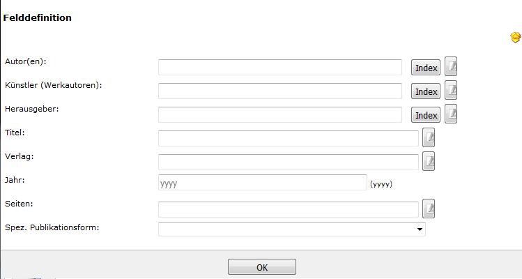

Fügen Sie alle Felder, die der Maske zugeordnet werden mit |Neu| hinzu. Anschließend können Sie auch
nachträglich neben den Feldern mit dem Button |Pfeile| die Reihenfolge verändern, Felder wieder löschen
mit |Loeschen| oder erneut mit |Bearbeiten| bearbeiten.

Felder müssen einzeln definiert werden. Erzeugen Sie zuerst ein neues Feld |Neu|:

Es gibt unterschiedliche Feldtypen:

* **Horizontale Feldgruppe:** Vereint mehrere normale Felder horizontal, indem diese in eine Zeile geschrieben werden. 
* **Vertikale Feldgruppe:** Vereint mehrere normale Felder die in einem Kasten dargestellt werden. 
* **Label:** Erzeugt lediglich Text, der in der Maske dargestellt wird. Ein Feld wird hier nicht verknüpft bzw. benötigt.
* **Normales Feld:** Das normale Feld ist die Standardauswahl:

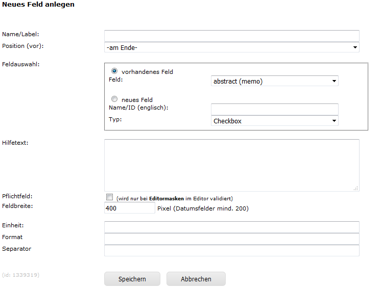
	
* **Name/Label:** Geben Sie den Inhalt an, der später vor dem Feld erscheinen soll. Doppelpunkte werden automatisch ergänzt. So wird z.B. aus Ihrer Eingabe "Titel" die Darstellung in der Maske zu "Titel:".
* **Position (vor):** Hier erscheint eine Liste, der bisher erzeugten Felder. Geben Sie an, an welcher Position das Feld eingegliedert werden soll.
* **Feldauswahl:** 

 * **vorhandenes Feld:** Wählen Sie ein Feld aus Ihrem Metadatenschema aus. 
 * **neues Feld:** 
 
 .. ###############################################
 
 * **Typ:** In beiden Fällen ist die Art des Inhalts anzugeben.

* **Pflichtfeld:** Markiert dieses Feld in Eingabe-/Editormasken als Pflichtfeld.
* **Feldbreite:** Geben Sie die Breite des Feldes in Pixel an.
* **Einheit:** Handelt es sich bei Ihrem Feld z.B. um einen Zahlenwert, der immer in einer bestimmten Einheit genannt wird, können Sie diese an das Feld in der Darstellung anhängen, ohne die Metadaten zu verändern.
* **Format:**

.. ###########################################################

* **Separator:** 

.. ##############################

* **Speichern:** Nach dem Speichern der Änderungen gelangen Sie in die Übersicht der Maske.

.. _Rechtevergabe Admin:

Rechteverwaltung
----------------

Grundinformationen sind zu finden unter :ref:`Grundlegende Rechtevergabe`. 

Besonderheiten auf Gruppenebene:
^^^^^^^^^^^^^^^^^^^^^^^^^^^^^^^^

Grundinformationen sind zu finden unter :ref:`Rechtevergabe Gruppenebene`.

Wurde eine Gruppenregel "Nicht Jeder" erzeugt, kann diese dazu benutzt werden, 
alle zugeordneten Berechtigungen für ein Verzeichnis oder Dokument auf einmal zu entziehen.
Ordnen Sie die Gruppe "Nicht jeder" zur linken Seite zu und speichern Sie diese ab, es werden alle 
Benutzergruppen entfernt. Nur noch Administratoren können nun wieder eine gewünschte Gruppe zuordnen.
Wenn dies durch Editoren durchgeführt wird, haben diese sich selbst z.B. die Rechte zur Bearbeitung
entzogen und können in Folge dessen keine Berechtigungen mehr verwalten.

Rechtevergaben auf Benutzerebene:
^^^^^^^^^^^^^^^^^^^^^^^^^^^^^^^^^

Wie auch bei der Vergabe von Rechten für bestimmte Gruppen, kann dies auch auf Ebene von einzelnen
Nutzern erfolgen. Dabei werden alle Nutzer die in mediaTUM registriert sind in der Liste aufgeführt. 
Suchen Sie die Nutzer heraus und ordnen Sie diese wie gewünscht den einzelnen Berechtigungen (sehen,
bearbeiten, herunterladen) zu und speichern Sie dies ab.
Diese Verteiltung von Rechten erfolgt unabhängig der Gruppenrechte. Auch Rechte der Benutzerebene 
können weitervererbt werden.

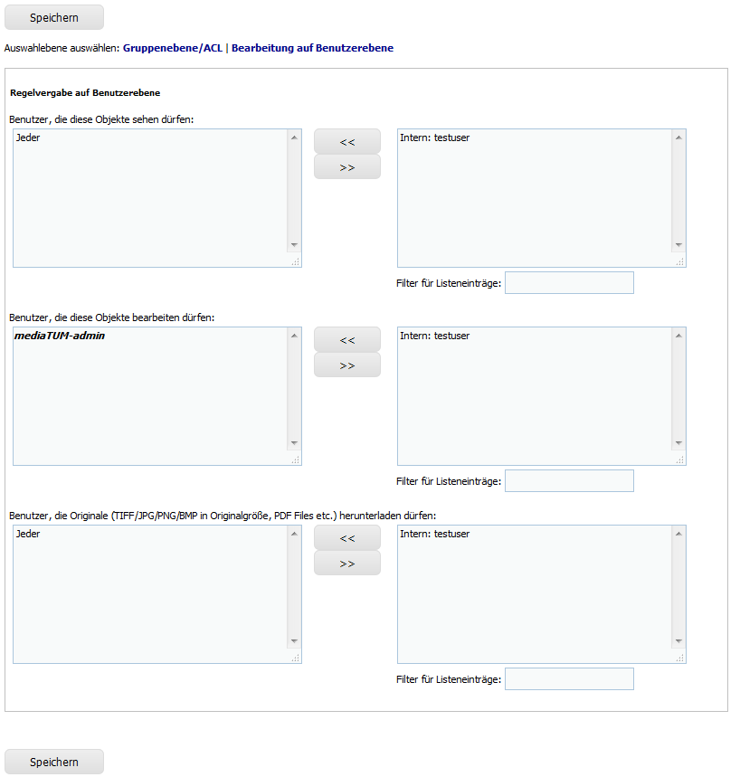

    
    

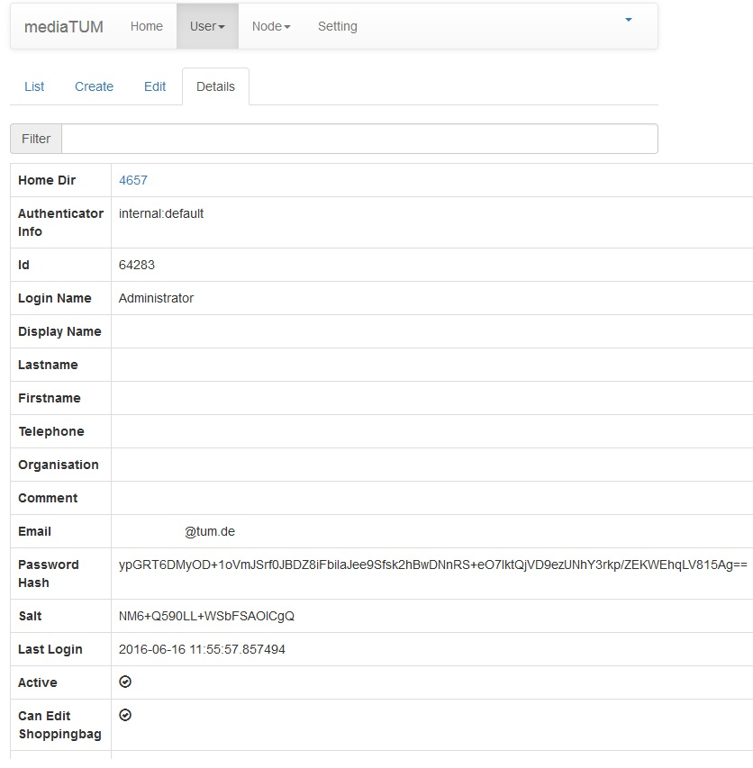
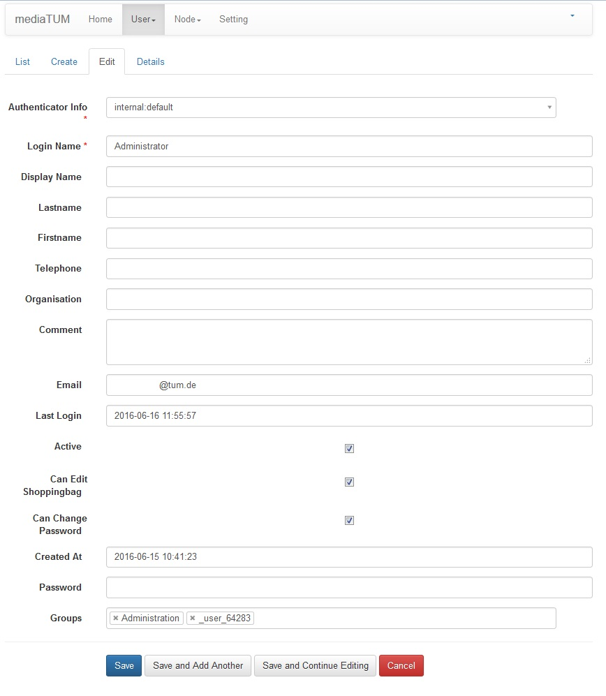
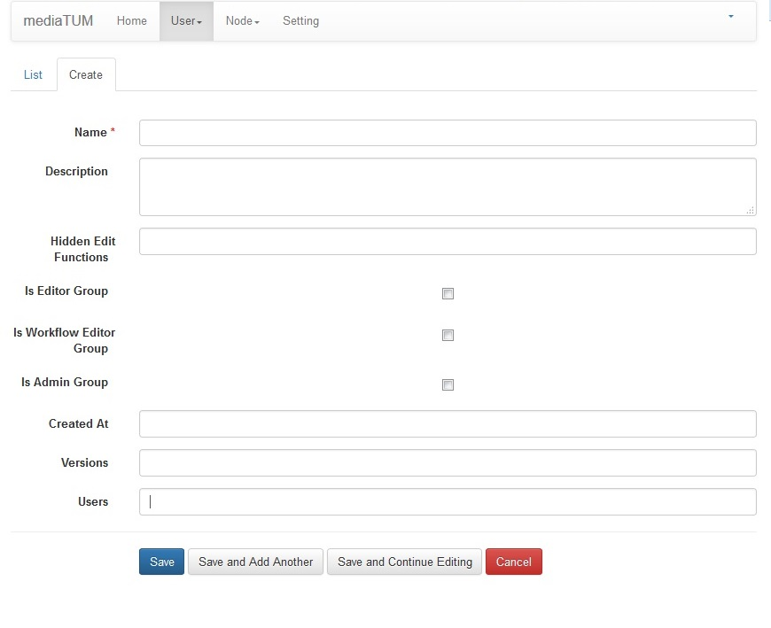

.. |Edit| image:: ../images/Edit.jpg

.. |Pfeil| image:: ../images/Pfeil.jpg

.. |Neu| image:: ../images/Neu.jpg

.. |Unchecked| image:: ../images/Unchecked.jpg
