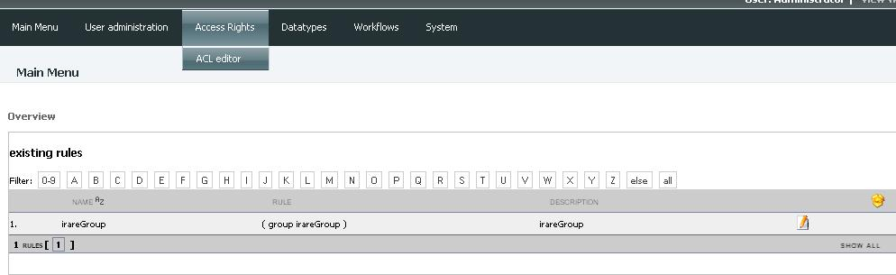
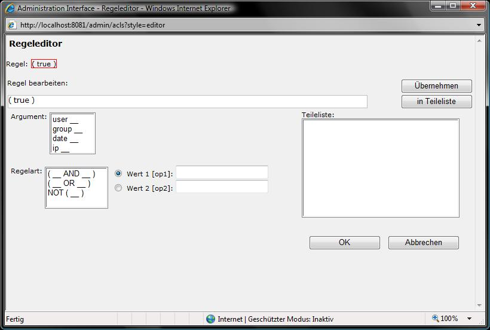
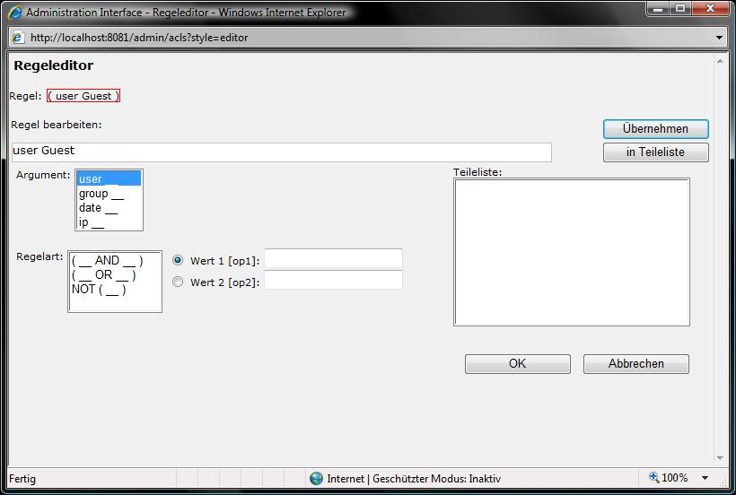
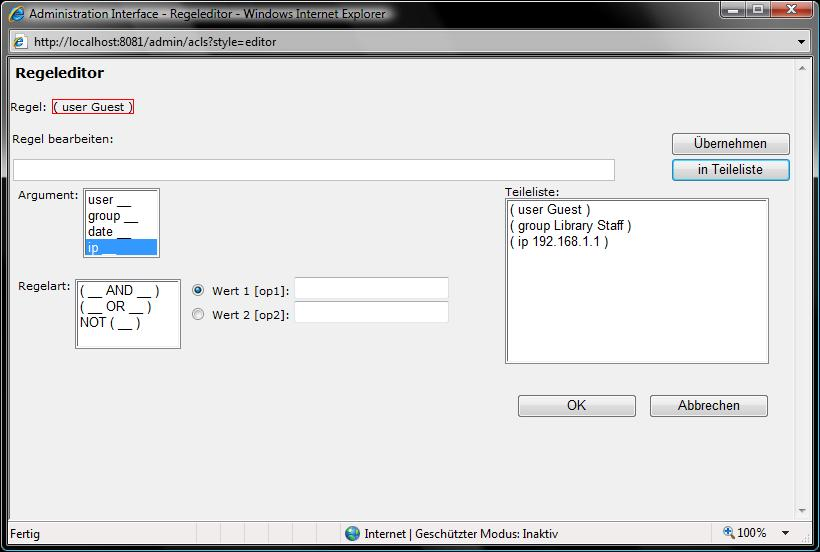
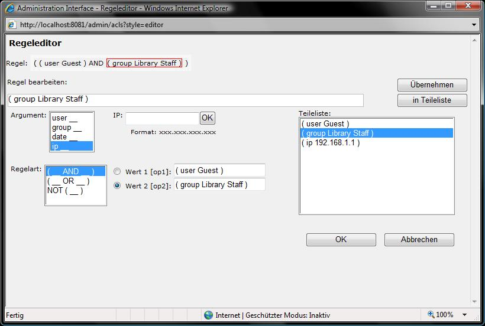

Access rights with ACL editor
-----------------------------

After selecting *Access rights* and then *ACL editor* the following view
will be displayed:

   Access rights

Here you can see a list of all existing access rules. There exists an access
rule for each usergroup you have created so far (if you checked the box
*create access rule for current user group* while creating the
usergroup). A new access rule can be created by clicking on the yellow
box in the right upper corner of the view. The following view will be
shown:

.. figure:: create-new-rule.jpg
   :width: 397 px

   Create new access rule

Here you have to enter the name of the new rule and a brief description.
Than click on the button *edit rule* under the description frame. A
popup window appears:

   Rule editor

The part of the rule, you want to edit, have to be selected first. After clicking
on the text in front of *rule:* (here *true*) a red frame will appear,
and the selected part will be shown in the field *edit rule*. Now the
rule can be created by selecting of the arguments, e.q.
``argument: user_``, ``user: Guest``. The condition will be shown in the
*edit rule* field.

.. figure:: select-arguments.jpg
   :width: 820 px

   Create an access rule

If no other conditions are needed, the creation of the
rule can be completed by clicking on *accept*.

   Accept the rule

The rule will then appear in the
red frame in front of *rule*-label. Select *OK* to finish the creation
of the rule. The popup window will be closed and the rule can be saved.
The rule is now available. You can change its arguments or edit it any
time by clicking on the edit icon |image5| in front of it. The rule
parts can be also buffered in the part list by clickint on the
*partlist*-button.

   Save the rule in the part list

In the screenshot above you can see three
rules saved in the part list. In the field *rule type* different boolean
operators can be selected.

.. figure:: rule-type.jpg
   :width: 820 px

   Select the rule type

With the radio buttons *value1* and *value2*
the operands for the boolean operator can be set. Click on the rule
parts from the part list to add an item to one of the value fields. Then
select the rule type and it will appear in the field *edit rule*. By
clicking on the accept button every rule part can be accepted as a rule.
It will appear in the red frame in front of *rule* label.

   Accept the rule part

The same procedure can
be used to create as complicated rules as you need.

.. |Create new access rule| image:: create-new-rule.jpg

.. |Create an access rule| image:: select-arguments.jpg

.. |image5| image:: Edit.gif

.. |Select the rule type| image:: rule-type.jpg

