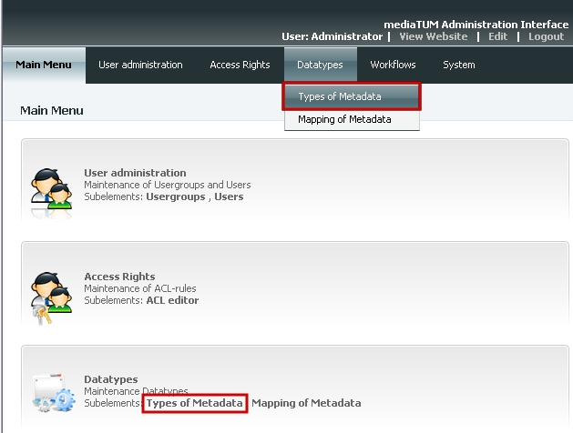
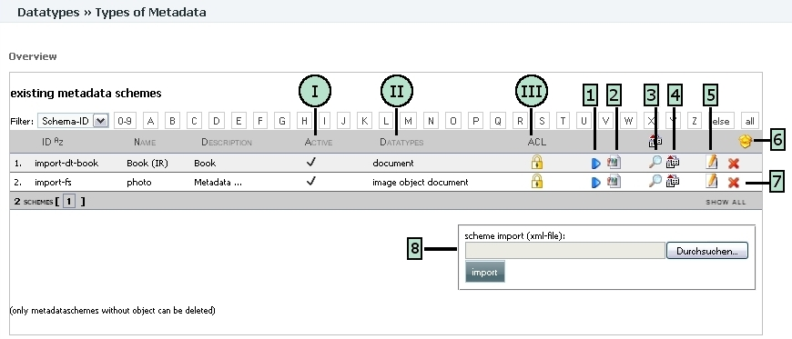
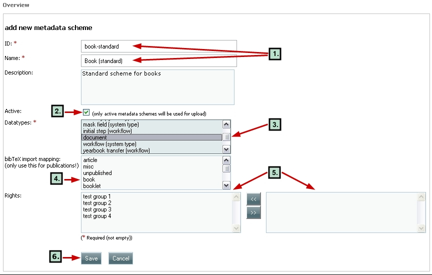
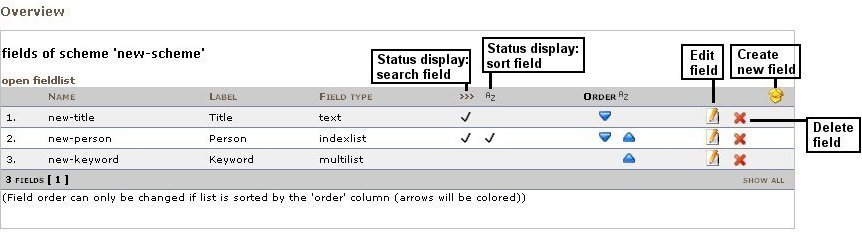
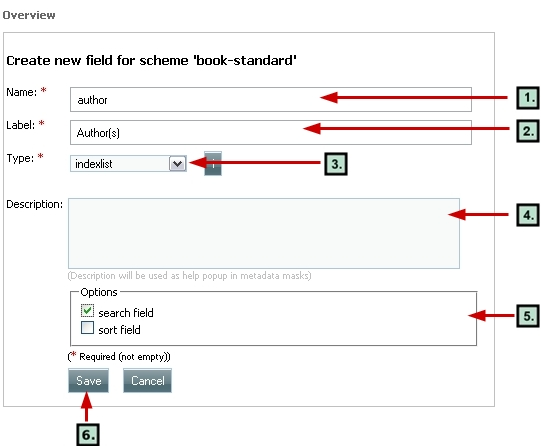
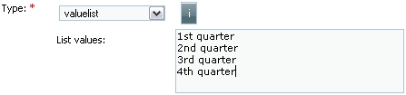
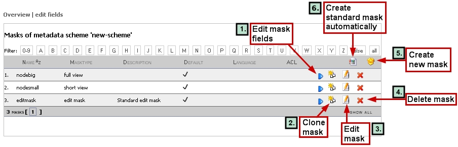

Types of metadata
-----------------

.. rubric:: 1.1 Introduction

To provide information like title or author/creator for data objects you
need a form to add specific information to the object. In mediatum,
these forms are highly flexible and can be individually customised. You
need different components to create these forms:

-  *Metadata scheme:* list of all needed/available fields
-  Different *masks* for different displays of the field, e.g small
   view, full display, different languge terms

*Metadata schemas* are lists holding the fields that want to be used to
describe an object, e.g. object type, title, author, date etc. You can
create different metadata schemes for different kinds of objects or
publication types. As mentioned above, they are very flexible and can be
individually customised. You can either build metadata schemes from
scratch or import metadata schemes via xml-files from other mediatum
systems. At http://mediatum.sourceforge.net/files a list of example
schemes for different data types (document, image) and publication types
are available. You can download the example schemes as xml files and
import them into your system. With *masks* you can create different sets
of fields that can be used for:

-  Different displays: e.g. short view with just 3 specific fields, or
   full view with all available fields.
-  Export/Import: to map different standards you need to create sets of
   fields that can be linked together with values from different/other
   standards.

**How to get started:** Choose *Data types* in main menu and click on
*Types of metadata*.

   Types of metadata

.. rubric:: 1.2 Overview

The overview gives you a status display, that shows all existing
metadata schemes. If you are using a freshly installed mediatum system,
there will be no schemas available. The example shows two schemas
imported via xml-files that were exported from another mediatum system.

   Types of metadata. Overview.

General description of metadata schema overview:

-  Ⅰ *Active*. Displays if data scheme is enabled for upload of digital
   objects.
-  Ⅱ *Datatypes*. Shows for which object types this metadata scheme can
   be used.
-  Ⅲ *ACL*. Displays if data scheme is available for user group.

**Editing functions:**

#. *Edit fields*. Display and edit fields of the metadata scheme.
#. *Edit masks*. Display and edit masks for a scheme (e.g. short
   display, full display, edit masks).
#. *Open field overview*. Displays fields and field types of the scheme
   in a table.
#. *Export metadata scheme*. Export of data schema as xml file.
#. *Edit metadata scheme*. Edit global properties of data scheme (Name,
   description, activation for upload, enabling user groups).
#. *Create new metadata scheme*. Create new schemes.
#. *Delete metadata scheme*. Delete schemes (**Remark:** only metadata
   schemes without objects can be deleted).
#. *Import metadata scheme from xml file*. Search for file (button
   *Durchsuchen*), then click on *import*.

.. rubric:: 1.3 Create new metadata scheme

Click on *Create new* symbol. Fill form with values. Fields with an
orange star \* are mandatory fields.

   New scheme

**Procedure:**

#. Enter scheme name and ID. *ID* is an internal name of scheme and has
   to be unique. *Name* of the scheme will be shown later in form for
   upload and does not have to be unique.
#. Enable for upload of digital objects by ticking checkbox *Active*.
   (**Important!**)
#. Define which object or data types are allowed within the scheme. In
   general the following settings are recommended:

   -  Documents
   -  Image objects
   -  Video objects
   -  Audio objects

   You can either create one scheme per data type, which is probably the
   standard case as different data types require different description
   fields. But of course it is also possible to create schemes for
   combined data types, e.g. one scheme that fits all. Multiple
   selection is possible by holding down CTRL while selecting.
#. Define mapping for bibTeX import.
#. Define which user groups should be able to use the specific scheme.
   Select from the list shown in the right hand frame. Multiple
   selection is possible by holding down CTRL while selecting. Assign
   rights to the user groups by clicking on double arrow button between
   the two frames. The user group will move to the left-hand frame.
#. Save the scheme and its settings.

.. rubric:: 1.4 Edit fields of metadata scheme

Use editing function 1 from the figure "Types of metadata. Overview"
(Section 1.2).

   Edit fields of metadata scheme

**Remark:** It is recommended to change the order of the fields. In the
way they are already in the required order for the edit mask. Use the
blue triangles to move a field up or down.

.. rubric:: Create new field for scheme

Click on symbol |image4|. Fill the form with values. Fields with an
orange star \* are mandatory fields.

   Create new field

**Procedure:**

#. *Name*. Enter a name (this will be used as an internal system
   identifier).
#. *Label*. Enter a label which will be displayed in the administration
   interface.
#. *Type*. Select the type of metadata field.
#. *Description*. Enter here notes on content and comment metadata
   field; this text will be shown as information in the edit masks.
#. *Options*.

   -  Declare the field as search field (relevant for advanced search).
   -  Declare the field as sort field (relevant for advanced search).

   **Remark:** The features *Sort Files* and search masks for the
   feature *Advanced Search* can be created in the edit area (see
   chapter 5.4 and 5.5 in mediatum – Instructions for editors:
   `manual <http://mediatum2.ub.tum.de/node?id=676570>`__).
#. *Save*. Save field settings.

**List of available field types:**

-  *Combination field*. Can be put together from content of any metadata
   fields. Possible application as search field. Desired fields can be
   chosen from a specific list.
-  *Text*. Normal field to enter text without length restriction.
-  *Memo*. Text field with variable length. Optionally a maximum length
   can be specified (e.g. 5000 => maximum length is 5000 characters).
-  *Value list*. Drop-down list with values to choose from. Enter list
   values or upload a text file with one value per line. The text file
   can also contain value-lists for different languages separated with
   "\|". The list of the evaluable languages has to be placed in the
   first line, also separated with "\|". E.q.: en \| de \| it value \|
   Wert \| valore key \| Schlüssel \| chiave
-  *Number*. Field for entering a numeric value.
-  *Multilist*. Multiselect list with values to choose from. Enter list
   values or upload a text file with one value per line. See the
   description of the "Value list"-type.
-  *URL*. External link (new window).
-  *Technical metadata*. Technical metadata, automatically created by
   the system.
-  *Index list*. Input field with index as popup; suitable to control
   data entry and for data entry support (e.g. for names).
-  *Message*. Field to attach specific messages/warnings to all data
   sets that use the scheme. e.g. *For internal use only*
-  *Date*. Date entry. Choose format from the following formats:
   day/month/year, only year, only time.
-  *Checkbox*. Checkbox selection (for yes/no values).
-  *Watermark*. Adds text watermark to images. You can define a text
   that is shown as watermark in the image when displaying and
   downloading.

**Additional information for fields with type *value list***

There are two field types where individual value lists can be used:

-  *Value list*. Only one value from the list can be chosen
-  *Multilist*. Multiple values can be chosen by holding down the CTRL
   key while chosing the values.

You can create simple lists or hierarchical lists. Just create a simple
text file with every value in a new line and copy that in the field
*List values* in the definition of *Type*.

   Value list

**Examples:**

-  Input of list values for non hierarchical lists
-  Input of list values for hierarchic lists are defined by using
   asterisks. For hierarchical lists you can define if certain terms
   (e.g. generic terms) are displayed and possible to choose or just
   displayed.

**Important:** In the above example the values are listed but cannot be
chosen. To make them available you must put an empty space between the
last asterisk and the word. In some cases it might be required to list
the higher term but force the user to choose a term from a lower
hierarchical level.

.. rubric:: 1.5 Display and edit masks

   Edit mask

#. *Edit mask fields*. Edit, create or delete single fields of a mask
   and change the order of the of the fields.
#. *Clone mask*. Create a copy of an already existing mask.
#. *Edit mask*. Edit global properties of a mask (e.g. name, type).
#. *Delete mask*.
#. *Create new mask*. New mask will be created; this new mask is empty
   and does not contain any field.
#. *Automatic creation of standard mask*. New mask will be created; the
   new mask contains all fields of the original metadata scheme.

**Remark:** After a new metadata scheme has been created, masks do not
yet exist. Three masks are required by default and must have the
following standard names and mask types:

+-------------+-----------------+-------------------------------------+
| Nodebig     | Full display    | Full display in search interface    |
+-------------+-----------------+-------------------------------------+
| Nodesmall   | Short display   | Short display in search interface   |
+-------------+-----------------+-------------------------------------+
| Editmask    | Edit mask       | Edit mask for metadata entry        |
+-------------+-----------------+-------------------------------------+

.. rubric:: 2. Mapping of metadata

Will be added soon.

.. |image4| image:: images/Archive2.gif