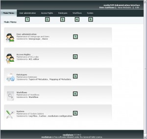

Administration: functional overview
-----------------------------------

The Administration area is divided into 5 sections. You can access these
subsections via the links at the administration start page or the
permanent menu on top of the administration area.

   Main menu

**1. User administration**

-  Usergroups

   -  Listing of usergroups properties
   -  Create new usergroups

-  Users

   -  Listing of user properties
   -  Create new user

**2. Access rights** Definition of access rights (ACL - Access Control
Lists) **3. Datatypes** *Types of metadata*

-  Creation of metadata schemes
-  Creation of editing masks
-  Definition of search fields and sort fields
-  Configuration of display formats: short display and full display

*Mapping of metadata*

-  Mapping your metadata fields with other format styles for import and
   export (e.g. BibTeX)

**4. Workflows** Create and edit workflows. **5. System**

-  Access to log files and caches
-  Overview over the mediaTUM configuration
-  Menu configuration
