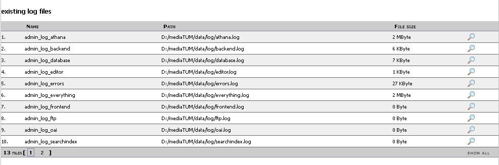
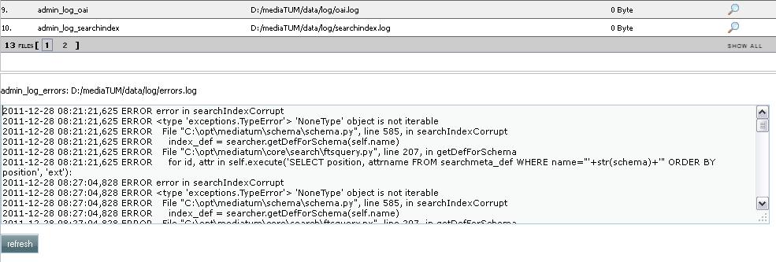
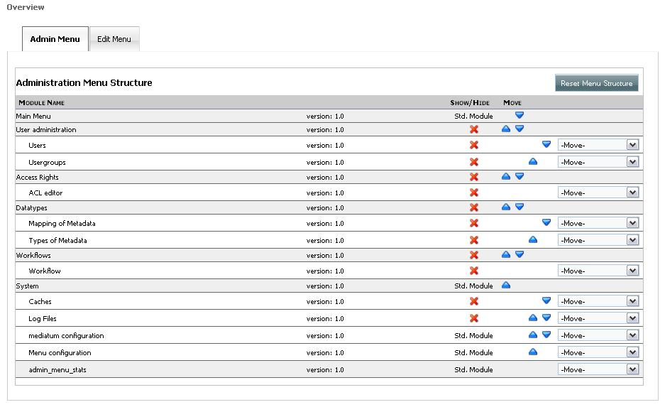
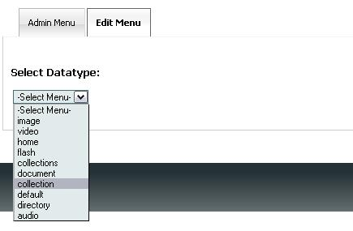
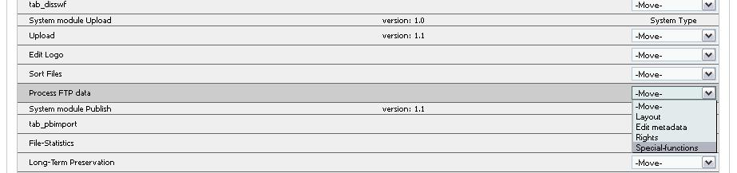
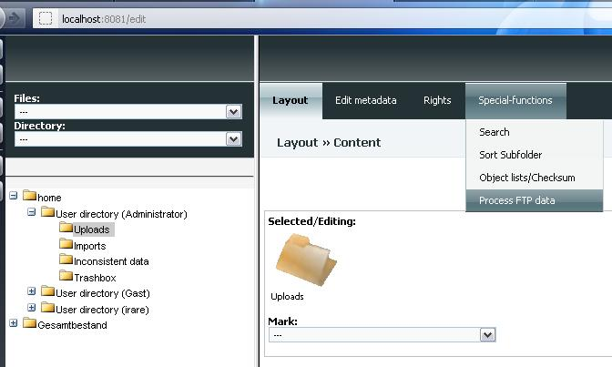
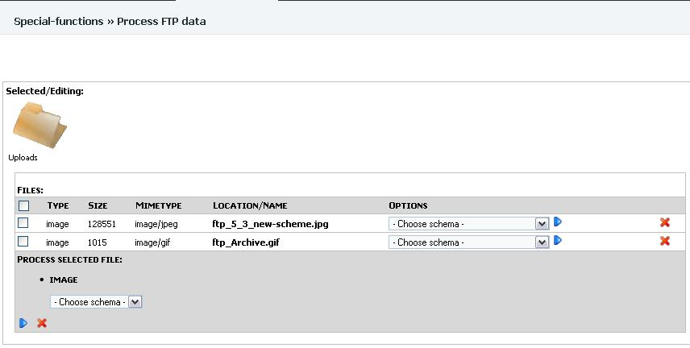
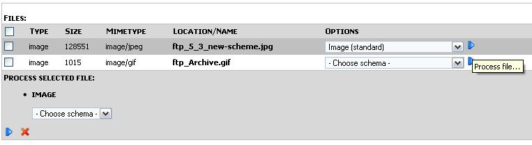
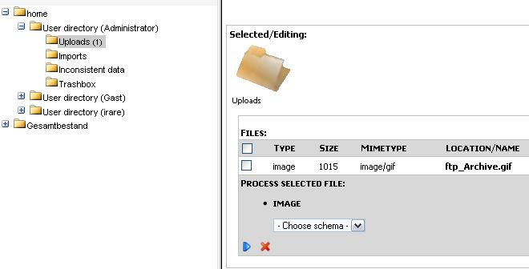

System
------

1. Log files

Here you can see the list of the log files created by **mediaTUM**.
Their access paths and file size are also displayed.

   Log files

By clicking on the reading-glass in
front of the relative log file, it's content will be listed under the
list of the log files.

   Log file

2. Caches

Description of functionalities will be added soon.

3. mediatum configuration

In this view the administrator can check how **mediaTUM** and related
programs are configured. Following configurations are visible:

-  *Python:* version, operating system, python copyright.
-  *MediaTUM:* the configuration file created during the installation.
   This view of the configuration file is not editable. To edit this
   file please use other editor.
-  *Database:* database type, database driver, list of tables in the
   database including the table definitions.
-  *Searchengine:* search engine, search engine status and size.
-  *Search configuration:* hier you can define some special characters
   to be replaced by the charecters which can be typed on your keyboard,
   e.q. by typing oe in the left column to be replaced by ``&#246;`` you
   will be able to type for example Bjoerk in order to search for Björk.
   The same replacement rules can be difined for whole words.
-  *Archiving settings:* indicates if archiving was activated

3.1. Configuration of mediaTUM for use of ftp upload

If you want to be able to upload ftp-files to mediaTUM you have to edit
the following part of your config-file:

``mediatum.cfg``

... [ftp] activate=true port=8021 # or some other port of your choice
...

The usage of this functionality is described below.

4. Menu configuration

Here you can difine wich options should be available in the
administration and edit view. The order of option icons can be also set
individually. The configuration of the admin menu looks like this:

   Admin menu

In the *Edit view* every
datatype has its own individual menu. So you have to select the
datatype, which menu you want to customize, first. Use the following
dropdown list for this purpose:

   Select datatype

After selecting of the datatype a view similair to
that of the *Admit Menu* will be displayed. The following options are
offered:

-  *Hide* the menu item by clicking on |image4| sign in front of it.
-  *Change the order* of the items shown in menu by clicking on the
   arrows |image5| and |image6|
-  *Show* a hidden menu item by selecting *Move*, and than the name of
   the menu container where you want to place the item.

   .. figure:: images/show-menu-item.jpg
      :width: 876 px

      Show the menu item

-  *Move* a menu item to another menu container by selecting the name of
   the target container from the dropdown list *Move* (see the
   screenshot above).

5. FTP upload

If you have configured your ``mediatum.cfg`` as shown in the section
3.1, the following output will appear at the prompt after the start of
mediatum:

Output:

``FTP server started at DATE, Port: YOUR PORT Authorizer: ftp_authorizer, Hostname: YOUR HOSTNAME``

Now you can use the ftp command in cmd.

ftp

``prompt>`` ftp ``ftp>`` open localhost 8021
``The connection with YOUR HOST was established. 220 YOUR HOST FTP server (...) ready. User (YOUR HOST):``
Administrator ``331 Password required. Password:`` *YOUR PASSWORD*
``230 Ok.`` ``ftp>`` send "YOUR FILE PATH"
``200 PORT command successful. 150 Opening ASCII connection for YOUR FILE 226 Transfer complete. FTP: xx d Bytes sent in yy seconds zz KB/s ftp>``

In order to process the uploaded object the function *Process FTP data*
ist needed. For this purpose please switch to *Administration area*.
Then to *System -> Menu configuration*. Select the tab *Edit Menu* and
then datatype *Directory*. Select the function *Process FTP data* and
move it e.q. to *Special functions*.

   Process FTP data

Now you can go to the *Edit area*, select the
upload directory of the user which performed the upload (Administrator
in our case), and then select the *Process FTP data* function.

   Process FTP data

The overview over all uploaded files will appear

   Uploaded ftp files

After selecting the schema and clicking on the
*Process file...* button

   Process file...

the file you have uploaded, will be now available
in the Upload directory

   After the processing

Instead of ftp command in cmd, you can use
every other graphical ftp-upload program, like FileZilla for example.

.. |image4| image:: images/delete.png
.. |image5| image:: images/downarrow.png
.. |image6| image:: images/uparrow.png
