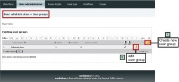
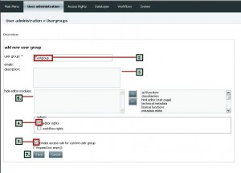
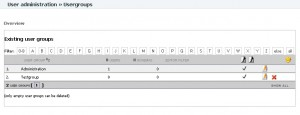
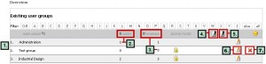
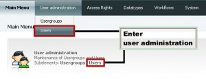
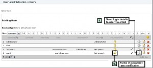

User administration
-------------------

1. Usergroups

The system’s rights management is based on user groups. Therefore, first
step is creating a user group that can hold one or more single user.
After installing the system there is just one user group, the
Administration group.

   Usergroups

The following user group operations are available:

-  Create new user groups
-  Edit user groups
-  Delete user groups

1.1 Create new usergroup

   Create usergroup

#. Click on the yellow box symbol in the right upper corner of the user
   group overview.
#. Enter name of user group.
#. You can add descriptive text for the group (optional).
#. Grant permissions for editor and workflow rights (if required)
#. Leave checkbox *create access rule for current user group* checked.
#. MediaTUM is based on different editing modules. That means for a
   usergroup you can exclude certain editing functions. This can be done
   by hiding them. By default all modules are available; you have to
   move one or more modules from the right to the left box to deny
   access in the edit mode for this group. Just double click the name of
   the module or mark it and click on the arrow button between the
   fields.
#. Click on *Save*.

**Result:** New usergroup is listed in overview:

   New usergroup

1.2 Edit / delete usergroups

The overview **(1)** shows you all existing user groups, the number of
users in the user group **(2)**, the assigned metadata schemes **(3)**,
if editing rights **(4)** and workflow rights **(5)** are given.

   Usergroups overview

You can edit usergroups by clicking on the yellow pen symbol **(6)**;
delete user groups by clicking on the red symbol **(7)**. **Remark:** A
usergroup can only be deleted when no users are assigned to this group.

2. Users

   Users

To get an overview of all existing users, click on *Users* in submenu
*User administration*. All users are listed with their username and
email address and optional first and/or last name and organsation. You
can also see the usergroups that are assigned to the user.

.. figure:: images/users_overview1-300x81.jpg
   :width: 300 px

   Users overview

The following user operations are available:

#. Create new user: yellow box icon
#. Edit user: document with pen icon
#. Send email to user: envelope icon
#. Delete user: red x icon

2.1 Create new user

Click on yellow box in user overview. The single user edit interface
will come up.

.. figure:: images/3_2_1_adduser-270x300.jpg
   :width: 270 px

   Add user

**Procedure:**

#. Enter name of new user and email address. This email-address will be
   used for sending the user account details later. Optional you can add
   first and last name of the user.
#. Allocate user to one or more user groups (Multiple selection: press
   CTRL-button while selecting with mouse)
#. If necessary activate checkbox *Password changeable*
#. Save new user

**Result:** User is listed in overview with all assigned usergroups.

   Users overview

To send the login details to the user via email, click the envelope
symbol **(5)**. Preformatted text will be displayed. This text can be
manually edited before sending. **Remark:** By sending the password you
also reset the password. The lock symbol **(6)** shows the status of the
password. Unlocked means the password has not been sent to the user via
email or has been changed.

2.2 Edit / delete users

To delete a user - click on red x icon in the list beside the user. To
edit the user - click on the edit symbol in the user list.

2.3 Password allocation

**Reset password** To change a user password just send login details via
email (envelope symbol). A new password for this user name will be
generated and sent. The old password is no longer valid. **Special
password configuration** If user wants a particular password (e.g.
"testpassword") where the password is not changeable (checkbox "Password
changeable" not checked), edit already created user by clicking the edit
button in the user overview. Enter the desired password in *new
password* field. Click on the lock symbol |image8| **Remark:** This
function cannot be used when first creating a user account, you first
have to create the account in the common way. Do not send the login
information (user name & password) via the envelope symbol. Instead send
the new login information to the user in a separate email.

