Workflow
========

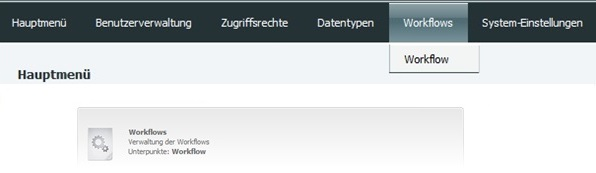

Allgemeine Informationen
------------------------

Ein Workflow besteht aus mehreren Schritten, die zusammen einen
Arbeitsablauf ergeben. Einzelne Schritte bestehen aus Daten hochladen,
E-Mails versenden, Metadaten eingeben etc. und können weiterführen zu
einer bestimmten Seite oder zwei verschiedene Buttons führen zu zwei
unterschiedlichen Seiten. (Ausnahme Endknoten: Hier endet der Workflow
und geht nicht weiter). Ein Workflow kann z.B. wie folgt aussehen:
Autorendaten eingeben ("Weiter") > Titeldaten eingeben > ("Zurück zu
Autorendaten" oder "Weiter") > …

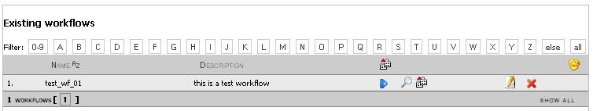

Die Übersicht aller vorhandener Workflows in einer Liste bietet folgende
Funktionen:

+--------------------+--------------------------------------------+
| **Symbol**         | **Bedeutung**                              |
+====================+============================================+
| |Loeschen|         | Gesamten Workflow löschen                  |
+--------------------+--------------------------------------------+
| |Bearbeiten|       | Bearbeiten der Metadaten des Workflows     |
+--------------------+--------------------------------------------+
| |Export|           | Exportieren des Workflows als XML-Datei    |
+--------------------+--------------------------------------------+
| |Lupe|             | Anzeige des Flussdiagramms des Workflows   |
+--------------------+--------------------------------------------+
| |Pfeil|            | Einzelne Schritte des Workflows anzeigen   |
+--------------------+--------------------------------------------+

Anzeige im Recherchebereich
---------------------------

Im Recherchebereich finden Sie im Menüband neben der Administration
einen weiteren Weg die Übersicht der Workflows zu öffnen. Nachdem Sie
Workflows angeklickt haben, öffnet sich die Übersicht aller vorhandenen
Workflows. Klicken Sie wiederum hier einen Workflow an, gelangen Sie
weiter zur Übersicht der Knoten des Workflows.

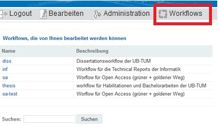

Der entscheidende Vorteil in dieser Ansicht ist die Anzeige, wieviele
Objekte aktuell entstehen und welchem Teilschritt ein Objekt zugeordnet
ist.

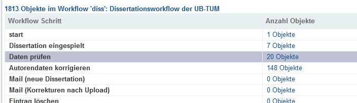

Nähere Informationen zu den einzelnen Dokumenten innerhalb eines
Workflow Schrittes erhalten Sie mit einem Klick auf den entsprechenden
Workflowschritt. Es erscheint eine solche Liste:

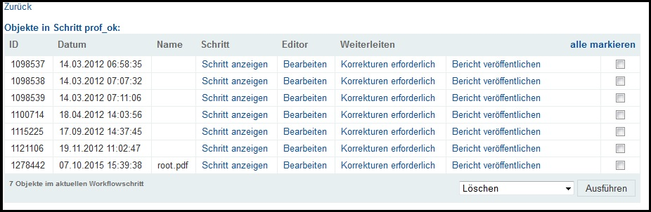

In dieser Übersicht sehen Sie alle Objekte eines Workflowschrittes (hier
"prof\_ok").

-  **Weiterleiten, Korrektur erforderlich / Bericht veröffentlichen:**
   Splittet sich in zwei Spalten auf dem "true" und "false" Knoten,
   die zum Workflowschritt gehören. Klicken Sie auf einen Knoten, um das
   Objekt dorthin weiterzuleiten.
-  **Editor, Bearbeiten:** Das Objekt öffnet sich in der Editoransicht.
   Hier können Sie die Metadaten bearbeiten oder die Zuordnung zu einem
   Workflowschritt anpassen.
-  **Schritt, Schritt anzeigen:** Zeigt Objekt in dem Workflowschritt
   an, in dem es sich gerade befindet.

Workflow starten
^^^^^^^^^^^^^^^^

Um den Workflow zu starten, gibt es zwei Wege:

-  Öffnen Sie mit Ihrem Browser folgende Adresse:
   (...)/publish/workflow\_name/start\_step\_name (start\_step\_name ist
   der Name des ersten Schrittes im Workflow, also der Knoten mit dem
   Typ "start").
-  Navigieren Sie in der Rechercheansicht zu den Workflows und der Liste
   aller Workflow Schritte, öffnen Sie hier den Knoten "start".

Aufbau eines Workflows
----------------------

Im Administrationsbereich navigieren Sie zu Workflows > Workflow >
|Neu| - hier können Sie einen neuen Workflow einrichten.

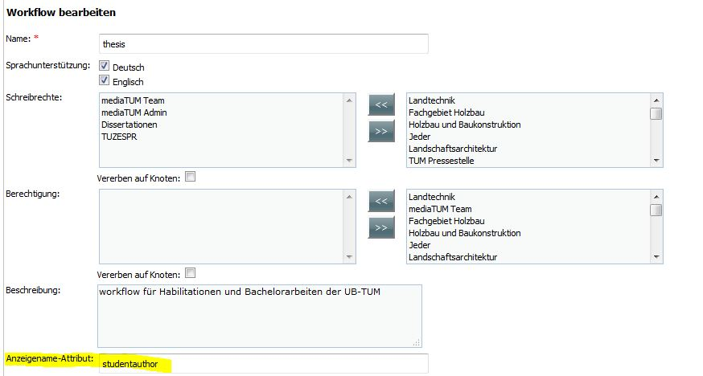

Es öffnet sich ein Fenster, in dem Sie die Metadaten für den Workflow
eintragen, mindestens den Workflownamen und ordnen Sie Schreibrechte
ein oder mehreren Benutzergruppen zu. Nachdem sie die Metadaten
gespeichert haben, sehen Sie unter Workflow die aktualisierte Liste
aller vorhandener Workflows. Die Einstellungen des Workflows können Sie
jederzeit mit |Bearbeiten| anpassen.

Unter dem Punkt "Anzeigename Attribut" kann
optional ein Feld eingetragen werden, wie z.B. "studentname", damit die
Werte dieses Feldes angeziegt werden können. Diese Übersicht listet alle
Dokumente, die sich in einem Workflowschritt befinden. Der Inhalt des
Feldes wird in der Spalte "Name" angezeigt. Trägt man kein oder mehr als
ein Attribut ein, bleibt die Spalte leer.

Hier die Ansicht im Recherchebereich, wenn ein Attribut angegeben wurde:

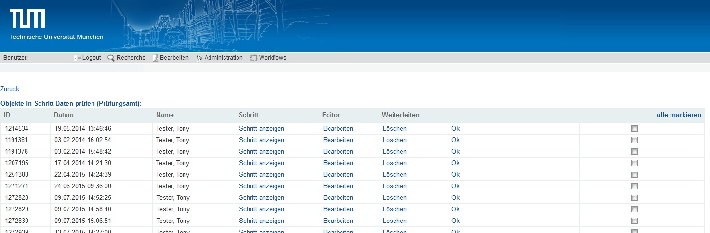

 

In der Workflowübersicht gelangen Sie mit |Lupe| zum Flussdiagramm,
welches Ihren Workflow und die verschiedenen Abzweigungen darstellt. 
Ein Ausschnitt aus dem Workflow für Dissertationen der
Technischen Universitätsbibliothek München:

.. figure:: images_wf/WorkflowFluss.jpg
   :alt: WorkflowFluss.jpg

Damit in diesem Flussdiagramm etwas angezeigt werden kann müssen Sie
aber zuerst unter Ihren Workflow mit |Pfeil| die Teilschritte, also
die Knoten, einrichten. Jeder Knoten symbolisiert einen Schritt, der im
Worflow abgearbeitet werden muss. Es gibt einen Knoten, der auf den
aktuellen verweist und der aktuelle Knoten verweist auf einen oder zwei
Folgeknoten, je nachdem, ob es eine Auswahlmöglichkeit geben soll.
**Ausnahme:** Der Startknoten hat keinen Vorgänger und der Endknoten hat
keinen Nachfolger.

Legen Sie unter Workflows > Workflow > Ihr Workflowname > |Pfeil| >
|Neu| einen neuen Knoten an:

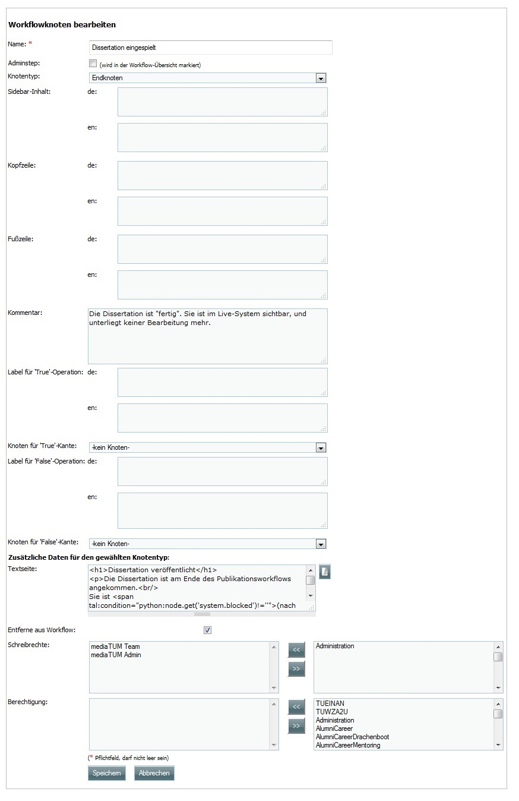

In diesen Feldern vergeben Sie:

#. Name
#. Entscheiden Sie sich, ob dieser Workflow Schritt als Adminstep hervorgehoben werden soll.
#. Im Kommentarfeld können Sie versteckte Informationen zur Erklärung des Knotens hinzufügen
#. Bestimmen welcher Knotentyp verwendet wird, möglich sind z.B.
 -  Start- / Endknoten
 -  Warten
 -  Email senden
 -  URN-Erzeugen
 -  Eintrag löschen
 -  Uploadknoten
 -  :ref:`Knotentypen`

Legen Sie nun die folgenden Schritte bzw. Folgeknoten fest. Wenn es nur
eine Möglichkeit gibt, welcher Schritt auf den aktuellen folgt - füllen
Sie nur den True-Bereich aus. Alternativ kann zusätzlich der "False"
Pfad vergeben werden.

Vorgehen:

#. Label für True vergeben: Dieser Text erscheint auf dem Button. 
#. True Pfad einem Knoten zuordnen, wird der Button angeklickt, wird dieser Schritt gestartet. 
#. Falls erwünscht: Schritt 1 und 2 für False wiederholen.

.. _Knotentypen:

Knotentypen weitere Informationen
^^^^^^^^^^^^^^^^^^^^^^^^^^^^^^^^^

Startknoten
"""""""""""""""""

Mit diesem Knoten beginnt der Workflow, kein anderer Knoten verweist auf
den Startknoten.

**Zusätzliche Daten für den gewählten Knotentyp:**

-  **Erstellbare Knoten-Typen (;-separiert):** können sie ein oder
   mehrere Metadatenschema(ta) im Format Datentyp/ID angeben.

-  **Text vor Auswahl:** Dieser Text erscheint vor der Auswahl der
   ersten möglichen Aktion auf true oder evtl. false zu klicken.

-  **Fortsetzen erlauben:**
 -  |Unchecked|
 -  |Checked|

Knotenbearbeitung
"""""""""""""""""

Lassen Sie die Editor-Maske anzeigen, in der Metadaten z.B. vom
Startknoten bearbeitet werden könnnen.

**Zusätzliche Daten für den gewählten Knotentyp:**

-  **Editor-Maske:** Geben Sie hier den Namen der Maske an, die
   verwendet werden soll. Normalerweise sollte mindestens eine
   Editor-Maske namens editmask für alle Metadatentypen vorhanden sein.

   
.. _Workflows Metadateneditor:

Metadateneditor
"""""""""""""""

Dieser Knotentyp zeigt die Metadaten in einen oder mehreren Masken an,
damit Daten zum Beispiel vom Nutzer kontrolliert werden können.

**Zusätzliche Daten für gewählten Knotentyp:**

-  **Anzuzeigende Masken (;-separiert):** Hier werden die Maske oder
   mehrere Masken angegeben, die angezeigt werden sollen.

Uploadknoten
""""""""""""

Zeigt dem Nutzer ein Formular an, in dem er für das aktuelle Objekt ein
Dokument hochladen darf.

**Zusätzliche Daten für gewählten Knotentyp:**

-  **Kopfzeile:** Dieser Text erscheint vor dem Formular für den Upload
   und sollte erklären, was hier hochgeladen werden sollte bzw. was
   erwartet wird.

-  **Fußzeile:** Nachdem das Dokument hochgeladen wurde, erscheint eine
   Liste mit Links zu erstellten Thumbnails, extrahierten Volltext etc.
   Der Nutzer könnte an dieser Stelle gefragt werden, ob er die Qualität
   geprüft hat.

-  **Admin\_wfstep\_single\_upload:**

 -  |Unchecked| Mehrere Uploads möglich.
 -  |Checked| Nur ein Upload möglich.
 
-  **Erl. Dateiendungen (;-separiert):** Listen Sie hier alle
   Dateiendungen auf, die Sie für den Upload erlauben möchten.

Email senden
""""""""""""

Möchten Sie in einem Workflowschritt eine Email versenden, ist dies
ebenfalls möglich. Die Email wird automatisch generiert, wenn Sie sie
entsprechend einrichten.

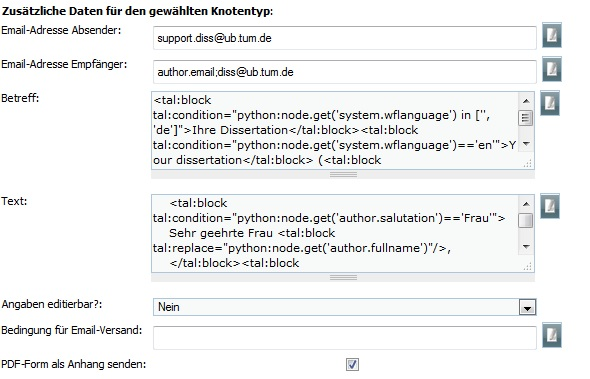

**Zusätzliche Daten für gewählten Knotentyp:** Geben Sie die
Email-Adresse vom Sender, Empfänger, den Inhalt und den Betreff an.

-  **Angaben editierbar?** (Ja/Nein):
-  **Ja:** Vorm Versand erfolgt die Anzeige der Mail und eine korrektur
   ist möglich.
-  **Nein:** Die Email wird umgehend versendet, es erfolgt zuvor keine
   Anzeige.

-  **Bedingung für den Email-Versand:** Die Email wird nur versendet,
   wenn die Bedingung wahr ist. Folgende Bedinungen kann man einrichten:

-  ``att:[attrname]=[value]``: attrname kann jedes Attribut zu
   einem Workflowknoten zuweisen, z.B. author\_fullname
-  ``schema=[valuelist] ( ;-separated)``: tetstet, ob das Schema
   des Workflowknotenzu einem Wert aus der Liste passt
-  ``type=[valuelist] (;-separated)``
-  ``hasfile``: testet nur, ob eine Datei an den Workflowknoten
   angehängt wurde.

-  **PDF-Form als Anhang senden:** Wenn eine PDF Datei an den aktuellen
   Knoten angehängt wurde (z.B. bei dem Workflow Schritt "Füge PDF
   Seiten hinzu"), wird bei
 -  ... |Unchecked| nichts an die Email angehängt.
 -  ... |Checked| die PDF an die Email angehängt.

**Beispiel:** automatisch Emailadresse eintragen; Betreff und Inhalt der
Mail automatisch anpassen; PDF hinzufügen.

**Inhalt Feld: Betreff:**

::

    <tal:block tal:condition="python:node.get('system.wflanguage') in ['', 'de']">Ihre Dissertation</tal:block>
    <tal:block tal:condition="python:node.get('system.wflanguage')=='en'">Your dissertation</tal:block> 
    (<tal:block tal:replace="python:node.id"/>): <tal:block tal:replace="python:node.name"/>

**Inhalt Feld: Email:**

::

    <tal:block tal:condition="python:node.get('system.wflanguage') in ['', 'de']">
        <tal:block tal:condition="python:node.get('author.salutation')=='Frau'">
        Sehr geehrte Frau <tal:block tal:replace="python:node.get('author.fullname')"/>,
        </tal:block><tal:block tal:condition="python:node.get('author.salutation')=='Herr'">
        Sehr geehrter Herr <tal:block tal:replace="python:node.get('author.fullname')"/>,
    </tal:block>
    Text.
        
    Für weitere Fragen geben Sie bitte immer Ihre Identifikationsnummer an: <tal:block tal:replace="python:node.id"/>

    Der dazugehörige Schlüssel lautet: <tal:block tal:replace="python:node.get('key')"/>

    Text.
      
    Mit freundlichen Grüßen

    Ihre Universitätsbibliothek
    Support E-Dissertationen

    support.diss@ub.tum.de

    </tal:block>
    <tal:block tal:condition="python:node.get('system.wflanguage')=='en'">

    Dear <tal:block tal:replace="python:node.get('author.fullname')"/>,
       
    Text.

    For additional questions, please remember to always provide us your identifier: <tal:block tal:replace="python:node.id"/>

    The corresponding key: <tal:block tal:replace="python:node.get('key')"/>

    Text

    Sincerely,
    The TUM University Library
    Support E-Dissertations

    support.diss@ub.tum.de

    </tal:block>

Eintrag löschen
"""""""""""""""

Lösche das Objekt, welches beim Workflowstart erstellt wurde.

Änderungen
""""""""""

Es wird ein zufälliger Schlüssel generiert und den Metadaten zur
eindeutigen Identifikation während im Workflow zugeordnet. Der Schlüssel
kann in geschützten Links (z.B. in Emails an Externe) genutzt werden,
damit der Zugriff auf das Objekt geschützt bleibt. Wenn mithilfe dieses
Knotentyps ein Schlüssel erstellt wurde, kann dieser Schlüssel in eine
Email hinzugefügt werden. Ein öffentlicher Link ohne Schlüssel kann nur
hinzugefügt werden, wenn der Link nicht geschützt ist.

Freischaltung
"""""""""""""

Die vom Startknoten eingerichtete Zugriffsbeschränkung, wird mit dem
"Lesenden Zugriff" überschrieben, das Dokument wird freigeschaltet.

Warten
""""""

In der aktuellen Version sind die Knotentypen "Warten" und
"Metadateneditor" identisch. Mehr Details unter: :ref:`Workflows Metadateneditor`.

**Zusätzliche Daten für gewählten Knotentyp:**

-  **Anzuzeigende Masken (;-separiert):** Wenn Sie hier eine Angabe
   machen, wird diese Maske während des wartens angezeigt.

Textseite anzeigen
""""""""""""""""""

Zur Anzeige einer Textseite, mit der optionalen Einstellung einen
zusätzlichen Textbereich anzuzeigen der HTML beinhalten darf.

**Zusätzliche Daten für gewählten Knotentyp:**

-  **anzuzeigender Text:** Tragen Sie hier Ihren Text ein und verwenden
   Sie bei Bedarf auch HTML.

Klassifizieren
""""""""""""""

Entscheiden Sie sich, an welcher Stelle innerhalb der Browsingstruktur
Ihr Objekt platziert werden soll.

**Zusätzliche Daten für gewählten Knotentyp:**

-  **Zielknoten-ID:** Tragen Sie ein oder durch Semikolon getrennt
   mehrere Verzeichnis oder Kollektions IDs ein. An diese Stelle(n) wird
   Ihr Dokument in die Browsingstruktur eingebunden. Alternativ können
   Sie auch auf das Ordnersymbol klicken und sich dort mithilfe der
   Baumhierarchie zur gewünschten ID navigieren.

-  **Unterknoten Attribut:**

-  Ein Attribut vom aktuellen Knoten kann genannt werden, um einen
   Unterordner zu spezifizieren.
-  **Beispiel:** Der aktuelle Knoten hat ein Attribut "year-published",
   es enthält Wert "2008" - das aktuelle Objekt wird im Unterverzeichnis
   "2008" als Kindknoten eingehängt. Existiert das Unterverzeichnis mit
   dem Namen "2008" noch nicht, wird dieses erstellt.

-  Wird nur ein Teil des Attributwerts benötigt, um zu bestimmen in
   welches Unterverzeichnis und an welchen Ort der aktuelle Knoten
   eingehängt werden soll, fügen Sie dem Attributnamen folgendes hinzu:
   ``|substring index-of-first-letter-in-substring, index-of-first-letter-after-substring``

-  **Beispiel:** Hat der aktuelle Knoten das Attribut "date-published"
   und es enthält den Wert im Format "yyy-mm-dd", kann das Jahr allein
   ausgegeben werden, indem man ``date-published|substring 0,4``
   eingibt.

-  **Nur Unterknoten:**

 -  |Unchecked| Der aktuelle Knoten wird direkt als Kind des Zielknotens angelegt. Zusätzlich wird im Unterordner der Attributname vom Eingabefeld spezifiziert.
 -  |Checked| Nur als Unterknoten eintragen - Verhindert das gerade Beschriebene.

Doublettencheck (Metadaten)
"""""""""""""""""""""""""""

Prüft, ob im aktuellen Knoten Dubletten vorhanden sind. Sind keine
Doubletten vorhanden, wird das Objekt zum nächsten Schritt des Workflows
nach dem "true"-Zweig verschoben. Werden aber Doubletten gefunden,
werden alle Doubletten und das Objekt in einer Tabelle angezeigt. Sie
können mithilfe des Buttons der ersten Spalte entscheiden, welcher
Knoten für den weiteren Workflowverlauf genutzt werden soll. Sobald der
"True"-Button angeklickt wird, wird dem Nutzer das ausgewählte Objekt im
aktuellen Workflowschritt angezeigt.

**Zusätzliche Daten für gewählten Knotentyp:**

-  **Namen geprüfter Attribute (;-separiert):** Geben Sie hier die
   Attribute an, die zum Doublettencheck verwendet werden sollen. In
   Python wurde das Modul Levenshtein installiert, damit neben
   übereinstimmenden strings auch die, die sich nur ähnlich sind,
   erkannt werden können. Wird dieses Modul nicht erkannt, werden die
   strings nur nach exakter Übereinstimmung geprüft. Die Inhalte der
   Attributfelder werden nach dem Klick auf den Button und der
   Erstellungszeit des jeweiligen Knotens in der Tabelle aufgeführt.

-  **Exakt passendes Attribut:** Dieses Attribut muss exakt
   übereinstimmen für das Finden von Doubletten. Der Inhalt des
   Attributs wird nicht angezeigt, wenn es nicht ebenfalls unter den
   "Namen passender Attribute" aufgeführt wurde. So soll die Anzahl der
   möglichen Doubletten beschränkt werden, z.B. auf OObjekte, die von
   einem bestimmten Nutzer erstellt wurden.

-  **Liste zusätzlich zu zeigender Attribute (;-separiert):** Um die
   identifizierung unterschiedlicher Knoten zu vereinfachen, sollten
   hier zusätzliche Attribute angegeben werden. Spezialfall: Wenn die
   Attribute einer Maske (z.B. nodebig) für diesen Knotentyp genutzt
   werden soll, kann die Maske hier genannt werden durch ausschließliche
   Eingabe von "mask:nodebig" in dieses Feld.

-  **Maskenliste für Labelbestimmung (;-separiert):** In der Liste der
   Masken sind die Labels der Attribute zu finden. Die Masken werden in
   vorgegebener Reihenfolge durchsucht. Das erste gefundene Label wird
   als Über- und Unterschrift der Spalte des Attributs verwendet. Wird
   kein Label gefunden (z.B. weil keine Maske ausgewählt wurde) wird die
   Bezeichnung aus dem Programmcode verwendet (z.B. nodebig; nodesmall;
   editmask).

-  **Doubletten bei 'True'-Operation löschen:**

 -  |Unchecked| Doubletten verbleiben im Workflow.
 -  |Checked| Alle Doubletten werden gelöscht, wenn Sie dem "true" Zweig folgen. Ausschließlich das ausgewählte Dokument verbleibt im Workflow.

LdapAuth
""""""""

Zunächst werden Sie nach Ihrer Kennung und dem Passwort von LDAP zur
Authentifizierungim gefragt (konfiguriert in mediaTUM.cfg). Gelingt die
Authentifizierung, wird der aktuelle Knoten zum Workflowschritt des
"True"-Zweigs übermittelt. Schlägt der Login fehl, wird der Knoten zum
Workflowschritt des "False"-Zweigs übertragen. Falls es keinen
"False"-Zweig gibt, wird der aktuelle Workflowschritt mit einer
Fehlermeldung angezeigt und ein neuer Loginversuch wird erlaubt.

**Zusätzliche Daten für gewählten Knotentyp:**

Attribut für Nutzer (default: system.ldapauth\_username): Wenn die Authentifizierung gelingt, übermittelt der LDAP Server einen einzigartigen "distinguished name (DN)", dieser DN kann für den Nutzer gespeichert werden, wenn in diesem Feld ein Knotenattribut bestimmt wird.

ORIGINAL: Here a node attribute can be named to store the unique distinguished name (DN) of the user as returned by the ldap server if the authentication succeeds.

Endknoten (Workflow Ende)
"""""""""""""""""""""""""

Dieser Knoten ist das Ende des Workflows und hat daher keinen folgenden
Knoten mehr.

**Zusätzliche Daten für den gewählten Knotentyp:**

-  **Textseite:** Der hier eingetragene Text erscheint nachdem der
   Workflow beendet wurde. Der Standardtext lautet: Fertig.
-  **Entferne aus Workflow:**
 -  |Unchecked| Das Objekt bleibt im Workflow.
 -  |Checked| Das vom Workflow erstellte Objekt wird nach Beenden des Workflows gelöscht.

Bedingungsfeld
""""""""""""""

Dieser Knoten wird nur zur Verzweigung genutzt. Es wird eine Bedingung
genannt und das System leitet entsprechend bei "true" zum "true"-Zweig
bzw. zum "false"-Zweig, der Nutzer sieht nur die nächste Anzeigemaske.
Der Nutzer sieht nicht, wie viele Bedingungen in Folge geprüft wurden,
um die korrekte Maske anzuzeigen.

Anhand eines Beispiels: Wird im vorherigen Workflowschritt der Upload
eines Volltextes ermöglicht und auf den Bedingungsknoten verwiesen, kann
dieser Knoten auf zwei unterschiedliche Knoten zeigen und anhand einer
Bedingung zum true oder false Knoten weiterleiten. Dies kann beliebig
oft verschachtelt werden und somit aus normalerweise max. 2 Alternativen
("Weiter" oder "Zurück") belieb viele Abzweigungen schaffen.
|Bedingung|

Folgende Kriterien können als **Bedingung** gesetzt werden:

-  ``att:[attrname]=[value]``: attrname kann jedes Attribut des
   Workflowknotens sein, z.B. author\_fullname
-  ``schema=[valuelist] (;-separated)``: testet, ob das Schema des
   Workflowknotens mit dem aus der Liste übereinstimmt.
-  ``type=[valuelist] (;-separated)``: testet, ob das Schema des
   Workflowknotens mit dem aus der Liste übereinstimmt.
-  ``hasfile:[filename]|[filetype]``: wenn ein kompletter Dateiname
   mit Dateiendung gegebn ist, wird getestet ob eine Datei mit gleichem
   Namen vorhanden ist. Wird nur das Dateiende angegeben, wird getestet,
   ob eine Dateiendung mit dieser Dateiendung übereinstimmt. Wird kein
   Parameter angegeben, wird nur getestet, ob irgendeine Datei an diesem
   Workflowknoten angehängt ist.

Freischaltverzögerung
"""""""""""""""""""""

Nutzen Sie diesen Knotentypen, wenn Sie eine Beschränkung bis zu einem bestimmten
Zeitpunkt einrichten möchten. So können Sie den Schreibzugriff, den Download oder 
das Publizieren zu einem frei gewählten Datum durchführen, vor dem Datum wird es 
verhindert.

**Zusätzliche Daten für den gewählten Knotentyp:**

-  **Attributename:** Geben Sie den Namen des Attribut an, der das Datum
   zur Freischaltung angibt.
-  **Zugriffsattribut:** Beschränken oder erlauben Sie hier mögliche
   Aktionen: read, write, data.

-  Wenn eine Mail versendet werden soll müssen folgende Felder
   ausgefüllt werden: **Email-Adresse Empfänger, Betreff, Text**

AddPictureToPDF
"""""""""""""""

Fügen Sie PDF-Seiten Bilder (z.B. Logos) hinzu. Der Bereich und die
Position für die Platzierung wird bei der Anzeige ausgewählt. Der
Orientierungspunkt liegt unten in der linken Ecke der Seiten - diese
können unterschiedliche Höhen und Breiten haben. Zur Unterstützung
erscheint ein Gitter mit ca 1 cm großen Abständen zur besseren
Positionierung. Mit der Maus und den Pfeiltasten kann das Bild bewegt
werden. Wenn ein Bild eingefügt wird, wird dies zurückgesetzt. Es ist
möglich die Eingabe mit Vorschauseiten oder der Anzeige der bearbeiteten
PDF (Link unter der Vorschau) zu überprüfen. Anschließend können
entweder weitere Bilder an weiteren Stellen eingefügt werden - oder - es
kann zum Originalzustand zurückgesetzt werden - oder - die eingaben
akzeptieren und der Prozess wechselt zum nächsten Workflowschritt.

**Zusätzliche Daten für den gewählten Knotentyp:**

-  **Text vor den Daten:** Das folgende Prozedere wird erklärt.

-  **Logo hier hochladen:** Laden Sie hier das Logo oder die Logos hoch.
   Folgende Formate sind mind. erlaubt: **.png, .jpg, .gif.** Stellen
   Sie sicher, dass das Bild Informationen zur Auflösung (DPI) enthält,
   ansonsten kann es passieren, dass das Bild nicht korrekt skaliert
   wird. In dieser Version werden keine Transparenzen in Bildern
   unterstützt.

-  **URL-Mapping (Separator: \|):** In diesem Textfeld kann für jedes
   hochgeladene Bild ein Link definiert werden. Der Link wird auf der
   rechten Seite des Bildes eingefügt. Jede Zeile sollte mit einem zum
   Dateinamen passenden string starten, um eindeutig identifizierbar zu
   sein. Darauf folgt ein pipe Symbol (\|) und der Link. Diese URLs
   werden dem Nutzer im Bereich unter den Bildern angezeigt. Dies
   erlaubt das Bearbeiten oder Löschen des Links, bevor ein Bild
   hinzugefügt wird. Ist ein Link ohne Bild gewünscht, muss ein
   transparentes Bild genutzt werden.

PDF-Seiten hinzufügen
"""""""""""""""""""""

Ein PDF-Formular wird im Workflow dem PDF Dokument verangestellt, oder
an den Knoten als "pdf-form" Typ angehängt. Die Textfelder des
Formulars werden entsprechend der Attributwerte des Dokuments ausgefüllt
(bei Übereinstimmung der Gleichheit der Feld- und Attributnamen).

**Zusätzliche Daten für den gewählten Knotentyp:**

-  **Eine PDF-Form hier hochladen:** Laden Sie hier das PDF-Formular
   hoch.
-  **PDF-Form-Felder editierbar:**

 -  |Unchecked| Felder können nicht verändert werden.
 -  |Checked| Felder sind editierbar.

-  **PDF\_Form separat an Knoten anhängen:**

 -  |Unchecked| PDF-Formulatr wird dem Dokument vorangestellt.
 -  |Checked| PDF-Formular wird dem Knoten als Datei mit dem Typ
   "pdf-form" angehängt
   
-  **PDF-Form überschreiben:**

 -  |Unchecked| PDF-Formular wird nicht ersetzt.
 -  |Checked| PDF-Formular wird ersetzt.

Datei entfernen
"""""""""""""""

In diesem Workflowschritt wird eine Datei während des Workflows
gelöscht.

**Zusätzliche Daten für den gewählten Knotentyp:**

-  **Dateityp:** Geben Sie hier entweder den Dateityp an, der entfernt
   werden soll, oder \* wenn jeder Dateityp entfernt werden soll.

Datenexport (Jahrbuch)
""""""""""""""""""""""

Die Dissertations-Daten werden elektronisch zum Jahrbuch übermittelt.

**Zusätzliche Daten für den gewählten Knotentyp:**

-  Füllen Sie die folgenden Felder aus: **Email-Adresse Absender,
   Betreff, Text**

URN-erzeugen
""""""""""""

Es wird automatisch eine URN nach bestimmten Kritieren erzeugt und dem
Dokument zugeordnet.

**Zusätzliche Daten für den gewählten Knotentyp:**

-  **URN Attribute:** am einfachsten: urn

-  **URN SNID 1 und 2:** optionale Unternamensräume können angegeben
   werden (Subnamespace Identifier)

-  **URN NISS:** Objekt Kennzeichnung (Namespace Specific String)

Dateianhang
"""""""""""

Es ist möglich direkt ein Dokument als Anhang hinzuzufügen oder ein
Formular mithife einer Maske zunächst vorzubereiten.

**Zusätzliche Daten für den gewählten Knotentyp:**

-  **Dateieinhang:** Fügen Sie ein oder mehrere Dateien hinzu.

-  **Maskenname (optional):** Wenn der oben hinzugefügte Anhang ein
   Formular ist, kann hier eine Maske angegeben werden. Mithilfe dieser
   Maske wird das Formular automatisch anhand der Feldnamen mit Werten
   gefüllt, indem es z.B. Anrede, Adresse etc. einträgt.

Re-Auth
"""""""

Berechtigungen werden anhand des Schlüssel an den Doktoranden gegeben.

(INF) ID-Erstellung
"""""""""""""""""""

Das angegebene Attribut des definierten Knotens wird als Basis verwendet
und um eins inkrementiert dem Knoten als neue ID zugeordnet.

**Zusätzliche Daten für den gewählten Knotentyp:**

-  **Knoten mit ID:** Geben Sie die ID des Knotens an, der als Basis
   dienen soll.

-  **Attributname der ID:** Geben Sie ein Attribut vom ausgewählten
   Knotens an.

-  **ID-Format:** Geben Sie an, nach welchen Regeln die ID erstellt
   werden soll.

Inhalt Prüfen
"""""""""""""

Hiermit können Attribute auf gültige Angaben geprüft werden. Wenn kein
Fehler auftritt, wird der "true" Pfad fortgesetzt, ansonsten wird vom
System eine in den zusätzlichen Daten definierte Email versendet.

**Zusätzliche Daten für den gewählten Knotentyp:**

-  Folgende Felder müssen ausgefüllt werden, damit eine Mail bei einem
   Fehler versendet wird: **E-Mail Absender, Empfänger: Betreff, Text**

   
Tipp: Workflow anlegen
---------------------------------------------------------------------------

Es ist weniger Arbeit den Workflow „rückwärts“ einzurichten. Vom
Endknoten hin zum Startknoten.

**Grund:** Legen Sie die Knoten „Option 1“ und „Option2“ an, sind die
möglichen Pfade von „Aktuell“ bereits bekannt. So kann beim Einrichten
von „Aktuell“ umgehend der Pfad „Option 1“ bei true und „Option 2“ bei
false eingegeben werden. Erstellen Sie zuerst „Aktuell“ sind die genauen
Bezeichnungen von den folgenden Pfaden ggfs. noch nicht bekannt und der
Datensatz muss unvollständig abgespeichert werden und später nochmals
bearbeitet werden. Vor der Umsetzung ist es sinnvoll sich eine
entsprechende Skizze anzufertigen.

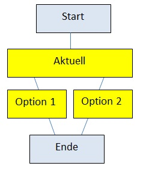

   
.. |Loeschen| image:: ../images/Loeschen.jpg
.. |Bearbeiten| image:: ../images/Bearbeiten.jpg
.. |Export| image:: ../images/Export.jpg
.. |Lupe| image:: ../images/Lupe.jpg
.. |Pfeil| image:: ../images/Pfeil.jpg
.. |Neu| image:: ../images/Neu.jpg
.. |Unchecked| image:: ../images/Unchecked.jpg
.. |Checked| image:: ../images/Checked.jpg
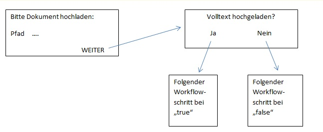
