Directories
-----------

There are two levels of directories: The level of a collection, which is
the highest level and holds specific settings and configurations of your
entire collection e.g. a logo that is displayed on every level
underneath. The next level are all directories in your collection and
their subfolders, basically they define the browsing structure. General
functions are the same on both levels; the main difference is the
status. Therefore the directories function is described first and later
the collection level with its central settings is described. **Available
operations regarding folders:**

-  See folder and all objects which are contained in the selected folder
-  Edit folder and all objects which are contained in the selected
   folder
-  Download original files (TIFF/JPG/PNG/BMP of original size, PDF
   files, videos, etc.) which are contained in the selected folder (or
   its subfolders).

In general folder related (or object related) authorizations are
assigned to user groups and every individual account is assigned to one
or more user groups. So you can perform all operations for which your
"parent" user groups are authorized. **Examples:**

-  You can always see and edit your own user directory and all
   subdirectories or objects therein: e.g. User directory (*YourName*).
-  If you administer a collection, you can see and edit the collection
   directory and its content (e.g Image Archive Wood Construction).

1. Selecting folders for displaying folder content and editing purposes

Select folder in the *Folder administration* area. If needed display
subfolders by selecting |image0| or hide subfolders by selecting
|image1| **Result:**

-  In the *Folder administration* screen area the selected (*active*)
   directory is tagged with a triangle **(1)**.
-  In the *Data editing* screen area all directory related (operation-)
   tabs are being displayed in the upper part of the *Data editing*
   area.
-  The selected (*active*) directory is being displayed with the label
   *Selected/Editing* **(2)**.
-  All objects (images, documents) which are contained in the selected
   folder are being displayed in a short format in the lower part of the
   screen **(3)**.

**Remark:** Content of subfolders will not be displayed. 

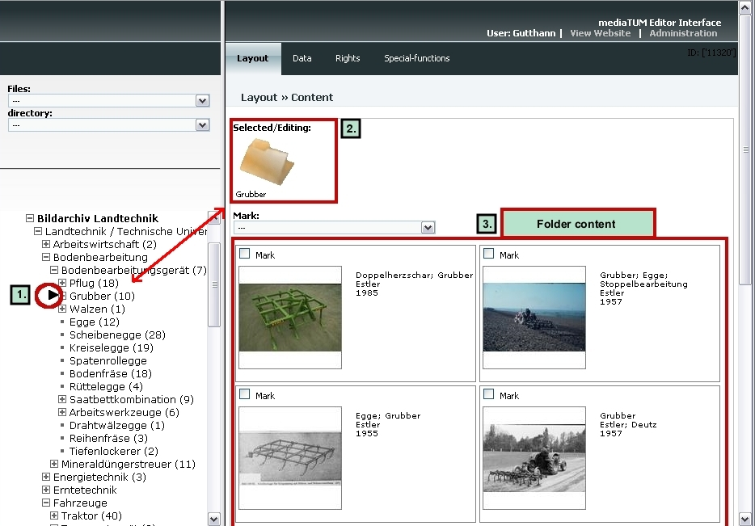

   Selecting folder for editing

2. Directory editing by means of the *General administrative functions*
panel

There are two categories of editing operations which can be initiated by
means of the *General administrative functions* panel. 

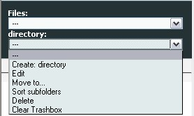

   Directory menu

Editing of **directory structure**

-  create directory
-  move a directory to another position in the tree
-  sort subfolders
-  delete a directory

Editing of **directory name**

-  edit (directory)

Special editing function:

-  clear trashbox (all deleted objects are automatically moved to the
   *Trashbox* in the work directory)

2.1 Create new folder

A new directory/folder will always be created as a subfolder of a
previously selected initial directory. When the new folder is created
you can edit the name and select a display format for the result list in
the standard web interface. First select the directory in which you want
to insert a new subfolder. Select the option *Create: Directory* A new
directory has been created. The new directory is a subfolder of the
initial directory. In order to edit the name of the new directory you
have to select the *Edit* option. There are also fields to set the
display format of objects for this new directory to a default setting.
You could choose between options for the default short display (*short
view style*) and the default full display (*full view style*).

2.2 Delete folder

Select the directory by mouse click. Select *Directory* and then
*Delete* in the *General administrative functions* panel. **Remark:** If
you delete a directory the contained subfolders will be also deleted. If
image objects or document files are contained only in the folder, which
is to be deleted, they will be moved to the *Trashbox*. But if image
objects, documents, etc are contained also in other folders, they still
will be found in those other folders. As well there is a directory
called *Trashbox*. This directory holds all deleted objects so that they
can be restored in case of deleting an object by accident. You could
also delete the folders *Uploads* and *Inconsistent data*. The software
will automatically create those two folders anew, if they are needed for
administration purposes.

2.3 Move directory

When you move a directory to another position in the tree by means of
the *Move to...* operation in the directory menu, the moving folder will
be inserted as a subfolder in the target folder. If you would like to
change the sequence of folders (that means "moving" a folder within a
given hierarchical level), then you have to use the *Sort subfolders*
operation. **How to do it:**

#. Select the directory you want to move by mouse click.
#. Select the *Move to…* option in the directory menu.
#. Select the target directory into which the moving folder is to be
   inserted.

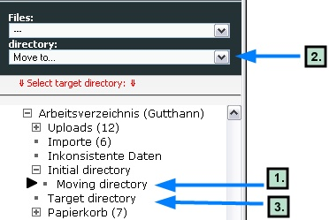

   Move folder

**Result:** 

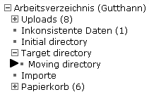

   Moved folder

2.4 Edit directory

**How to do it:**

-  Select the directory by mouse click.
-  Select *Directory* and *Edit* in the *General administrative
   functions* panel.

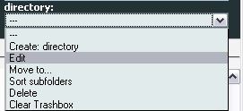

   Edit folder

**Result:** The *Edit
metadata* dialogue of the data editing section will be automatically
opened and you can edit the name of the new folder/directory and select
a display format for result lists.

2.5 Sort subfolders

**How to do it:**

-  Select the directory by mouse click.
-  Select *Directory* and *Sort subfolders* in the *General
   administrative functions* panel.

**Result:** The *Sort Subfolders* tab of the data editing section will
automatically be opened and you can subsequently change the sequence of
directories/folders within a given hierarchical level.

3. Folder editing in the *Data editing* frame.

Screen layout of the *Folder data editing* frame: 

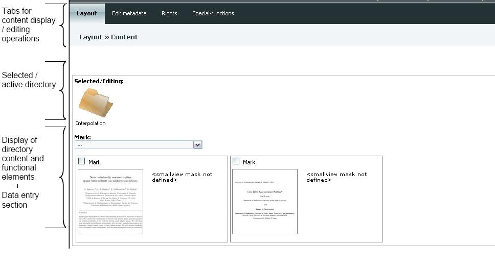

   Editing frame

3.1 Editing operations. Overview.

There are four sections that hold various functions in a subcategory.
You can see those functions by moving the mouse on one of the sections -
the menus will appear. **Layout** 

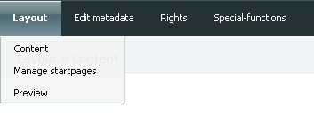

   Layout options

**Content:** Display of all images, documents, etc
which are contained in selected folder. Selection of one or more objects
for data editing. **Manage start page:** Managing and editing of HTML
data which will be shown in the standard Web Interface. Creation of
front pages for collections or subdirectories. Images used for these
start pages can be uploaded here as well. **Preview:** Feature not
relevant for folders but for single objects. **Edit metadata** 

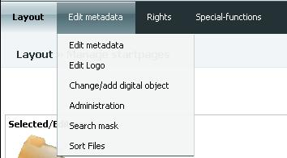

   Edit metadata

**Edit metadata**: Edit folder
name and select display format for result lists. **Edit logo:** Set logo
for the folder. An image can be uploaded here. **Change/add digital
object:** Exchange or add digital object, e.g. for thumbnail, logo,
image, etc. **Administration:** Display of technical metadata regarding
folder (upload time, uploading person, etc.) **Search mask:** **Sort
files:** Sort files in the selected folder. **Rights** 

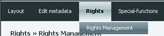

   Rights management

**Rights management:**
Assignment of permissions and authorizations (see, edit, download)
regarding the selected folder and the contained objects (images,
documents, etc). **Spetial functions** 

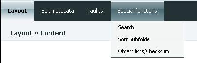

   Special functions

**Search:** Searching for
objects (images, documents) which are contained in selected folder.
Search results can be transferred to object data editing. **Sort
subfolders:** Sort subfolders of the selected folder (sorting means here
moving within a given hierarchical level). **Object list/checksum:**
Create lists of objects which are contained in the selected folder
(filenames, checksum, file size).

3.2 Layout >> Content

**Functional description:**

-  Display of all objects (images, documents, videos, etc) which are
   contained in selected directory. Subfolders of the selected directory
   won't be displayed - they are displayed in the *Directory
   administration* panel.
-  Select directory objects for data editing

Select directory in the *Directory administration* panel. The *Content*
edit page will automatically be activated and the contained objects will
be displayed. **Select/mark folder objects**

-  Option 1: Select one or more objects by checking the respective check
   boxes one by one.
-  Option 2: Select one or more objects simultaneously by means of the
   "Mark"-Drop down menu.

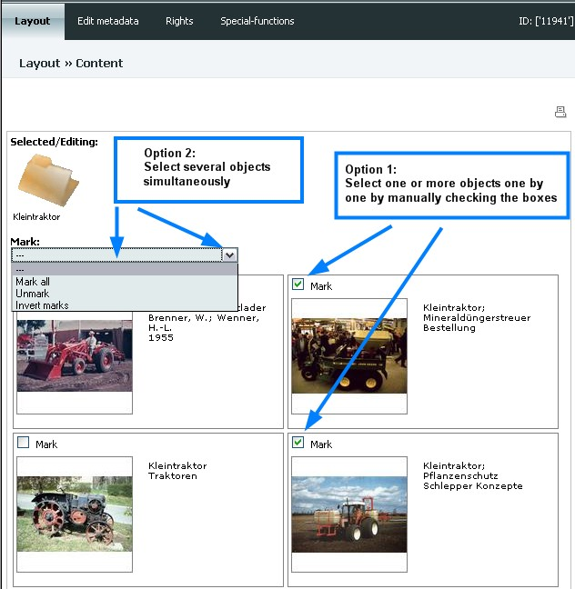

   Select objects

**Delete folder
objects** Select objects. Select *Files* and *Delete* in the *General
administrative functions* panel.

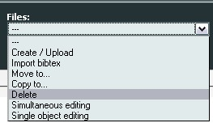

   Delete file

**Remark:** If the objects to be deleted are contained
only in the edited folder, they will be moved to the *Trashbox*. If the
objects are contained in other folders as well, they are only deleted
from the edited folder, but will still be found in those other folders.
**Selecting folder objects and transferring them to the object *Data
editing*** Select objects. Select *Files*, then *Simultaneous editing*
frame (if more than one object has been selected, data editing will be
done for all selected objects at the same time) or *Files*, then *Single
object editing* (editing one object at a time; if more than one object
has been selected, then editing will be done consecutively) in the
*General administrative functions* panel. You can edit the single object
also by selecting it by mouse click in the area on the right hand side
of the object thumbnail (do not click on the thumbnail because this will
give you a preview instead of the editing form). **Move/copy folder
objects**

-  Option 1: Select objects in the source folder. Select *Files*, *Copy
   to...* or *Move to...* in the *General administrative functions*
   panel. Select target folder. Objects will be moved or copied now.
-  Option 2: Objects which are already in the object data editing mode.
   Use the menu *Classification* and *Place in browsing structure* to
   copy or move objects.

**Sort subfolders** Select directory. Activate *Special-functions* and
*Sort Subfolders* or select *Directory* and *Sort subfolders* in the
*General administrative functions* panel. 

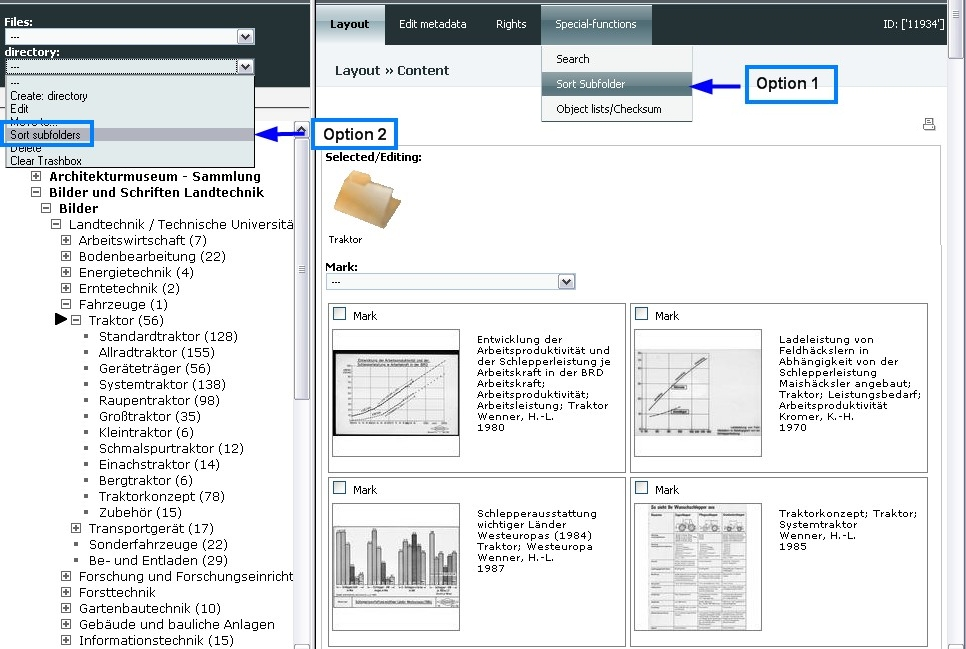

   Sort subfolders

Now you can sort manually or automatically by
attribute, e.g. name. To come up in the list, the attributes have to be
defined as sorting fields before (in Admin area). You can also choose
between ascending and descending sorting. 

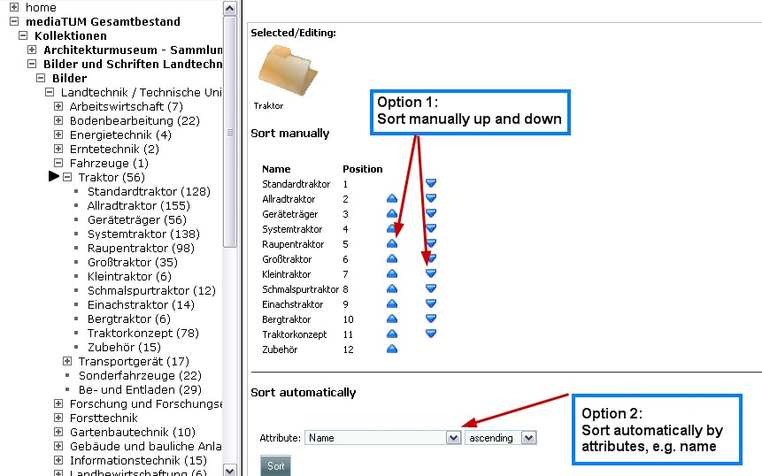

   Sort subfolders

3.3 Edit metadata

Editing the metadata is slightly different weather you are on collection
level or just on normal directory level. In general the functions are
similar and described as follows:

-  Change the name of the selected directory
-  Define the short format for display of result lists in the standard
   Web interface. Available formats: text, list, thumbnails. Definition
   valid only for collection type folders

**Example:** Editing at Collection level Select collection. Select *Edit
metadata* and again *Edit metadata* in the *Data editing* frame.

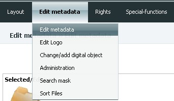

    Edit metadata

The following screen will come
up: 

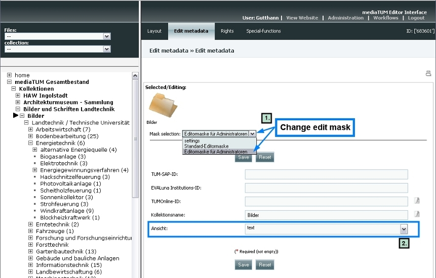

   Edit metadata

Here you can edit
the general parameters of a collection, e.g. name. You can set the
display format of objects for a collection to a default display setting.
Therefore you have to change from *Standard edit mask* to *Edit mask for
Administrators* first. Then you can choose between three options for the
short display:

-  thumbnail
-  list
-  text

This setting can only be changed at collection level. This means a
setting on directory level will be overwritten by the setting that is
made at collection level. As mentioned above make sure that you change
the setting not in the standard editing mask but the edit mask for
administrators. To edit names of folders the procedure is the same, just
click on the folder and follow the same menu steps as above. There are
also fields to set the display format of objects for this directory to a
default setting. In theory you could edit the setting for the directory
level but this setting will always be overwritten by the setting that
has been made at collection level.

3.4 Permissions

Folder related (or object related) authorizations are assigned to user
groups. Every individual account is assigned to one or more user groups.
Available operations regarding folders and objects in folders:

-  see folder and all objects which are contained in the selected folder
-  edit folder and all objects which are contained in the selected
   folder
-  download original files (TIFF/JPG/PNG/BMP of original size, PDF
   files, videos, etc.) which are contained in the selected folder (or
   its subfolders)

Collections are treated as folders. Generally, permissions are valid for
folders and all objects (e.g. objects, subfolders) therein. **Remark:**
If there is no entry in the "permission frame" (that means if you don't
assign a right to a user group), then the collection content can be seen
and downloaded without restriction by everyone (worldwide)! In order to
manage the rights select directory, select *Rights* and than *Rights
management*. Select user group by clicking on it and assign or disallow
permissions via clicking the button. 

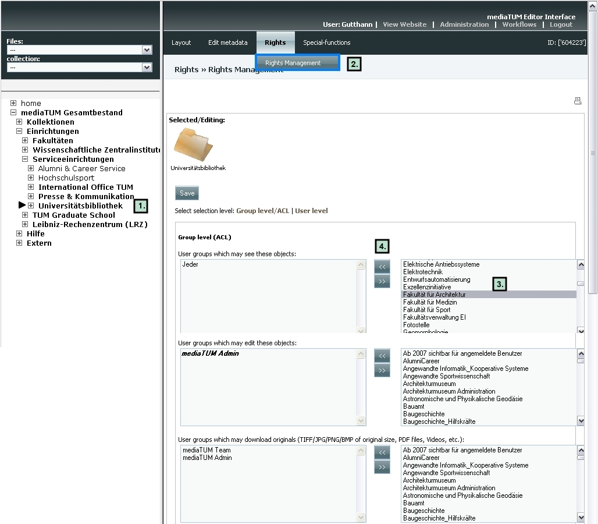

   Rights management

3.5 Start page of a collection or directory.

**Functional description:** For every collection or directory an
individual frontpage with text and/or images can be created. This
function can be used to present your collection with explanations and
information on the actual collection. At directory level you can e.g.
give an overview of a subsection. It is not necessary to create a start
page but if no start page is defined, a list of objects that are located
underneath that hirachy level will be displayed. In some cases it might
be handy to not have a list but to give some general information on the
objects or your institutions. In case you create some start page, please
consider, that the files saved in the folder with a startpage won't be
available in the website view. So if you want the users, that have the
right to see the folder and the files in it, but not the right to edit
it, to be able really to see the files, you have to locate this files in
some subfolder of the folder with a startpage. You can set up pages in
different languages for a folder, e.g. english or german pages that are
connected to the specific language chosen by the user. To manage and
create start pages

#. Select collection or directory
#. Select menu *Layout* and *Manage startpages*. The following screen
   will come up. It shows that no startpage is defined yet.
#. To create a start page click on the yellow box symbol on the right.
#. A HTML editing window opens that allows you to enter contents (text,
   images) to the page. Functions are similar to that in MS Word. You
   can enter text, images, tables, etc. Save the entered content by
   clicking on the button below the content box.

Select *Layout* and *Manage startpages* again from the menu. The first
start page has been created and you can edit the following:

#. The page can be named, which is optional but recommended when using
   more than one start page for the same directory/collection. Just
   enter a name in the field *Descriptive name*.
#. To see a preview from the page, click on the blue triangle facing to
   the right.
#. You can set for which language(s) the start page should be used. It
   can either be used for both, english and german or just one of them
   by ticking the box.
#. To edit a start page again, click on the edit symbol and change the
   content. Don't forget to save the changes.
#. Save changes to keep name and language settings.

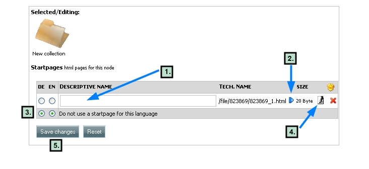

   Edit start page settings

You can create another start page by clicking on
the yellow box and change language settings as you need. **Manage and
use images in the HTML editing tool** You can use images that are
already saved as objects in mediaTUM. Simply use the link provided in
the normal web view when you open the original image and do a right
mouse click > *Image properties*. Of course you can also use the smaller
thumbnail image of the full view by using the *Image properties* link of
the right mouse click menu. Insert link to the image by clicking on the
image button |image20| of the editor and insert the URL in the *Image
Info* field for an URL. You can also use different images that are not
part of your collection or images that are generally stored in a
restricted area but can still be used for that purpose. You can upload
images specially for the display on the start page.

#. Move cursor on the spot where the image should be inserted and click
   on the image button of the HTML editor's menu.
#. Click on the *Upload* tab of the upcoming image manager.
#. Click on *Durchsuchen* and choose the path to the image you want to
   upload.
#. Click on *Send it to server* button.
#. Click on *OK* to finish upload process.

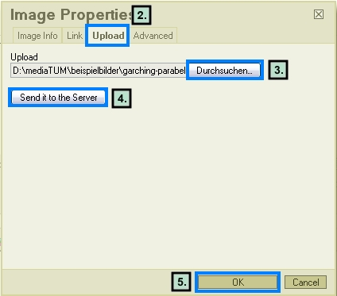

   Upload an image

**Result:**
The image is stored on the server and ready to use. The image manager
shows the *Image Info* tab now and you can edit the image. 

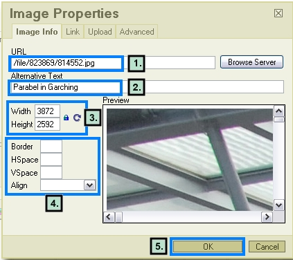

   Image info

#. The field URL shows the image path on the server.
#. You can enter alternative text that is shown when the cursor moves
   over the image (e.g. descriptive text).
#. You can change the size of the image, e.g. make it smaller for
   display. Simply enter a new value (pixels) for either width or
   height, the size change will be made in proportion. Click on the lock
   symbol to save the new size. The preview window will show you the
   change.
#. You can also enter/change values for the attributes border, HSpace,
   VSpace and align.
#. Save the new values by clicking OK.

**Result:** The image is shown in the HTML editor with the content.

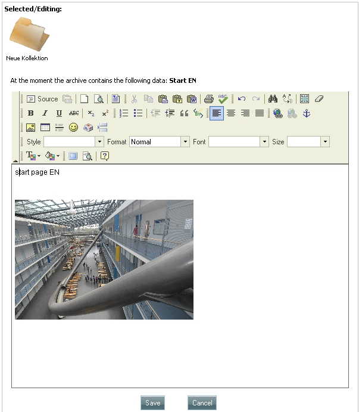

   Uploaded image

To upload more
images just repeat the described procedure. To use already uploaded
images simply click on the image button |image24| of the menu and then
click on *Browse server*. A pop-up window that shows all uploaded images
of that node/directory will appear. Choose the one you want to use and
click OK. You can change the image size, etc, for every use with
different settings. 

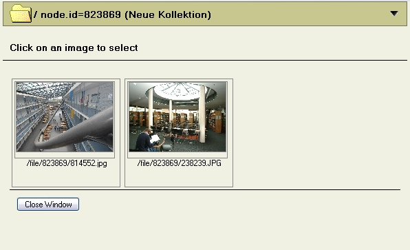

   Select an image

3.6 Spetial functions. Object lists/Checksum.

**Functional description:** Create lists of objects which are contained
in the selected directory for administrative purposes (filenames,
checksums, file sizes). This function ist only relevant for image files.

-  select a directory
-  select *Special-functions* and then *Object lists/Checksum*
-  select link *Create object list*

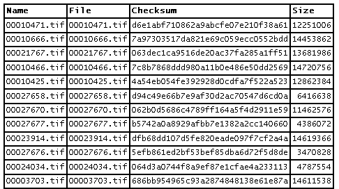

   Object list

.. |image24|  image:: images/imagebutton1.jpg
