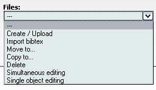
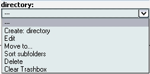

Edit area - Overview
--------------------

Access to the mediaTUM editor interface is only available when you are
logged in. After Log-in select *Edit* in the top left corner.

Screen Area I: *General administrative functions* panel

Functional description: Selection of operations regarding digital
objects and folders/directories: 

   Operations regarding objects

Operations regarding objects (images, documents, etc):

-  Upload, delete
-  Copy, move
-  Editing (of data regarding objects, images, documents)

   Operations regarding directories

Operations regarding folders/directories:

-  Create new, delete
-  Move
-  Editing (of data regarding folders)
-  Sort subfolders

Screen Area II: *Folder administration*

.. figure:: images/folderop-ed.jpg
   :width: 490 px

   Folder administration

**Functional description:**

#. Displaying hierarchies and content of existing folders/directories:

   -  *User directories*. Never visible in the standard web search
      interface.
   -  *Collections*. Visible in the standard web search interface. The
      individual visibility depends on the assignment of rights to user
      groups. The displayed hierarchy of the folders defines the
      browsing structure in the standard Web search interface.

#. Navigation for administrative purposes (e.g. editing of folders or
   folder content).

Screen Area III: *Data editing frame* panel

**Functional description:** Editing of data regarding collections,
folders, directories and objects (descriptive data, technical data,
permissions, etc).
