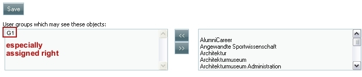
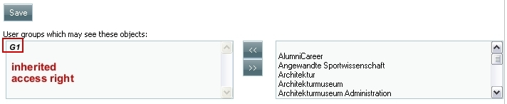
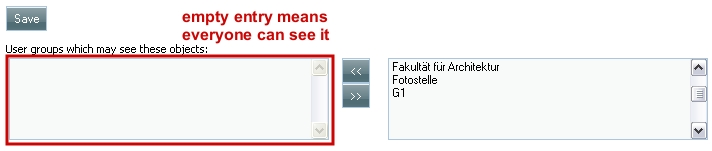
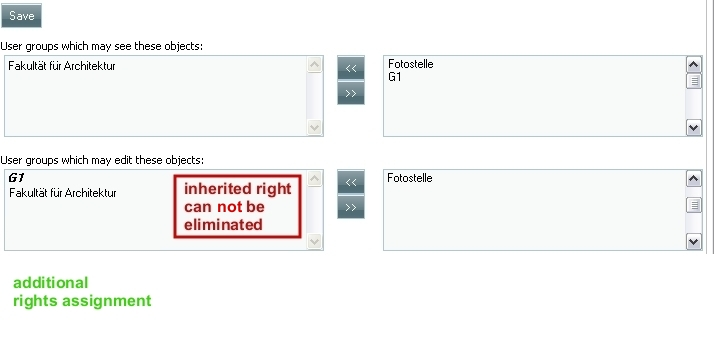

Rights management in mediaTUM
-----------------------------

The objects in mediaTUM are:

-  digital object files (image files, document files, video files, et
   cetera)
-  directories and folders
-  metadata schemes

Collections are interpreted in mediaTUM as directories, not as objects.

1. Operations

+--------------+--------------------------------------------------------------------------------------------------------------------------------------------+
| see (read)   | objects                                                                                                                                    |
+--------------+--------------------------------------------------------------------------------------------------------------------------------------------+
| edit         | objects                                                                                                                                    |
+--------------+--------------------------------------------------------------------------------------------------------------------------------------------+
| download     | original files (TIFF/JPG/PNG/BMP of original size, PDF files, videos, etc.) which are contained in the selected folder or its subfolders   |
+--------------+--------------------------------------------------------------------------------------------------------------------------------------------+

The rights to *see*, *edit* and *download* are assigned separately:

-  Holding the right to *see* an object does not include the right to
   *edit* or *download* the object.
-  Holding the right to *edit* an object does not include the right to
   *see* or *download* the object.
-  Holding the right to *download* an object does not include the right
   to *see* or *edit* the object.

2. Rules of inheritance. General overview.

By default the lower hierarchy inherits the rights (to see, edit or
download) of the upper hierarchy. For example:

-  Image files contained in a folder inherit the rights structure of
   this folder.
-  Subfolders inherit the rights structure of the parent folder.

The inheritance process described above can be modified. Modification
procedures and results for *see* and *download* are identically
structured. Modification can eliminate the results of the (default)
inheritance process completely. Modification procedures and results for
*edit* differ from the procedures and results for *see*. Modification
cannot eliminate the results of the (default) inheritance process
completely in this case.

3. *See*. Detailed discussion.

Example collection **Tree**:

-  Coniferous tree

   -  Pine.jpg
   -  Spruce.jpg

-  Deciduous tree

   -  Beech.jpg
   -  Birch.jpg
   -  Maple.jpg

**What rights do you need in order to see objects?** (e.g. in the
browsing tree in standard Web interface or in the editor interface)

-  What authorizations do you need in order to see the file
   ``Pine.jpg``? It is sufficient if you are assigned the right to see
   the file ``Pine.jpg``. But in this case you must know the URL
   explicitely in order to find the file.
-  What authorizations do you need in order to be able to browse to the
   file ``Pine.jpg`` in the standard Web interface or in the editor
   interface? In addition to the right to see the file ``Pine.jpg`` you
   need the right to see the directories *Tree* and *Coniferous tree*.

**Example 1:** Usergroup G1 can see the complete example collection
*Tree* (all folders and all objects).

+-------------------+------------------------------------------------------------------+
| Objects           | Explicit assignments or inheritance of the right *See*           |
+===================+==================================================================+
| Tree              | G1                                                               |
+-------------------+------------------------------------------------------------------+
| Coniferous tree   | [no explicit assignment, inherits rights of *Tree*]              |
+-------------------+------------------------------------------------------------------+
| Pine.jpg          | [no explicit assignment, inherits rights of *Coniferous tree*]   |
+-------------------+------------------------------------------------------------------+
| Spruce.jpg        | [no explicit assignment, inherits rights of *Coniferous tree*]   |
+-------------------+------------------------------------------------------------------+
| Deciduous tree    | [no explicit assignment, inherits rights of *Tree*]              |
+-------------------+------------------------------------------------------------------+
| Beech.jpg         | [no explicit assignment, inherits rights of *Deciduous tree*]    |
+-------------------+------------------------------------------------------------------+
| Birch.jpg         | [no explicit assignment, inherits rights of *Deciduous tree*]    |
+-------------------+------------------------------------------------------------------+
| Maple.jpg         | [no explicit assignment, inherits rights of *Deciduous tree*]    |
+-------------------+------------------------------------------------------------------+

**How does this look like in mediaTUM?** For the folder *Tree*: |Assign
the right to see to the group G1| For the folder *Coniferous tree*:
|Inherited right to see| It is sufficient to assign the permission to
the collection *Tree* directly; this folder defines the highest
available hierarchy. By means of the default inheritance process the
lower hierarchies (e.g. the folder *Coniferous tree* and all contained
objects) inherit the assigned right. Note that inherited rights are
displayed in ***boldface***. You cannot disallow inherited rights
directly by selecting the group name and using |image2| (but you can
disallow inherited rights indirectly, see below). **Example 2:** A
collection consists of two folders. The first folder (*Worldwide
folder*) can be seen worldwide, the other folder (*Group access folder*)
can be seen by members of the user group G1 only.

+-----------------------+------------------------------------------------------------------+
| Objects               | Explicit assignments or inheritance of the right *See*           |
+=======================+==================================================================+
| Test collection       | Everyone                                                         |
+-----------------------+------------------------------------------------------------------+
| Worldwide folder      | [no explicit assignment, inherits rights of *Test collection*]   |
+-----------------------+------------------------------------------------------------------+
| Group access folder   | G1 [inheritance from *Test collection* is deactivated]           |
+-----------------------+------------------------------------------------------------------+

**Remark:** The effects of explicitely assigning a right to everyone and
leaving the assignment area empty are equal. |Rights for everyone| The
checking process of the access rights to the folder *Group access
folder* works like this: There are explicitly stated access rights
regarding said folder. So only these assigned access rights (which say
that user group G1 can see the folder) are relevant and the checking
process is terminated. Since the folder of the upper hierarchy (folder
*Test collection*) can be seen worldwide, the members of the user group
G1 are able to browse to the *Group access folder*. **Example 3:** A
collection (*Flowers*) consists of two folders:

-  *InternalFolder* can only be seen by the administration
   (floweradmin).
-  *TransferFolder* can be seen by the administration (floweradmin) and
   by a guest group (flowerguest).

+---------------------+-----------------------------------------------------------------+
| Objects             | Explicit assignments or inheritance of the right *See*          |
+=====================+=================================================================+
| Flowers             | floweradmin, flowerguest                                        |
+---------------------+-----------------------------------------------------------------+
| TransferFolder      | [no explicit assignment, inherits rights of *Flowers*]          |
+---------------------+-----------------------------------------------------------------+
| SunflowerFile.jpg   | [no explicit assignment, inherits rights of *TransferFolder*]   |
+---------------------+-----------------------------------------------------------------+
| MarigoldFile.jpg    | [no explicit assignment, inherits rights of *TransferFolder*]   |
+---------------------+-----------------------------------------------------------------+
| InternalFolder      | floweradmin [inheritance from *Flowers* is deactivated]         |
+---------------------+-----------------------------------------------------------------+
| ButtercupFile.jpg   | [no explicit assignment, inherits rights of *InternalFolder*]   |
+---------------------+-----------------------------------------------------------------+

**How to modify the results of the inheritance process:** Starting
point: User group G1 has the right to see the folder "Coniferous tree",
this right is inherited from an upper hierarchy level.

#. Select any user group from the list on the right hand side.
#. Transfer the user group into the *assignment frame*.
#. Click the button *Save*.
#. Select the remaining user group.
#. Shift the user group to the right, the *assignment frame* is empty,
   the inherited rights are eliminated.

4. *Edit*. Detailed discussion.

If you want to edit objects, you must have the right to see those
objects as well. Nevertheless the assignment processes of the *se*\ e
and *edit* rights are separate procedures with differing logic.

-  The right to see must have been assigned before the right to edit an
   object.
-  You need the right to edit regarding the object you would like to
   edit

The rights assigned in lower hierarchical levels expand the rights which
result from the inheritance process. **Example 1:** Enabling the user
group G1 to edit the complete example collection *Tree* (all folders and
all objects).

+-------------------+------------------------------------------------------------------+
| Objects           | Explicit assignments or inheritance of the right *See*           |
+===================+==================================================================+
| Tree              | G1                                                               |
+-------------------+------------------------------------------------------------------+
| Coniferous tree   | [no explicit assignment, inherits rights of *Tree*]              |
+-------------------+------------------------------------------------------------------+
| Pine.jpg          | [no explicit assignment, inherits rights of *Coniferous tree*]   |
+-------------------+------------------------------------------------------------------+
| Spruce.jpg        | [no explicit assignment, inherits rights of *Coniferous tree*]   |
+-------------------+------------------------------------------------------------------+
| Deciduous tree    | [no explicit assignment, inherits rights of *Tree*]              |
+-------------------+------------------------------------------------------------------+
| Beech.jpg         | [no explicit assignment, inherits rights of *Deciduous tree*]    |
+-------------------+------------------------------------------------------------------+
| Birch.jpg         | [no explicit assignment, inherits rights of *Deciduous tree*]    |
+-------------------+------------------------------------------------------------------+
| Maple.jpg         | [no explicit assignment, inherits rights of *Deciduous tree*]    |
+-------------------+------------------------------------------------------------------+

It is sufficient to assign the permission to the collection *Tree*
directly; this folder defines the highest available hierarchy. By means
of the default inheritance process the lower hierarchies (e.g. the
folder *Coniferous tree* and all contained objects) inherit the assigned
right. **Example 2:** A collection *Flowers* consists of two folders:

-  *InternalFolder* can only be edited by the administration
   (floweradmin).
-  *TransferFolder* can be edited by the administration (floweradmin)
   and by a guestgroup (flowerguest).

+---------------------+-----------------------------------------------------------------+
| Objects             | Explicit assignments or inheritance of the right *See*          |
+=====================+=================================================================+
| Flowers             | floweradmin                                                     |
+---------------------+-----------------------------------------------------------------+
| TransferFolder      | flowerguest and [inherits rights of *Flowers*]                  |
+---------------------+-----------------------------------------------------------------+
| SunflowerFile.jpg   | [no explicit assignment, inherits rights of *TransferFolder*]   |
+---------------------+-----------------------------------------------------------------+
| MarigoldFile.jpg    | [no explicit assignment, inherits rights of *TransferFolder*]   |
+---------------------+-----------------------------------------------------------------+
| InternalFolder      | [no explicit assignment, inherits rights of *Flowers*]          |
+---------------------+-----------------------------------------------------------------+
| ButtercupFile.jpg   | [no explicit assignment, inherits rights of *InternalFolder*]   |
+---------------------+-----------------------------------------------------------------+

You cannot eliminate inherited rights. You can only extend the set of
rights owners in lower hierarchies. |image4|

5. Download rights

The logic of the assignment of authorizations regarding the *Download*
operation are identical to the logic of the *See* process. Therefore the
assignment process is analogous to the *See* process.

