Editor
======

Erste Schritte
--------------

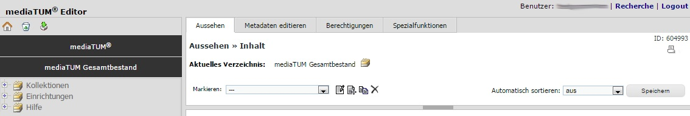
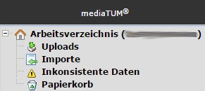
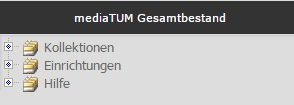
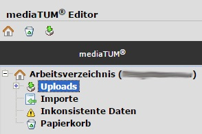
   

Der Editor-Bereich ermöglicht das Hochladen von Dateien, das Eintragen von Metadaten und die Publikation der
eingestellten Datensätze innerhalb von Kollektionen und Verzeichnissen.
Daneben sind zahlreiche weitere Funktionen verfügbar.

Der Editor-Bereich ist nur angemeldeten Nutzern zugänglich.
Melden Sie sich bei mediaTUM an, indem Sie auf der Webseite 
links oben auf **Login** klicken. Geben Sie Ihre Kennung sowie das 
zugehörige Passwort ein und klicken auf **Anmelden**. Sie erkennen 
an der Anzeige Ihres Benutzernamens oben links, dass Sie eingeloggt 
sind. Klicken Sie nun oben links auf Bearbeiten, um in den 
Bearbeitungsmodus zu wechseln.

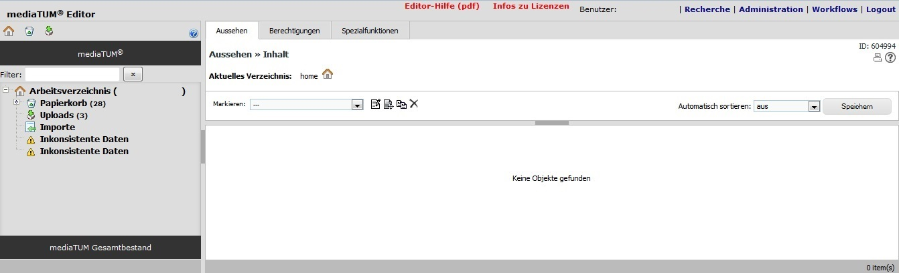
   

+----------------+-----------------------------------------------------------------+
| Symbol         | Beschreibung                                                    |
+================+=================================================================+
| |Home|         | Das Haus-Icon verlinkt direkt in das eigene Arbeitsverzeichnis. |
+----------------+-----------------------------------------------------------------+
| |Papierkorb|   | Der Papierkorb verlinkt zum eigenen Papiertkorb.                |
+----------------+-----------------------------------------------------------------+
| |Download|     | Das Pfeil-Symbol verlinkt direkt in den Upload-Bereich.         |
|                | Neue Datensätze können Sie nur in diesem Verzeichnis anlegen.   |
+----------------+-----------------------------------------------------------------+

|ErstSchri1|

Hier sehen Sie die Funktionen *Aussehen*, *Metadaten editieren*, *Berechtigungen* und *Spezialfunktionen*.
Diese Funktionen stehen Ihnen für das Bearbeiten von Objekten und Verzeichnissen zur Verfügung.
Auf der linken Seite des Bearbeitungsmodus können Sie in den Verzeichnissen von mediaTUM navigieren.

+-----------------+------------------------------------------------------------+
| |ErstSchri2|    |**mediaTUM** enthält Ihr persönliches Arbeitsverzeichnis.   |
|                 |In Klammern wird Ihr Benutzername angezeigt.                |
|                 |Dieses Verzeichnis ist nur für Sie sichtbar.                |
+-----------------+------------------------------------------------------------+
| |ErstSchri3|    |**mediaTUM Gesamtverzeichnis** enthält den veröffentlichten |
|                 |Bestand. Dorthin verschieben bzw. publizieren Sie die       |
|                 |fertigen bibliothraphischen Datensätze. Dadurch werden diese|
|                 |für die Öffentlichkeit sichtbar.                            |
+-----------------+------------------------------------------------------------+

In Ihrem Arbeitsverzeichnis legen Sie die Datensätze zunächst an, bevor sie veröffentlicht werden.
Die blaue Unterlegung zeigt an, in welchem Verzeichnis Sie sich im Moment befinden.

|ErstSchri4|

Oben links finden Sie Symbole für eine schnellere Navigation in Ihrem Arbeitsverzeichnis.

Auf der rechten Bildschirmseite befindet sich der Eingabebereich.
Hier können Sie Datensätze anlegen und bearbeiten, digitale Objekte hochladen, Berechtigungen vergeben usw.
Dieser Bereich kann vergrößert werden.
Verschieben Sie dafür den Rahmen bzw. klicken zum Ausblenden der Navigation auf den grauen Balken.

.. figure:: images/ErstSchri5.jpg
   :alt: ErstSchri5.jpg

   
   
Datensätze   
----------    

Neue Metadaten anlegen   
^^^^^^^^^^^^^^^^^^^^^^

Manuelles Anlegen eines bibliographischen Datensatzes
"""""""""""""""""""""""""""""""""""""""""""""""""""""

Wechseln Sie in den Upload-Bereich über das Pfeil-Symbol: |Download|
oder über die Verzeichnisstruktur Ihres Arbeitsverzeichnisses. Wählen
Sie **Metadaten einstellen** aus. Es öffnet sich das Menü **Neues
Metadatenobjekt anlegen**:

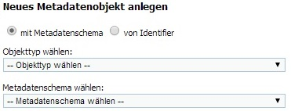

Wählen Sie zunächst den Objekttyp (z.B. **Dokumente**) und anschließend
das Metadatenschema (z.B. **Zeitschriftenaufsatz**) aus. Anschließend
erscheint der Button **Objekt erzeugen**.

.. figure:: images/ErstelleDatensatz2.jpg
   :alt: ErstelleDatensatz2.jpg

**Ergebnis:** Nachdem Sie **Objekt erzeugen** angeklickt haben, wird der
Datensatz im Upload-Ordner angelegt und kann nun editiert werden, 
siehe :ref:`Datensatz bearbeiten`.

Anlegen eines bibliographischen Datensatzes über einen Identifier
"""""""""""""""""""""""""""""""""""""""""""""""""""""""""""""""""

Wurde für das zu veröffentlichende Dokument bereits eine DOI vergeben
(z.B. für einen Aufsatz in einer Fachzeitschrift), wählen Sie im Menü
die Option von **Identifier** aus. Geben Sie die DOI in das Eingabefeld
ein und klicken Sie auf **Objekt erzeugen**.

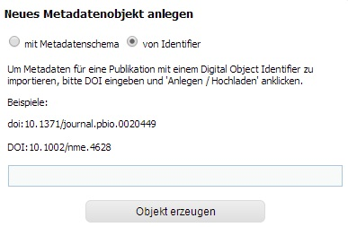

   
**Ergebnis:** Der Datensatz wird mit den Metadaten, die über die DOI
ermittelt werden konnten, angelegt und kann jetzt – falls erforderlich -
bearbeitet und ergänzt werden, siehe :ref:`Datensatz bearbeiten`.

Automatisches Anlegen bibliographischer Datensätze im BibTeX-Import
"""""""""""""""""""""""""""""""""""""""""""""""""""""""""""""""""""

Sie möchten eine Publikationsliste aus Ihrem
Literaturverwaltungsprogramm (z.B. Citavi oder EndNote) nach mediaTUM
übertragen. Exportieren Sie dafür die gewünschten Datensätze im
Bibtex-Format. Speichern Sie die Datei mit der Endung **.bib** ab.
Wechseln Sie in den Upload-Bereich über das Pfeil-Symbol
|Download|\ oder über die Verzeichnisstruktur Ihres
Arbeitsverzeichnisses. Wählen Sie **Datei(en) hochladen** aus. Es öffnet
sich ein Dialog-Fenster. Klicken Sie zunächst auf **Dateien
hinzufügen**.

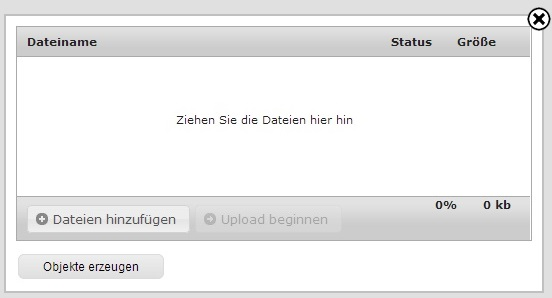

Es öffnet sich der gewohnte Windows-Dialog zur Auswahl einer Datei.
Wählen Sie die Bibtex-Datei durch Markieren aus und klicken anschließend
auf **Öffnen**. Die Auswahl **Dateiinhalt entpacken** ist
voreingestellt. Klicken Sie auf **Upload beginnen**, damit die
Bibtex-Datei auf den mediaTUM-Server übertragen wird.

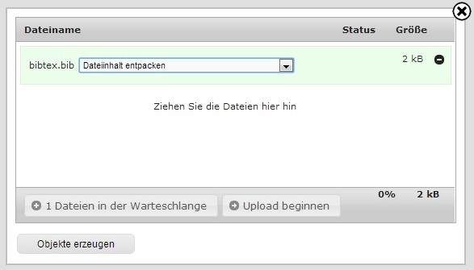

Der Inhalt der Bibtex-Datei wird überprüft. Sind Bibtex-Datensätze in
der Datei enthalten, können diese jetzt importiert werden. Klicken Sie
auf **Objekte erzeugen**.

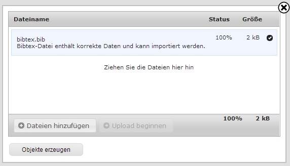

**Ergebnis:** Die Datensätze werden angelegt und können jetzt editiert
werden, siehe :ref:`Datensatz bearbeiten`.

Upload von digitalen Objekten
^^^^^^^^^^^^^^^^^^^^^^^^^^^^^

Wechseln Sie in den Upload-Bereich über das
Pfeil-Symbol:\ |Download| oder über die Verzeichnisstruktur Ihres
Arbeitsverzeichnisses. Wählen Sie **Datei(en) hochladen** aus. Es öffnet
sich ein Dialog-Fenster. Klicken Sie zunächst auf den Button **Dateien
hinzufügen**.

Es öffnet sich der gewohnte Windows-Dialog zur Auswahl einer Datei.
Wählen Sie eine oder mehrere Dateien durch Markieren aus und klicken
anschließend auf **Öffnen**.

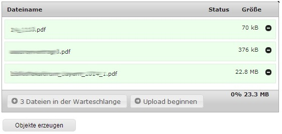

In der Dialog-Box werden die ausgewählten Dateien angezeigt. Klicken Sie
nun auf **Upload beginnen**. Dateien, die Sie doch nicht hochladen
möchten, können Sie mit einem Klick auf das Minus-Zeichen am Ende der
Anzeige wieder entfernen.

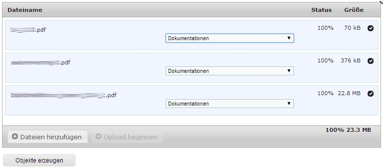

Wählen Sie nun das passende Metadatenschema aus dem Pulldown-Menü aus
und klicken dann auf **Objekte erzeugen**.

**Ergebnis:** Die Datensätze werden angelegt und können jetzt editiert
werden, siehe :ref:`Datensatz bearbeiten`.

Digitale Objekte austauschen und hinzufügen
"""""""""""""""""""""""""""""""""""""""""""

Zu einem Datensatz können nachträglich digitale Objekte ergänzt bzw.
ausgetauscht werden. Wechseln Sie in das Verzeichnis, in welchem sich
der gewünschte Datensatz befindet.

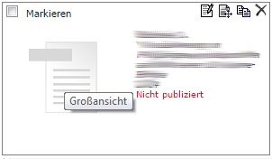

Klicken Sie in der Symbolleiste des Datensatzes auf das Symbol
|BearbeitenEdit| (Metadaten editieren) oder im linken Bereich der
Datensatz-Anzeige auf das Volltext-Symbol (Großansicht). Anschließend
wählen Sie unter **Metadaten editieren** den Unterpunkt **digitale
Objekte austauschen/hinzufügen** aus und klicken auf **Optionen**. Es
erscheint folgendes Menü:

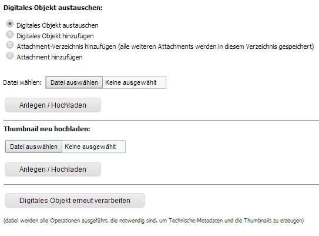

Wählen Sie **Digitales Objekt hinzufügen** aus und klicken Sie auf
**Datei auswählen**. Es öffnet sich der gewohnte Windows-Dialog zum
Auswählen einer Datei. Wählen Sie eine Datei, z.B. eine PDF-Datei, durch
Markieren und klicken Sie auf **Öffnen**. Klicken Sie anschließend auf
**Anlegen/Hochladen**.

Um den Vorgang abzuschließen, klicken Sie auf den Button **Digitales
Objekt erneut verarbeiten**. Der Text der PDF-Datei wird dadurch
durchsuchbar gemacht und ein Thumbnail für die Anzeige erzeugt.

Der Austausch eines digitalen Objekts funktioniert analog, wählen Sie
dafür zu Beginn **Digitales Objekt austauschen** aus.

Mit der Funktion **Thumbnail hochladen** können Sie ein bestehendes
Thubnail durch ein neues Thumbnail ersetzen. Die Grafik sollte 300x300px
groß sein.

.. _Datensatz bearbeiten:

Bearbeite Datensatz
^^^^^^^^^^^^^^^^^^^

Wechseln Sie zunächst in das Upload-Verzeichnis. Der Hinweis (rot hinterlegt) 
auf die Funktion *Quick-Publisher* erscheint und weist auf unpublizierte Objekte hin.

.. warning::

    **Achtung:** Dieser Schritt ist erst nach der Fertigstellung eines Datensatzes 
    nötig. Bitte nutzen Sie diese Funktion also erst nach der endgültigen Bearbeitung 
    der Datensätze. Siehe auch diese Beschreibung :ref:`Datensätze publizieren`.

.. figure:: images/Bearb1.jpg
   :alt: Bearb1.jpg

Angelegte Datensätze öffnen
"""""""""""""""""""""""""""

Ein neu angelegter Datensatz kann zur Bearbeitung geöffnet werden.
Bewegen Sie dazu den Mauszeiger auf die Datensatz-Anzeige. In der
rechten oberen Ecke der Datensatz-Anzeige erscheinen verschiedene
Optionen |BearbeitenEdit|, von denen Sie die Option (Metadaten
editieren) auswählen.

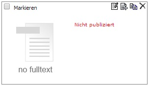

**Ergebnis:** Die Eingabemaske für die Metadaten öffnet sich.
Weitere Optionen: der Datensatz kann verschoben (|VerschiebenEdit|), kopiert (|KopierenEdit|) und wieder
gelöscht (|LoeschenEdit|) werden.

Daten eingeben und Informationen zu Feldtypen
"""""""""""""""""""""""""""""""""""""""""""""

Sie können alle Daten, die Ihnen bekannt sind, für den Datensatz
eingeben. Für jeden Datentyp sind unterschiedliche Felder vorgegeben.
Prinzipiell steht es Ihnen frei, welche und wie viele Felder Sie
ausfüllen möchten; es gibt jedoch für jedes Metadatenschema einige
Pflichtfelder, die mit einem roten Stern \* gekennzeichnet sind. Hier
muss ein Wert eingetragen werden, sonst kann der Datensatz nicht
veröffentlicht werden.

Beachten Sie, dass es verschiedene Arten von Feldern gibt:

**Textfeld:** Der Inhalt kann frei über die Tatstatur eingegeben werden.

**Indexfeld:** Der Inhalt kann ebenfalls frei eingegeben werden. Die
eingegebenen Werte werden in einem Index gespeichert, der über einen
Klick auf den Button „Index“ aufgerufen werden kann. So können Sie
früher eingegebene Werte einfach aus der Liste auswählen und klicken
anschließend auf „OK“. **Vorteil:** Sie müssen den Namen oder Wert nicht
jedes Mal neu eingeben. **Tipp:** Sie können mehrere Einträge markieren,
indem Sie die STRG-Taste drücken.

Bitte achten Sie bei der Eingabe von Autorennamen auf eine einheitliche
Schreibweise und auf die korrekte Verwendung des Semikolons, damit die
Einträge auch wirklich getrennt voneinander verzeichnet werden. Schema
für Namen: Nachname, Vorname

**Werteliste:** Aus einer vorgegebenen Liste kann genau ein vorgegebener
Wert ausgewählt werden.

**Datumsfeld:** Es kann nur ein Datum in einem bestimmten Format
eingetragen werden, z.B. dd.mm.yyyy (Tag.Monat.Jahr). Die Anzahl der
Buchstaben gibt an, mit wie vielen Stellen der Wert eingetragen werden
soll. Als Hinweis auf ein Datumsfeld steht am Ende des Feldes das
vorgegebene Format.

**Daten sichern:** Nach Eingabe von Daten müssen diese durch Anklicken
des Buttons „Speichern“ gesichert werden.

Datensätze veröffentlichen
^^^^^^^^^^^^^^^^^^^^^^^^^^

.. _Datensätze publizieren:

Quick Publisher
"""""""""""""""

Wir empfehlen Ihnen, mehrere Datensätze fertig anzulegen und diese dann
auf einmal zu publizieren. Beim Publizieren werden die Datensätze in Ihr
öffentliches Verzeichnis verschoben und sind damit für die
Öffentlichkeit sichtbar. Prüfen Sie daher vorher genau, ob die Daten
auch richtig eingegeben worden sind.

Klicken Sie auf den Upload-Ordner, der die zu veröffentlichenden
Einträge enthält. Die Datensätze werden zusammen mit dem Hinweis auf den
Quick-Publisher eingeblendet.

.. figure:: images/Bearb1.jpg
   :alt: Bearb1.jpg

Klicken Sie auf den Link **Unpublizierte Objekte jetzt publizieren
(Quick-Publisher).**

.. warning::

    Bitte beachten Sie: Es werden automatisch alle Datensätze ausgewählt –
    zu erkennen an dem Häkchen bei den einzelnen Datensätzen. Wenn Sie nur
    bestimmte Datensätze veröffentlichen wollen, entfernen dieses durch
    Anklicken bei den Datensätzen, die Sie nicht publizieren wollen.

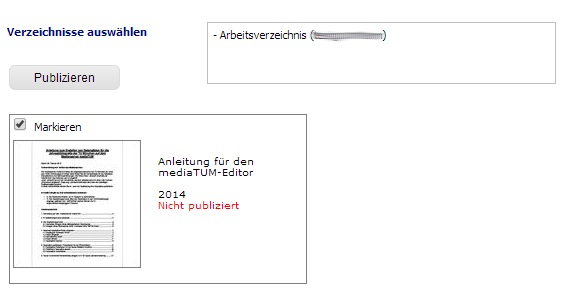

Klicken Sie nun auf den Link **Verzeichnisse auswählen**. Im folgenden
Dialog wird der öffentliche Bereich von mediaTUM in einer
Browsingstruktur angezeigt. Über das Pluszeichen (|Plus|) können Sie
die Verzeichnisse weiter öffnen. Das Verzeichnis Ihrer Institution
finden Sie unter **Einrichtungen** > **Fakultäten** oder
**Wissenschaftliche Zentralinstitute** oder **Serviceeinrichtungen**.

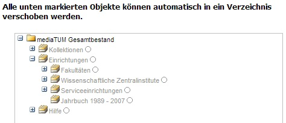

Klicken Sie sich durch zum Verzeichnis Ihrer Einrichtung. Ihre
Benutzerkennung hat automatisch die Berechtigung, Objekte im Verzeichnis
Ihres Lehrstuhls abzulegen. Verzeichnisse, für die Sie
Bearbeitungsrechte haben, erkennen Sie an der Textfarbe schwarz.
Verzeichnisse, die Sie zwar sehen, aber nicht bearbeiten können, werden
grau dargestellt. Um das Zielverzeichnis auszuwählen, klicken Sie in den
Kreis hinter dem gewünschten Verzeichnis. Bei Bedarf können Sie auch
mehrere Verzeichnisse auswählen. Dadurch werden Kopien des Datensatzes
angelegt, siehe :ref:`Datensätze einhängen <Datensätze kopieren>`.

Bestätigen Sie die Auswahl anschließend mit einem Klick auf **OK**. Die
Auswahl wird nun im Kasten neben **Publizieren** angezeigt. Klicken Sie
anschließend auf **Publizieren**. Die ausgewählten Datensätze werden
automatisch in das ausgewählte Verzeichnis verschoben und sind dann
nicht mehr im Arbeitsverzeichnis enthalten.

Beim Anlegen eines Datensatzes wird eine eindeutige ID vergeben. Der
publizierte Datensatz ist jetzt über seine Dokument-ID direkt aufrufbar,
z.B.:

.. code-block:: ruby

    http://mediatum.ub.tum.de/1166386 
    
Die ID eines Datensatzes finden Sie, wenn Sie den Datensatz im Editbereich 
aufrufen, die ID steht in der rechten oberen Ecke.

.. _Datensätze verschieben:

Datensätze verschieben
^^^^^^^^^^^^^^^^^^^^^^

Publizierte Datensätze können verschoben werden. Das ist z.B. notwendig,
wenn Datensätze in ein falsches Verzeichnis eingestellt wurden oder die
Ordnerstruktur geändert werden soll.

Wechseln Sie über den Navigationsbaum in das Verzeichnis, in dem die
betreffenden Datensätze liegen. Wählen Sie die gewünschten Datensätze
aus, indem Sie die **Markieren-Checkbox** der betreffenden Datensätze
anhaken und führen anschließend über das Symbol |VerschiebenEdit|
(Selektierte Objekte verschieben) die gewünschte Aktion aus.

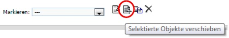

Es erscheint der Hinweis, dass ein Ziel-Verzeichnis ausgewählt werden
soll. Die Auswahl erfolgt durch das Anklicken des Verzeichnisses in der
linken Navigation. Die Datensätze werden in dieses Verzeichnis
verschoben. Wenn Sie einen einzelnen Datensatz verschieben möchten,
können Sie alternativ auch die Funktion |VerschiebenEdit| (Objekte
verschieben) aufrufen, die angezeigt wird, wenn Sie den Mauszeiger über
den betreffenden Datensatz bewegen.

.. _Datensätze kopieren:

.. Datensätze in Browsingstruktur (Klassifikation) einhängen
.. """""""""""""""""""""""""""""""""""""""""""""""""""""""""

Datensätze kopieren
^^^^^^^^^^^^^^^^^^^

Publizierte Datensätze können in andere Verzeichnisse kopiert werden.
Die Kopierfunktion benötigen Sie, wenn Sie z.B. neben einer
Ordnerstruktur, in der Datensätze nach Erscheinungsjahr einsortiert
werden, eine Ordnerstruktur nach Autoren oder Publikationstypen aufbauen
möchten.

Markieren Sie die gewünschten Datensätze wie in :ref:`Datensätze verschieben`
beschrieben und wählen die Aktion |KopierenEdit|
(Objekt kopieren bzw. selektierte Objekte kopieren) aus. Mit der Auswahl
des Zielverzeichnisses werden die Datensätze kopiert.

Wenn Sie einen einzelnen Datensatz kopieren möchten, können Sie
alternativ auch die Kopierfunktion |KopierenEdit| (Objekte kopieren)
aufrufen, die angezeigt wird, wenn Sie den Mauszeiger über den
betreffenden Datensatz bewegen.

**Hinweis zu kopierten Datensätzen:** Jeder Datensatz in mediaTUM
besitzt eine ID. Original und Kopie eines Datensatzes in mediaTUM
besitzen dieselbe ID. Verändern oder ergänzen Sie einen Datensatz in
mediaTUM, so sind dieses Anpassungen in allen Kopien sichtbar. Löschen
Sie eine Kopie eines Datensatzes, bleibt das Original in mediaTUM
erhalten.

Datensatz ändern
^^^^^^^^^^^^^^^^

Ein Datensatz kann über das Symbol |BearbeitenEdit| in der
Datensatz-Anzeige des Verzeichnisses erneut aufgerufen werden, um
Ergänzungen und Korrekturen vorzunehmen.

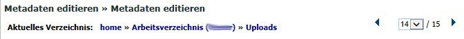

Sie können mehrere Datensätze hintereinander bearbeiten: Nachdem Sie
einen Datensatz zur Bearbeitung geöffnet haben, können Sie über die
Pfeile am oberen Rand zum nächsten oder vorherigen Datensatz wechseln.
Über das Pulldown-Menü können einzelne Datensätze auch direkt aufgerufen
werden.

Datensätze löschen
^^^^^^^^^^^^^^^^^^

Wechseln Sie zunächst in das Verzeichnis, in dem der zu löschende
Datensatz liegt. Bewegen Sie den Mauszeiger auf den zu löschenden Datensatz. 
In der rechten oberen Ecke der Anzeige erscheint das Lösch-Symbol
(|LoeschenEdit|). Klicken Sie auf dieses Lösch-Symbol. mediaTUM
fragt noch einmal nach, ob Sie den Datensatz wirklich löschen möchten.
Bei einer Bestätigung mit **OK** wird der Datensatz gelöscht bzw. in den
Papierkorb im Arbeitsverzeichnis verschoben.

Mehrere Datensätze gleichzeitig bearbeiten
^^^^^^^^^^^^^^^^^^^^^^^^^^^^^^^^^^^^^^^^^^

Markieren sie im Verzeichnis mehrere Datensätze und klicken Sie im oberen Navigationsbereich 
auf das Symbol |BearbeitenEdit|, |VerschiebenEdit|, |KopierenEdit| oder |LoeschenEdit| so gelangen Sie in die
gleichzeitige Bearbeitungsfunktion.

Es ist möglich, mehre Datensätze zu selektieren und dann gleichzeitig zu bearbeiten.
Wählen Sie dazu die Datensätze eines Verzeichnisses aus,
indem Sie die **Markieren-Checkbox** der betreffenden Datensätze anhaken.
Über das Pulldown-Menü **Markieren** können Sie auch alle Datensätze eines Verzeichnisses markieren,
eine Auswahl invertieren oder aufheben.

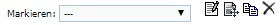
   

Klicken Sie anschließend auf |VerschiebenEdit|, |KopierenEdit| oder |LoeschenEdit| und Sie können diese 
Aktion für alle ausgewählten Dokumente durchführen.

Bearbeiten mehrerer Metadaten gleichzeitig
""""""""""""""""""""""""""""""""""""""""""

Klicken Sie anschließend auf das Symbol |BearbeitenEdit| (Metadaten
selektierter Objekte gleichzeitig bearbeiten), das sich neben dem
Pulldown-Menü **Markieren** befindet.

Die selektierten Datensätze werden nun in einer Eingabemaske angezeigt.
Ist der Inhalt eines Feldes bei allen Datensätzen identisch, wird der
Inhalt angezeigt.
Bei unterschiedlicher Feldbelegung wird ein Fragezeichen im Eingabefeld angezeigt.
Nicht belegte Felder bleiben leer.

Jetzt können Sie neue Inhalte in die Felder eintragen
:ref:`Datensatz bearbeiten`, diese werden dann in alle
ausgewählten Datensätze übernommen. Um ein Feld neu zu belegen, in dem
ein Fragezeichen angezeigt wird, müssen Sie zunächst die Checkbox
**überschreiben anhaken**, das sich neben dem Eingabefeld befindet.

Speichern Sie die Änderungen ab, indem Sie auf **Speichern** klicken.

.. warning::

    Bitte beachten Sie, dass nur Datensätze eines Metadatenschemas
    gleichzeitig bearbeitet werden können.

.. FTP-Daten verarbeiten
.. ^^^^^^^^^^^^^^^^^^^^^

.. **Voraussetzung:** Konfiguration muss entsprechend eingerichtet sein.

.. Wählen Sie Ihren Uploadordner aus und wählen Sie anschließend Metadaten
.. editieren > FTP-Daten verarbeiten wie im Screenshot gezeigt aus.

.. :: images/Ftp2.jpg
   :alt: Ftp2.jpg

..  Wählen Sie im Dropdownmenü ein Schema aus und klicken Sie anschließend
    auf |Pfeil| (Process file...). Die hochgeladene Datei ist nun im
    Upload Verzeichnis verfügbar. Anstelle von einem FTP Kommandos in der
    cmd, können Sie auch FTP-Upload Programme nutzen, wie zum Beispiel
    FileZilla.

Verzeichnisse
-------------

Verzeichnis anlegen
^^^^^^^^^^^^^^^^^^^

In der Auswahl von **Neuen Ordner anlegen** wählen Sie aus, ob Sie eine
Kollektion oder ein Verzeichnis anlegen wollen. Anschließend wird der
neue Ordner mit dem Namen **Neuer Ordner** angelegt.

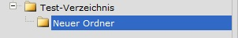

Verzeichnisse bearbeiten
^^^^^^^^^^^^^^^^^^^^^^^^

Um ein Verzeichnis bearbeiten zu können, wählen Sie mit einem Klick der
linken Maustaste dieses Verzeichnis aus. Das Verzeichnis wird durch die
Auswahl blau markiert.

Mit einem Klick der rechten Maustaste auf ein blau markiertes
Verzeichnis wird das Menü aufgerufen, das mehrere
Bearbeitungsmöglichkeiten bietet.

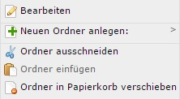

Verzeichnisse umbenennen
^^^^^^^^^^^^^^^^^^^^^^^^

Nachdem Sie mit der linken Maustaste das gewünschte Verzeichnis
ausgewählt und dann die rechte Maustaste geklickt haben, klicken Sie im
Menü auf **Bearbeiten**. Es erscheint eine Eingabemaske, in die der
deutsche und englische Verzeichnisname eingetragen werden können.
Speichern Sie die Eingaben, um die Änderungen zu sichern. Alternativ
können Sie nach der Auswahl des Verzeichnisses die Eingabemaske über den
Navigationspunkt **Metadaten editieren: Metadaten editieren** erreichen.

Verzeichnisse  sortieren
^^^^^^^^^^^^^^^^^^^^^^^^

Nachdem Sie einen Ordner markiert haben, können Sie die Unterordner über
eine Spezialfunktion in der **Menüleiste > Spezialfunktionen >
Unterordner sortieren.**

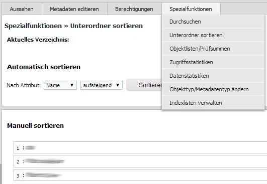

Für eine automatische Sortierung wählen Sie unter **Automatisch
sortieren** im Pulldown-Menü die Eigenschaft aus, nach der sortiert
werden soll (z.B. Name des Ordners), bestimmen die Sortierrichtung (auf-
oder absteigend) und klicken auf den Button **Sortieren**. Oder Sie
verändern die Reihenfolge der Ordner unter **Manuell sortieren** mit der
Drag-and-Drop-Funktion.

Verzeichnisse verschieben
^^^^^^^^^^^^^^^^^^^^^^^^^

Klicken Sie im Bearbeitungsmenü auf **Ordner ausschneiden**. Klicken Sie
mit der linken Maustaste den Ordner an, in den der Container eingefügt
werden soll. Im Menü wählen Sie dann die Option **Ordner einfügen** aus.

Verzeichnisse löschen
^^^^^^^^^^^^^^^^^^^^^

Ein ausgewähltes Verzeichnis können Sie über den Menüpunkt **Löschen**
entfernen. Das Verzeichnis ist nicht endgültig gelöscht, sondern wird
zunächst in den Papierkorb verschoben.

.. _Suche einrichten:

Suche einrichten
----------------

Schnellsuche einrichten
^^^^^^^^^^^^^^^^^^^^^^^

Die Startseite einer Kollektion kann individuell gestaltet werden. Dazu
gehört auch das Hinzufügen einer Schnellsuche. Zusätzlich zu dem
Suchschlitz auf der linken Seite, können direkt auf Ihrer Startseite
beliebig viele Suchschlitze mit vorgegebenen Feldern eingebaut werden.
Hierdurch ist der Sucheinstieg schneller, wenn Sie nach häufig
verwendeten Suchfeldern recherchieren möchten (im Bsp.: Autor und
Titel).

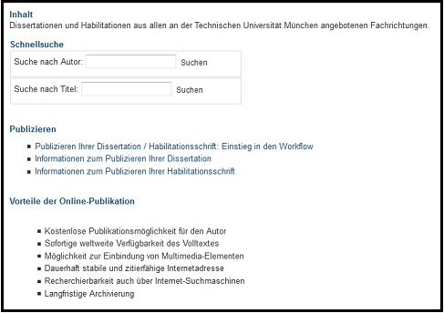

IDs müssen ausgetauscht werden, können per Metadatentypen-Export
ermittelt werden.

Erweiterte Suche einrichten
^^^^^^^^^^^^^^^^^^^^^^^^^^^    

Um eine erweiterte Suche einrichten zu können muss der Bereich in dem
gesucht werden kann eine Kollektion sein. Nur in Kollektionen kann die
erweiterte Suche eingestellt werden. Verzeichnisse dagegen haben zwar
auch die Möglichkeit der erweiterten Suche - diese kann aber nur von der
oberen Kollektion vererbt werden.

Eingerichtet wird die erweiterte Suche im Bearbeitungsbereich unter
Metadaten editieren > Suchmaske

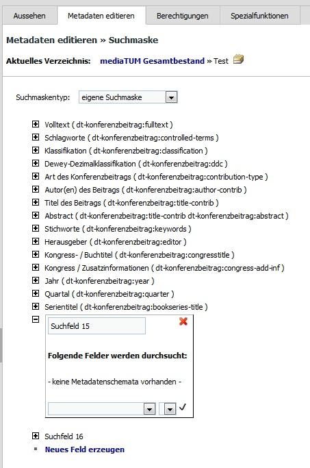

   
Als Suchmaskentyp gibt es 3 Optionen zur Auswahl:

#. Keine Suchmaske
    Wird hier *keine Suchmaske* ausgewählt, wird in der Recherche
    ausschließlich die einfache Suche angeboten.

#. Vererbt von Elternobjekt
    Bei dieser Option werden die Einstellungen der Suchmaske des
    hierarchisch höheren Elements vererbt, also identisch übernommen.

#. Eigene Suchmaske
    Eine eigene Suchmaske kann nur für Kollektionen eingerichtet werden.
    Es wird eine erweiterte Suche angeboten, in der nach unterschiedlichen
    Feldern gesucht werden kann.
    Diese Felder können mit dem Anklicken von *Neues Feld erzeugen* neu erstellt werden.
    Das Bearbeiten erfolgt mit dem *plus*-Zeichen. Es kann eine Bezeichnung ausgewählt werden, die
    anschließend im Dropdown-Menü der erweiterten Suche auftaucht.

    .. figure:: images/Suchfeld2.jpg
       :alt: Suchfeld2.jpg

    In dem Feld *Folgende Felder werden durchsucht* wird das Metadatenschema
    ausgewählt und anschließend das zu durchsuchende Feld angegeben.

    
.. _Grundlegende Rechtevergabe:   

Rechteverwaltung für Dokumente und Verzeichnisse
------------------------------------------------

Sie können die Berechtigungen auf einzelne Dokumente oder bestimmte Verzeichnisse separat einstellen.
Ordnen Sie die Gewünschten Berechtigungen zu, indem Sie das Dokument oder Verzeichnis auswählen und
anschließend unter *Berechtigungen* > *Rechtevergabe* auswählen.

Dort finden Sie drei unterschiedliche Berechtigungsformen: sehen, bearbeiten, herunterladen. 

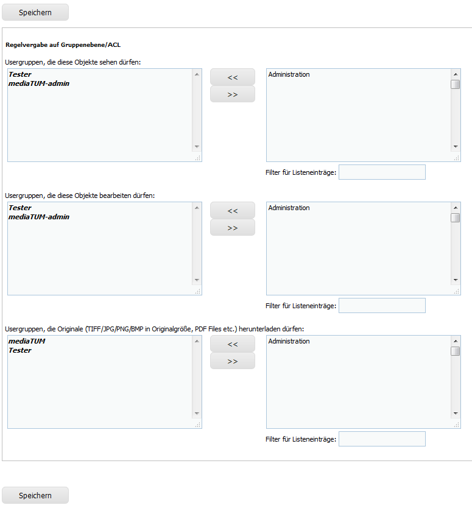
     

Diese können unabhängig voneinander Gruppen zugeordnet werden. Links sehen Sie, welche Gruppen den unterschiedlichen 
Kategorien zugeordnet wurden. Diese werden vom Überordner eines Verzeichnisses oder vom Verzeichnis eines 
Dokuments weitervererbt und damit automatisch voreingestellt.
Diese Werte können überschrieben werden, mit entsprechenden Gruppen: :ref:`Rechtevergabe Gruppenebene`. Als
Admin können  Rechte auch für einzelne Nutzer zugeordnet werden: :ref:`Rechtevergabe Admin`.  

Des Weiteren erscheint auf der rechten Seite eine Liste aller vorhandener Gruppen bzw. Benutzern. Diese
kann mithilfe des Filters für Listeneinträge schneller durchsucht werden. Tragen Sie in das Feld Ihre 
Suchanfrage ein, und es werden umgehen nur Listeneinträge angezeigt, welche die Eingabe enthalten.
Wählen Sie Ihren Treffer aus, indem Sie ihn einmal anklicken und anschließend mit << nach Links verschieben
oder indem Sie Ihn doppelt anklicken.

.. _Rechtevergabe Gruppenebene:

Rechtevergabe auf Gruppenebene
^^^^^^^^^^^^^^^^^^^^^^^^^^^^^^

Um eine Gruppe als berechtigt hinzuzufügen, suchen Sie die Gruppe in der rechten Liste und schieben Sie 
diese nach links. Nach dem Abspeichern wird diese Berechtigung aktiviert.

   
  
Möchten Sie die Vererbten Berechtigungen entziehen, müssen Sie die Regel "Nicht_Benutzergruppe" nach 
links verschieben und anschließend speichern, damit das vererbte Recht entzogen wird.

Weitere Informationen für Admins: :ref:`Rechtevergabe Admin`.
   
    
    
    
Sonstiges
---------

**Publikationsliste**

Lassen Sie automatisch auf Ihrer Homepage den aktuellen Inhalt Ihrer Verzeichnisse auf Ihrer Homepage darstellen.
MehrInformationen finden Sie unter :ref:`Publikationsliste`.

**Papierkorb leeren** |Papierkorb|

Wenn Datensätze oder Verzeichnisse gelöscht werden, werden sie zunächst
in Ihren Papierkorb geschoben. Dort können Sie wieder hergestellt bzw.
in andere Verzeichnisse geschoben werden. Sie können den Papierkorb
leeren und die enthaltenen Elemente endgültig löschen, indem Sie in
Ihrem Arbeitsverzeichnis zunächst das **Verzeichnis Papierkorb**
anklicken und anschließend die rechte Maustaste drücken. Es erscheint
ein Menü, in dem Sie **Papierkorb leeren** auswählen. Anschließend sind
die Inhalte endgültig gelöscht.

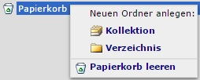

**Ausloggen** 

Um sich vom System abzumelden, klicken Sie auf **Logout**
am rechten oberen Bildschirmrand.

