Editor
======

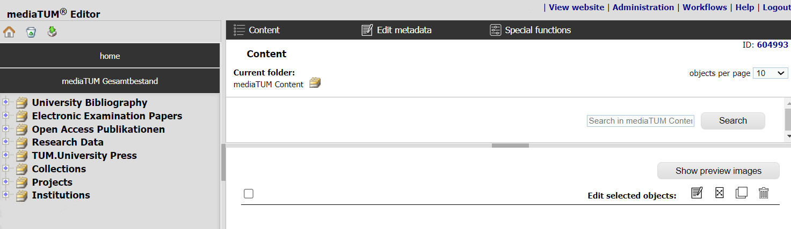
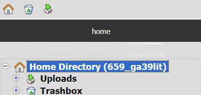
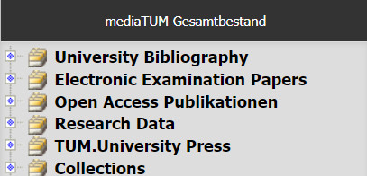
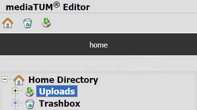

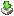

Quick Guide
-----------

mediaTUM, the institutional repository of Technical University of Munich, enables you to upload and manage your institution’s publications. mediaTUM Editor supports you in this. You can create publication lists from the entries in mediaTUM and embed them in the webpage of the institution. 

Open Editor 
^^^^^^^^^^^

- Log in at  https://mediatum.ub.tum.de.
- Click on "Edit" in the left upper corner of the page.
- You will get this view: 

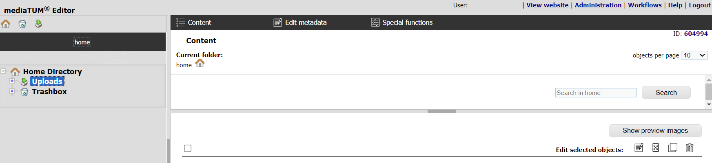

   
Creating new datasets
^^^^^^^^^^^^^^^^^^^^^

Möglichkeit 1: Option 1: click on "Create from metadata" 
""""""""""""""""""""""""""""""""""""""""""""""""""""""""

- Choose a metadata schema.
- Fill out the input mask and save your entries.
- If you want to add a full text, click on "Add files". You find this function in the upper part of the page. 
- Choose a file and click "Create / Upload".

Option 2: DOI-Import
""""""""""""""""""""

- Click "DOI-Import".
- Enter a DOI.
- Click OK.
- Metadata will be created automatically.
- Check the metadata and add it if necessary. 
   
   
Option 3: click "Upload file(s)" 
""""""""""""""""""""""""""""""""

- Choose a file, upload it, click "Start upload" and select a corresponding metadata schema
- Once you click "Create objects", a dataset will be created.
- You will find the dataset in your “Uploads” Folder (left upper corner of the page).
- To edit the dataset, click the symbol |BearbeitenEdit| "Edit metadata".

Option 4: BibTeX-Import
"""""""""""""""""""""""

- Click "BibTeX -Import".
- Upload a BibTeX-file.
- Click "Start upload".
- Click "Create objects".
- New entry will be automatically created.
- Check the metadata and edit (Click on the symbol |BearbeitenEdit|) if necessary. 

   
   

Making dataset public with "Publishing assistant" 
^^^^^^^^^^^^^^^^^^^^^^^^^^^^^^^^^^^^^^^^^^^^^^^^^

- Click "Publishing assistant".
- You see a list of available documents. Click "Choose directories".
- A directory tree will be displayed. Select one or more folders, where the dataset(s) are to be published. Click OK to confirm selection.  
- Tick the datasets to be published.
- Click on "Publish".
- Dataset will be moved to the selected folders and published.

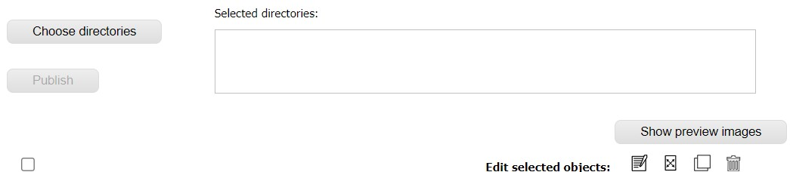
   
   
Website with publication list
^^^^^^^^^^^^^^^^^^^^^^^^^^^^^
If you need to create a publication list and embed it on a webpage of your institution, contact us for help if needed: mediatum@ub.tum.de 

First steps
-----------

The mediaTUM Editor enables you to upload files, enter metadata and publish datasets within collections and directories. Further functions are available as well.

.. figure:: ../user/images/Recherche.jpg
   :alt: Recherche.jpg

Only registered users can use mediaTUM Editor. Please log into mediaTUM by clicking on **Login** in the upper left-hand corner of the page. 
Insert your TUM-ID and the corresponding system password. Then click **Login**. Click on **Edit**, to reach mediaTUM Editor. 

+----------------+-----------------------------------------------------------------+
| Symbol         | Beschreibung                                                    |
+================+=================================================================+
| |Home|         | The home icon links directly to your own working directory.     |
+----------------+-----------------------------------------------------------------+
| |Papierkorb|   | The recycle bin links to your own recycle bin.                  |
+----------------+-----------------------------------------------------------------+
| |Download|     | The arrow symbol links to the upload area.                      |
|                | New data sets can only be created in this directory.            |
+----------------+-----------------------------------------------------------------+

|ErstSchri1|

Here you can see three functions: *Content*, *Edit metadata* and *Special functions*. 
These functions enable editing of objects and directories.

On the left side you see a navigation tree of mediaTUM.  Left-click to select an area, it will be highlighted in blue. 
Right-click to call up the **context menu**.

+-----------------+------------------------------------------------------------+
| |ErstSchri2|    |**mediaTUM** contains your personal working directory.      |
|                 |Its name is your TUM-ID.                                    |
|                 |Only you can see the content of this directory.             |
+-----------------+------------------------------------------------------------+
| |ErstSchri3|    |**mediaTUM Gesamtverzeichnis** contains all published       |
|                 |datasets. Your published datasets can be seen and found     |
|                 |in the corresponding directory of mediaTUM.                 |
|                 |If you press the symbol |Plus| you will see subfolders.     |
|                 |Gray font means that you do not possess editing rights      |
|                 |to the directory. Black font means that you can edit        |
|                 |content of a directory.                                     |
+-----------------+------------------------------------------------------------+

Create datasets in your working directory before publishing them. The datasets are not yet published. 
The blue underlay shows which directory you are currently in. 

|ErstSchri4|

In the upper left corner, you will see symbols for a quick navigation in your working directory. 

On the right side of the screen there is a working space (highlighted in blue, see below).
Here you can create and edit data records, upload digital objects, specify permissions, etc.
If you want to enlarge this area, move the frame or click on the gray bar (marked in red) to hide the navigation tree.

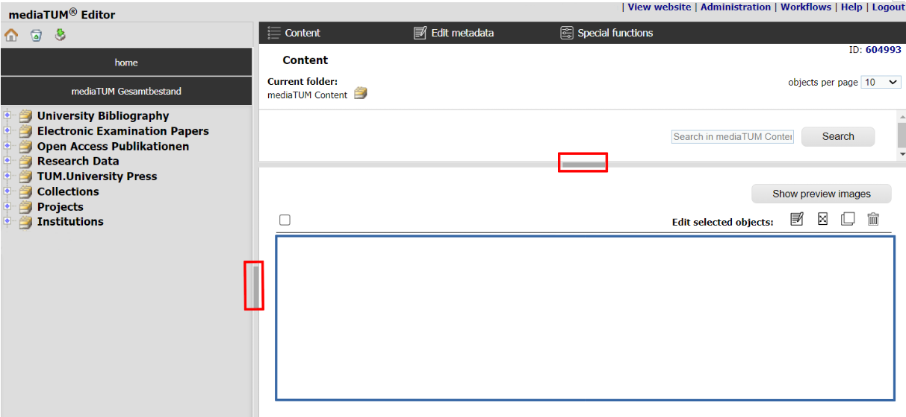

Datasets
--------

Creating new metadata
^^^^^^^^^^^^^^^^^^^^^

Creating dataset manually
"""""""""""""""""""""""""

Switch to the upload area by clicking on arrow symbol: |Download| 
or via the directory structure of your working directory. 
Choose option **Create from metadata**. You will see a window called 
**Create new object from metadata**:

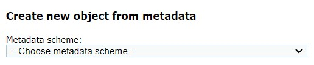

Select a metadata schema (for example, **journal article**). Then the button **Create object** appears.

As a result, a dataset will be created and you can find it in your upload directory. If necessary, the dataset can be edited.
see :ref:`Editing dataset`.

Creating dataset with DOI
"""""""""""""""""""""""""

If you have a DOI for a document that has already been published (for example, an article in a journal), 
go for option **DOI import**. Insert the DOI into the input field and click on **OK**.

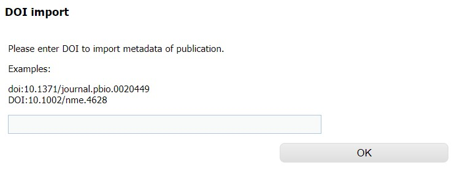

By determining metadata via DOI a dataset will be automatically created. If necessary, the dataset can be edited. See :ref:`Editing dataset`. 

Automatic creation of a bibliographic record via BibTeX import
""""""""""""""""""""""""""""""""""""""""""""""""""""""""""""""

If you want to transfer a list of publications from your reference management program 
(e.g. Citavi or EndNote) to mediaTUM, export desired data records in BibTeX format. 
The file must have a .bib extension and the encoding UTF-8. 
Switch to upload area by clicking on an arrow symbol: |Download| or use the directory structure 
of your working directory.
Choose option **BibTeX import**. A dialogue window will open. Click on **Add files**

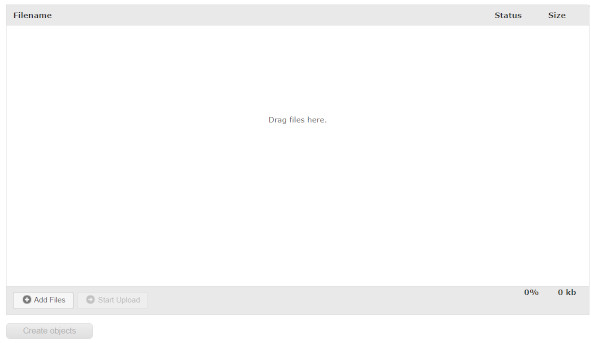

A dialogue window will open. Select a BibTeX file and click **Open**. **Unpack file content** is preset. 
Click on **Start upload**. The BibTeX file will be automatically transferred into mediaTUM.

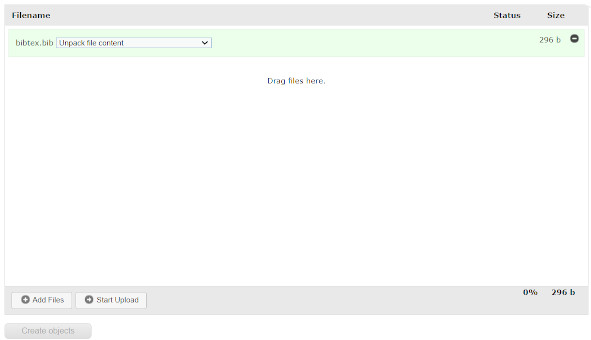

The content of the BibTeX file will be checked. If BibTeX data records are available in the file, 
they will be imported. Click on **Create objects**.

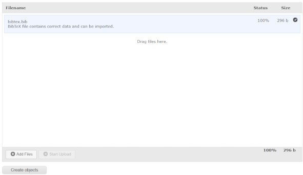

**Result:** Datasets will be created and can be edited if necessary. See :ref:`Datensatz bearbeiten`.

Uploading Digital Objects
^^^^^^^^^^^^^^^^^^^^^^^^^

Switch to upload area by clicking on arrow symbol: |Download| or use the directory structure 
of your working directory. Select option **Upload file(s)**. A dialogue window will open. 
Click on **Add files**.

A dialogue window will open. Select one or more files to be uploaded. Click on **Open**. 

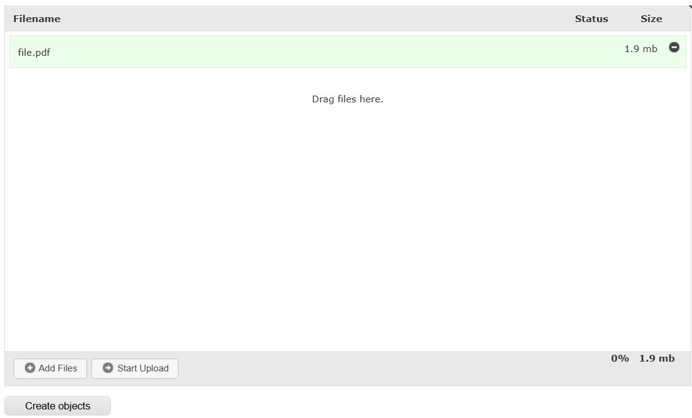

In the dialogue window selected files will be listed. Click on **Start upload**. 
By clicking on the minus sign, you can deselect a file if it should not be uploaded. 

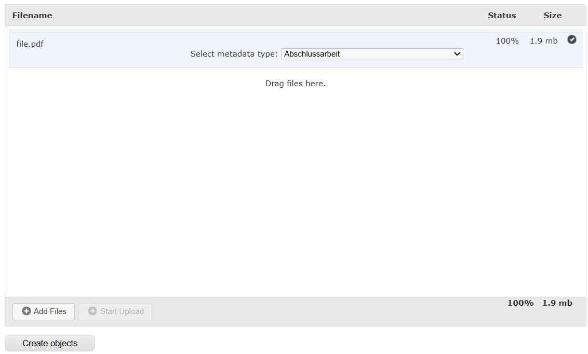

Select a corresponding metadata schema from the drop-down menu and click on **Create object(s)**. 

**Result:** Datasets will be created and can be edited if necessary. See :ref:`Datensatz bearbeiten`. 

Exchanging and adding digital objects
"""""""""""""""""""""""""""""""""""""

If necessary you can add or exchange digital objects in the existing dataset. Switch to the directory in which the dataset was created. 

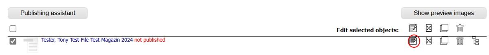

Klicken Sie in der Symbolleiste des Datensatzes auf das Symbol
|BearbeitenEdit| (Metadaten bearbeiten). Anschließend
wählen Sie im Menü **Datei hinzufügen** aus. Es erscheint folgendes Menü:

Click on the symbol |BearbeitenEdit| (Edit metadata) and then click **Add files** (upper part of the screen). You will get this view: 

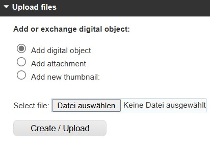

Choose option **Add or exchange digital object** and click **Datei auswählen**. Choose a file and click **Open**. Then click **Create/Upload**.
You can exchange a file in a dataset in the same way.

If other file formats need to be uploaded, you can add them via option **Add attachment**. Attachments have no file format restrictions, but can only be opened separately in the attachment browser. Alternatively, you can create metadata for each attachment. See :ref:`Kindelemente`.

The function **Add new thumbnail** exchanges an existing thumbnail with a new one. The image should be at least 300x300 in size. 

.. _Kindelemente:

Child elements
""""""""""""""

As an alternative to attachments you can create child elements. The advantage is that each element gets its own metadata and can therefore be found individually. Moreover, links are created between the elements.

Load Retrieve a dataset. Assign child elements to your  dataset by selecting Children tab under **Add file**. You will see an overview of all attached child elements if they have already been linked.

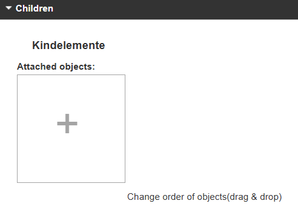

The dataset that is currently open is a parent element, while a list consists of child elements. To add a child element, first click on the symbol |Plus|.

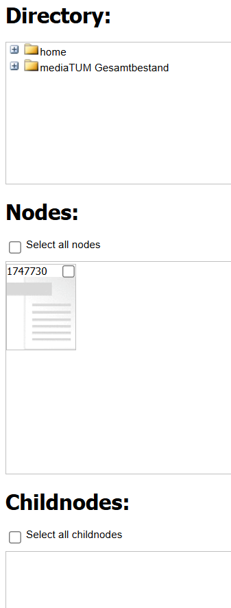

You get a list of datasets which you can attach as *children*. The tree structure of mediaTUM is displayed as well. You can assign elements as *children* from your home directory and from the entire inventory of mediaTUM. The content of the folder you select in the tree structure is displayed under element nodes. Mark the desired element with a tick |Checked| and confirm the selection with *OK*. You will return to the initial view in which the new child element is listed. If several child elements are available, you can change the sequence by drag-and-drop. Click Save in the end.

Child elements are listed in the individual view and can be clicked on individually. This is how you get to the respective metadata.

.. _Datensatz bearbeiten:

Editing Dataset
^^^^^^^^^^^^^^^

Opening created dataset
"""""""""""""""""""""""

A newly created dataset can be edited. Click on the symbol |BearbeitenEdit| (Edit metadata). 

**Result:** The input mask will open and metadata can be edited if necessary. You can also use further options: Move object (|VerschiebenEdit|), copy object (|KopierenEdit|) and delete object (|LoeschenEdit|).

Entering Data and Field Type Information
""""""""""""""""""""""""""""""""""""""""

In metadata fields you can insert all available information. For each data type there is an own metadata schema. You decide which fields will be filled out. However, there are some mandatory fields. They are marked with a red asterisk *. These fields must be filled out, otherwise you cannot publish the dataset. 

Keep in mind, there are different types of fields:

**Text field:** A text can be freely entered.

**Indexfield:** The content can also be entered freely. Entered values are saved in an index which can be called up by clicking on the *Index* button. This way you can select previously entered values from the list and then click on *OK*. **Advantage:** You do not have to re-enter the name or a value each time. **Tip:** You can select several entries by pressing the CTRL key.

When entering author names, please ensure that the spelling is consistent and semicolons are used correctly so that entries are really recorded separately. Format for names: Last name, first name

**Value list:** a value can be selected from a predefined list. 

**Date field:** only one data in one format can be entered, e.g. dd.mm.yyyy (day.month.year). A number of letters indicates a number of digits data should consist of. A specified format of date can be seen on the right side of the field.

**Save data:** once data has been entered, it must be saved by clicking on *Save* button.

Publishing datasets
^^^^^^^^^^^^^^^^^^^

.. _Datensätze publizieren:

Publishing assistant
""""""""""""""""""""

We recommend creating several datasets and then publishing them all at once. During the process of publishing, datasets are moved to your public directory and become publicly available. Carefully check the files and corresponding metadata before publishing. 

Switch to the upload folder containing datasets to be published. Click on **Publishing assistant**. The following view appears:

Click on **Choose directories**. The public area of mediaTUM is displayed. You can open directories by clicking on the plus symbol (|Plus|).

You can find your institution's directory under Institutions > Schools.

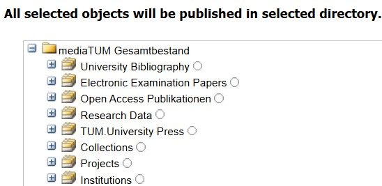

Open your institution's directory. Your user ID automatically has the right to store objects in the directory of your chair. If you possess editing rights to the directory, its name will be marked in bold black font. 
Directories that you can see but not edit are shown in gray. To select the target directory, tick the circle next to the directory’s name. If necessary, you can also select several directories. In this case copies of a dataset will be created. See :ref:`Datensätze einhängen <Datensätze kopieren>`.

Confirm your choice by clicking on *OK*. Selected directories will be displayed next to button **Publish**. Selected datasets will be automatically moved from your home directory into selected directories.

While being created, each dataset gets its own ID. The published dataset can be called up via its document ID, e.g.

.. code-block:: ruby

    https://mediatum.ub.tum.de/1166386

When you switch into mediaTUM editor (click on **edit**), you will find the ID of the dataset in the upper right corner of the screen.

Assigning Creative Commons Licenses
"""""""""""""""""""""""""""""""""""

The input mask for a metadata of an object also contains a field *CC license*. You can choose a desired license in the dropdown list. The license icon contains linked information (logo and a link). 
  
For further information on Creative Commons licenses please refer to this document: https://mediatum.ub.tum.de/1289704

.. _Datensätze verschieben:

Moving datasets
^^^^^^^^^^^^^^^

Published datasets can be moved if necessary. For example, 
if a dataset was published in the wrong directory or a navigation tree was restructured. 

Switch to the directory in which the affected data sets are stored. 
Select the desired datasets by ticking a checkbox of a respective dataset(s) 
and then click on the symbol |VerschiebenEdit| (Move objects).

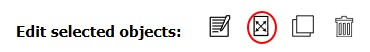

You will get a notice that a target directory is to be selected. 
Click on the directory on the left side. The datasets will be moved to this directory. 
If you want to move a single dataset, you can alternatively call up the function 
|VerschiebenEdit| (Move objects).

.. _Datensätze kopieren:

.. Datensätze in Browsingstruktur (Klassifikation) einhängen
.. """""""""""""""""""""""""""""""""""""""""""""""""""""""""

Copying datasets
^^^^^^^^^^^^^^^^

Published records can be copied to other directories. 
You need the copy function if, for example, you want to set up a folder structure 
according to authors or publication types in addition to a folder structure 
in which records are sorted according to year of publication.

Mark desired datasets as described in :ref:`Datensätze verschieben` and click on the symbol 
|KopierenEdit| (Copy object). When you select a directory in the navigation tree, 
dataset(s) will be copied. 

If you wish to copy one single dataset, click on the symbol |KopierenEdit| (Objekte kopieren). 

**Note:** Each data record in mediaTUM has an ID. The original and the copy of a dataset 
in mediaTUM have the same ID. If you change metadata or exchange files of the dataset, 
these adjustments are visible in all copies. If you delete a copy of a dataset, 
the original remains in mediaTUM.

Editing dataset
^^^^^^^^^^^^^^^

Ein Datensatz kann über das Symbol |BearbeitenEdit| in der
Datensatz-Anzeige des Verzeichnisses erneut aufgerufen werden, um
Ergänzungen und Korrekturen vorzunehmen.

If you need to modify a dataset, use the symbol |BearbeitenEdit|. 

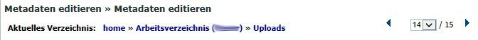

You can edit several data sets in succession: open a dataset for editing, 
then switch to the next or previous dataset using the arrows at the upper right top part of the screen. Individual datasets can also be called up directly via the pull-down menu.

Datensätze löschen
^^^^^^^^^^^^^^^^^^

Wechseln Sie zunächst in das Verzeichnis, in dem der zu löschende
Datensatz liegt. Bewegen Sie den Mauszeiger auf den zu löschenden Datensatz.
In der rechten oberen Ecke der Anzeige erscheint das Lösch-Symbol
(|LoeschenEdit|). Klicken Sie auf dieses Lösch-Symbol. mediaTUM
fragt noch einmal nach, ob Sie den Datensatz wirklich löschen möchten.
Bei einer Bestätigung mit **OK** wird der Datensatz gelöscht bzw. in den
Papierkorb im Arbeitsverzeichnis verschoben.

Editing multiple data sets simultaneously
^^^^^^^^^^^^^^^^^^^^^^^^^^^^^^^^^^^^^^^^^

You can edit several datasets simultaneously.
Mark multiple data sets in the directory. To edit them, click on the symbol you need |BearbeitenEdit|, |VerschiebenEdit|, |KopierenEdit| or |LoeschenEdit| (upper level of the menu). 

    • |BearbeitenEdit| stands for editing
    • |VerschiebenEdit| stands for moving
    • |KopierenEdit| stands for copying
    • |LoeschenEdit| stands for deleting

Editing multiple datasets simultaneously
""""""""""""""""""""""""""""""""""""""""

Choose all datasets you need to edit. If you want to edit metadata of the datasets, 
click on the symbol |BearbeitenEdit| (Edit metadata of selected objects).

Selected datasets will be displayed in the input mask. If the content of a metadata field 
is identical for all datasets, this content will be displayed. If you see a question sign, 
it means the content of the field is different in the selected datasets. 
If the field has not been filled out, it will be displayed empty. 

Now you can insert new content into fields, see also :ref:`Datensatz bearbeiten`. New information will be inserted in all selected datasets. 
If you wish to update information in the fields marked by a question mark, tick the box **Overwrite**, which you can see next to the field. 

Click **Save** to save your changes. 

.. warning::

    Please note that only data sets of the same metadata schema can be edited simultaneously.

.. FTP-Daten verarbeiten
.. ^^^^^^^^^^^^^^^^^^^^^

.. **Voraussetzung:** Konfiguration muss entsprechend eingerichtet sein.

.. Wählen Sie Ihren Uploadordner aus und wählen Sie anschließend Metadaten
.. editieren > FTP-Daten verarbeiten wie im Screenshot gezeigt aus.

.. :: images/Ftp2.jpg
   :alt: Ftp2.jpg

..  Wählen Sie im Dropdownmenü ein Schema aus und klicken Sie anschließend
    auf |Pfeil| (Process file...). Die hochgeladene Datei ist nun im
    Upload Verzeichnis verfügbar. Anstelle von einem FTP Kommandos in der
    cmd, können Sie auch FTP-Upload Programme nutzen, wie zum Beispiel
    FileZilla.

.. _Ordner: 

Folder
------

In this chapter, the terms *folder*, *directory* and *collection* are used. 
All three terms describe entities that can be hierarchically embedded into mediaTUM. Each entity can contain several documents. 
*Folder* is to be understood as a generic term for *directory* and *collection*. Special features of collection are explained here: :ref:`Besonderheiten Kollektion`.

Creating a folder
^^^^^^^^^^^^^^^^^

Navigate to the area where you wish to create a folder. Right-click on the current folder and then **Add new folder**.

Select whether you want to create a collection or a directory. A new folder is then created and is called New Folder.

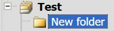

Editing a folder
^^^^^^^^^^^^^^^^

Um eine Kollektion oder ein Verzeichnis bearbeiten zu können, wählen Sie mit einem Klick der linken Maustaste diesen Ordner aus.
Der Ordner wird durch die Auswahl blau markiert.

If you wish to edit a collection or a directory, select it with a left-click. The selected folder will be highlighted in blue. 

Mit einem Klick der rechten Maustaste auf ein blau markierter Ordner wird das Menü aufgerufen, das mehrere Bearbeitungsmöglichkeiten bietet.

Right-click on the folder, which is marked in blue now. A context menu will appear. 

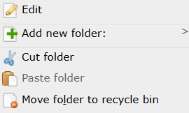

Renaming a folder
^^^^^^^^^^^^^^^^^

Left-click to choose a folder to be renamed. Then right-click to call up a context menu. Choose **Edit**. Use the input mask to enter German or English folder names. Press **Save** to save entries. Alternatively, change the name of the entity by using **Edit metadata** function. 

See also: :ref:`Besonderheiten Kollektion`.

Sorting subdirectories
^^^^^^^^^^^^^^^^^^^^^^

Select a folder. Then sort its subdirectories by using **Special Functions > Sort subdirectories**. 
Select **Sort automatically** for automatic sorting. In the pull-down menu, select the property to be used for sorting. E.g. **name of the folder**. Then determine the sorting direction (ascending or descending) and click on the **Sort** button. 
Manually change the order of folders by using the drag-and-drop function.

Moving a folder
^^^^^^^^^^^^^^^

Left-click to choose a folder to be moved. Right-click to call up a context menu. Choose **Cut folder**.
left click on the destination folder. Then select the option Paste Folder. 

Deleting a folder
^^^^^^^^^^^^^^^^^

To move a folder to the recycle bin, select a folder. Then right-click to call up the context menu. Choose **Move Folder to Recycle Bin**. The folder is not permanently deleted, it is only removed. 
To permanently delete a folder, move it to the recycle bin. Then empty the recycle bin. 

.. _Besonderheiten Kollektion:

Special features of a collection
^^^^^^^^^^^^^^^^^^^^^^^^^^^^^^^^

- **Default view of hitlists:** specify a default view of the hits. See also :ref:`Default-Ansichten`
- **Logo for landing pages:** applicable only for collections. See :ref:`Logo`.
- **Number of documents:** to know the number of datasets in a folder, switch into Editor. The number of items is displayed in the right bottom corner of the screen. 

Searching in Editor
-------------------

It is possible to search for datasets in a folder in the editor mode. Search in editor mode is congruent to research mode, see :ref:`Suche`.

Configuirung start pages
------------------------

Setting up a start page
^^^^^^^^^^^^^^^^^^^^^^^

You can set up a start page for your collections or directories. 
Other pages can also be created and linked from the start page.
If no start page exists, all content of the entity will be displayed. 

First, enter mediaTUM editor and choose a collection or a directory for which a start page will be created. 
It does not matter whether it is a public folder or not.

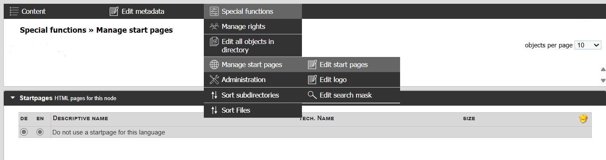

Once you have clicked on a collection or a directory, it will be marked in blue. Now you can create a start page. Menu **Special functions > Manage start pages > Edit start pages**.  
Click on |Neu| to open an input window for the content of your page. Next, click **Source** to enter HTML code and save it. 
Then find your new entry under Start pages. If applicable, rename the page. 
Lastly, on the left-hand side, select a display language for the page.

.. _Logo:

Logo
^^^^

This function is available only for collections, but is independent from start pages. 
You can display a logo for your area, which optionally links to an URL.

First, navigate to the collection and click on it so that it is highlighted in blue. Menu **Special functions > Manage start pages > Edit logo**.

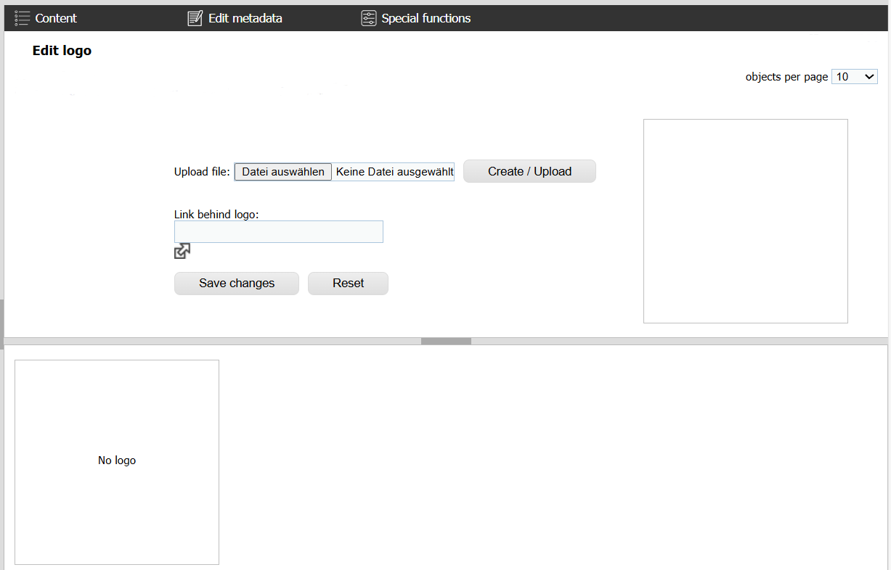

Select your logo, then upload it with *Create / Upload* and save the changes. Now the logo will be displayed on your collection page.

If you have entered an URL, clicking on the logo will take you to the link.

.. _Suche einrichten:

Setting up Search
-----------------

Setting up  quick search
^^^^^^^^^^^^^^^^^^^^^^^^

The landing page of a collection can be customized. You can set up a quick search, if you wish. In addition to a search slot on the left-hand side, add any number of search slots with predefined fields directly to your landing page. This makes the search quicker if you search for frequently used search fields (e.g. author and title).

Setting up advanced search
^^^^^^^^^^^^^^^^^^^^^^^^^^

Setting up an advanced search is possible only for collections. 
For directories, advanced search is only possible by adding them to a collection 
that allows advanced search. Then, directories inherit search settings 
from the upper collection. 

To start setting up advanced search, go to **Special functions > Manage start pages > Edit search mask**

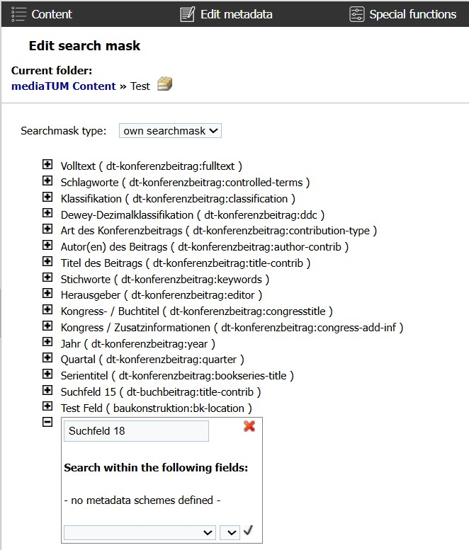

There are three options to choose:

#. no search mask
    If no search mask is selected, only a simple search is offered.

#. use from parent
    Settings of a search mask of the hierarchically higher element are inherited, i.e. adopted identically.

#. own search mask 
    An own search mask can be set up only for collections. Advanced search offers multiple fields in which a search will be carried out. To create a new search field, click on *add new field*. To edit field settings click *plus*. A designation can be selected, which then appears in the drop-down menu of the extended search.
   
    In *Search within the following fields* a metadata schema is selected. Then a field to be searched in will be specified.

.. _Grundlegende Rechtevergabe:

Right management
----------------

With the help of rights management function, it is possible to define: 
- who is authorised to reach individual folders and metadata entries
- who is authorised to download PDFs 
- who is authorised to edit folders and datasets   

Basic principle: rights are applied to the folder. Subfolders and datasets within it inherit the same rights. 
However, you can customise the rights (extend or restrict) on subfolders or datasets.
Please note: datasets can be published in multiple places in the directory tree, 
in this case they inherit the rights from all high-level (parent) folders.   

The metadata and full texts of datasets in a repository like mediaTUM should be accessible as free as possible. 
It means the rights for datasets and digital objects should be set to "Jeder" ("Jeder" means "everyone" in English).

However, there may be some reasons to restrict access: 

- Embargo period (e.g. Dissertations)
- Access restrictions due to contractual agreements, e.g. Access only within campus
- Internal documents

The right management is accessible in Editor via the menu bar “Special functions” – “Manage rights”: 

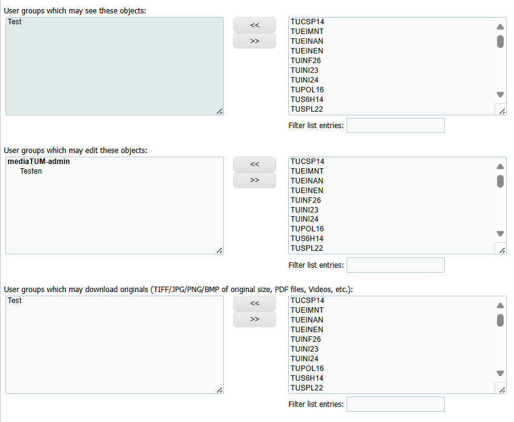

The boxes on the left side show which user groups possess which rights. On the right side you can see the list of groups that can be added.

Click on the group, to highlight it. Use arrow keys or double click to move the group either to the right or to the left. 

Applied changes to the assigned rights must be confirmed with “Save”-button. 

Use "Filter list entries" to search for a group.

If the group is marked in bold, it means these rights are inherited from high-level directory and can not be moved. 

You can determine rights on the folders and on the individual datasets as well. 

Rights assignment on individual items: 

- User groups which may see these objects: if "Jeder" is assigned, it means everyone can see the folder or the metadata of the dataset without any restrictions. 
- User groups which may edit these objects:  users can  create and edit datasets; create, rename and delete subfolders. To perform these actions, a user group must be assigned for this folder.
- User groups which may download originals: if "Jeder" is set here, it means everyone can see and download the preview-image and the digital object (PDF, Image) without restrictions. 

By setting "Nicht jeder", all assigned and inherited rights will be revoked. In other words, "Nicht jeder" blocks all the existing rights assigned to the item. 
Please note, the administrators will still have access and editing rights despite "Nicht jeder" and will be able to access the dataset or the folder. 

By adding a concrete group in the boxes 
"User groups which may see these objects" or "User groups which may download originals", only assigned group will be able to reach the metadata or upload the digital objects accordingly.  

Miscellaneous
-------------

**List of publications**

Content of your mediaTUM directory can be displayed on your personal homepage. For further information please refer to :ref:`Publikationsliste`.

**Recycle bin** |Papierkorb|

When content is deleted, it is moved to your recycle bin. From there it can be restored or moved to other directories.

To permanently delete content, empty the recycle bin. However, emptying the recycle bin permanently deletes its entire content. Please consider the content carefully. It cannot be reinstated once the recycle bin has been emptied! 

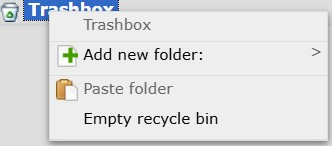

To restore a dataset, move it back to your home directory . Move a dataset by clicking on Move object and left click on your home directory. To move several documents at the same time, select all of them and click on |VerschiebenEdit| selected objects in the upper area. Then left click on your upload folder, and all selected records will be moved at the same time.

To permanently delete the content of the recycle bin, left-click on recycle bin so it is highlighted in blue. Then right-click for the context menu. Here, choose Empty recycle bin. The content will be permanently deleted. 

**Logout**

To log out of the system, click **Logout**
at the top right of the screen.

