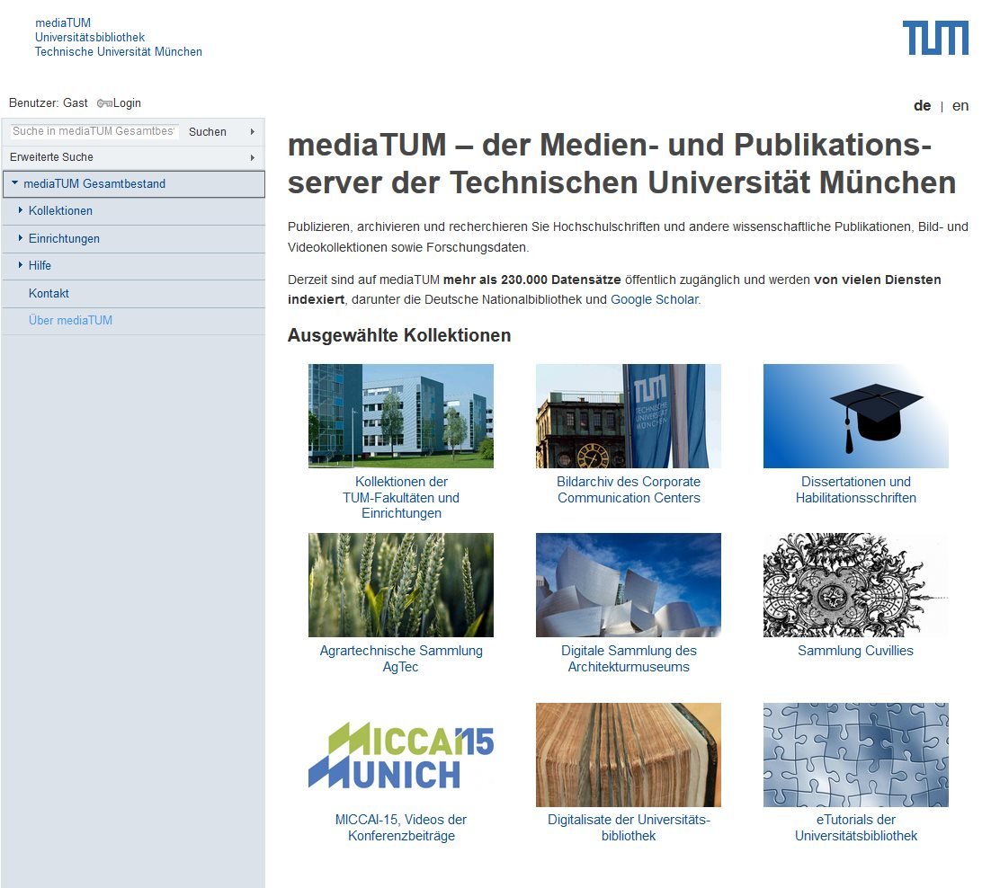
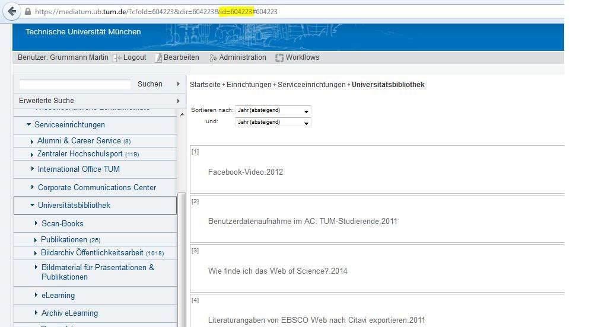
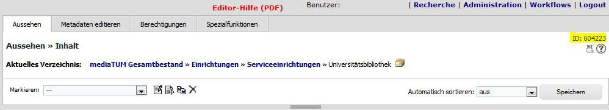
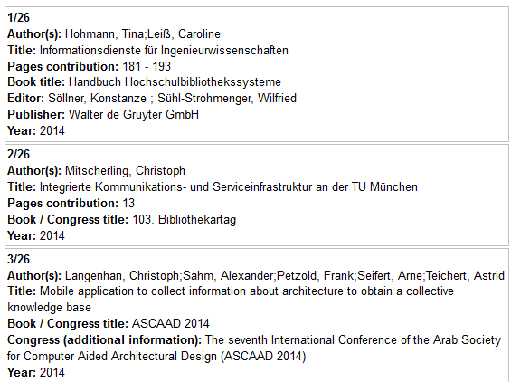

Anwender-Dokumentation
======================

Die folgenden Abschnitte beschreiben Funktionalitäten von mediaTUM für die eine Registrierung und Anmeldung des Nutzers nicht notwendig ist.

   

Navigation
----------

Inhalte werden in mediaTUM in einer Hierarchie von Kollektionen und Verzeichnissen bereitgestellt.
Im Seitenaufbau auf der linken Seite befindet sich der Navigationsbaum.
Er ist hierarchisch aufgebaut und bietet eine Übersicht aller Inhalte und ermöglicht den gezielten Aufruf einzelner Kollektionen.

Wenn keine Startseite für eine Kollektion erstellt wurde, sehen Sie die Inhalte aller Unterordner.
Klicken Sie auf ein Unterverzeichnis, damit die Anzeige weiter gefiltert wird.
Handelt es sich um ein Verzeichnis, sehen Sie im Navigationsbaum neben dem Verzeichnisnamen eine Zahl.
Diese nennt die Anzahl aller Dokumente, die in diesem Verzeichnis liegen.
Wenn Sie weniger Treffer einsehen können, als die Zahl beschreibt, sind interne Dokumente im Verzeichnis enthalten.
Damit Sie diese einsehen können, müssen Sie sich mit einem Account mit entsprechenden Berechtigungen einloggen.

Suche
-----

In dem Eingabefeld links oben kann eine einfache Suche durchgeführt werden. 
Beim Ausführen einer Suche auf der mediaTUM Startseite wird eine Suche im Gesamtbestand durchgeführt.
Wechselt man in eine Kollektion oder ein Unterverzeichnis, werden nur diese Bestände durchsucht.
Für einzelne Kollektionen kann auch eine erweiterte Suche durchgeführt werden, erreichbar über den Link "Erweiterte Suche".
Hier kann gezielt nach Inhalten in einzelnen Felder gesucht werden:
neben der Eingabe von Suchbegriffen ist eine Auswahl aus Index-Listen möglich.
Welche Felder durchsuchbar sind, wird vom Inhaber der Kollektion festgelegt: :ref:`Suche Einrichten`.

Inhalte darstellen
------------------

.. _Default-Ansichten:

Ansicht anpassen
^^^^^^^^^^^^^^^^

Wenn mehrere Dokumente aufgelistet werden, entweder nach einer Suche oder öffnen eines Bereichs, können Sie die Darstellung anpassen.
Sie können oben rechts zwischen vier Optionen wählen.

* Listen-Ansicht nur Text: Kompakte Darstellung, da keine Thumbnials dargestellt werden.
* Listen-Ansicht mit Thumbnail: Kompakte Darstellung, benötigt etwas Platz, da kleine Thumbnails sichtbar sind.
* Thumbnail-Ansicht: Ähnliche Darstellung wie die Listen-Ansicht mit Thumbnail. Aber kompakter, weil mehrere Dokumente in einer Zeile stehen.
* Thumbnail-Ansicht(groß): Ausschließlich Thubmnails werden angezeigt. Benötigt am meisten Platz, da die Thumbnails größer als in anderen Ansichten angezeigt werden. Es werden keine Metadaten dargestellt.

Vollanzeige
^^^^^^^^^^^

Nach der Auswahl in der Trefferliste wird das Dokument in der Vollansicht angezeigt. 
Angezeigt werden die Metadaten des Dokuments, die auch im Bibtex-Format exportiert werden können.
Ist ein Volltext vorhanden, kann er über einen Klick auf das Thumbnail aufgerufen werden.

Der Zugriff auf einen Volltext kann über IP-Adressen (z.B. campusweit) oder Benutzergruppen geregelt werden. 
Nicht immer ist ein Volltext vorhanden, z.B. aus urheberrechtlichen Gründen.

Permalinks
----------

Einen Permalink - also ein dauerhafter Link - zu einem aufgerufenen Datensatz erhält man über den Link "Dauerhafter Link zum angezeigten Objekt".
Der Permalink mit dem Schema ``https://mediatum.ub.tum.de/<DokumentID>`` wird dann in der Adresszeile des Browsers angezeigt.

.. _Publikationsliste:

Publikationsliste
-----------------

Publikationslisten sind Listen, die mit mediaTUM erzeugt werden und die Sie auf Ihrer Homepage einbauen können.
Sie können Kollektionen und beliebige Verzeichnisse oder Abfragen zu einem Bereich ausgeben lassen.
Die einzige Voraussetzung ist, dass die Dokumente sichtbar sein müssen.
Sie können die Liste mit JavaScript oder das Typo3 Plugin CurlContent erzeugen.

Java Script
^^^^^^^^^^^
Mit dem JavaScript-Export können Sie Publikationslisten auf Ihrer Lehrstuhl-Homepage anlegen.

Einstieg
""""""""
Mit dem JavaScript-Export können Sie Publikationslisten auf Ihre Lehrstuhl-Homepage anlegen.

**So ermitteln Sie die ID Ihres Lehrstuhl-Verzeichnisses:**

Rufen Sie das Verzeichnis über die Browsing-Struktur auf.
In der Adresszeile des Browsers finden Sie die gesuchte ID, s. Screenshot.
Im Beispiel unten handelt es sich um die ID 604223 (Verzeichnis der Universitätsbibliothek).

Alternativ finden Sie die ID auch im Edit-Bereich, nachdem Sie Ihren Lehrstuhl ausgewählt haben.

Ein einfaches Code-Beispiel:

.. code:: javascript

    

    
    

Kopieren Sie den Text in eine HTML-Seite Ihrer TYPO3-Instanz und tauschen Sie die ID 615843 durch die ID des gewünschten Verzeichnisses aus.

Auf der Webseite wird dann eine Publikationsliste angezeigt:

Anpassungen der Publikationsliste
"""""""""""""""""""""""""""""""""

**mediatum_load**
Mit *mediatum_load* können Sie festlegen, welche Inhalte in der Publikationsliste angezeigt werden.
Die Zeile *mediatum_load* ist wie folgt aufgebaut: *mediatum_load(id, limit, sort, query, format, language);*

Syntax: ``mediatum_load(id, limit,’ sort’, ‘query’, ‘format’, ‘language’);``

Die einzelnen Werte werden mit Komma voneinander dargestellt.
Der Inhalt der Felder ist in folgender Tabelle beschrieben:

+----------------+----------------------------------------------------------------------------+
|id              |ID des Verzeichnisses, dessen Inhalt angezeigt werden soll.                 |
+----------------+----------------------------------------------------------------------------+
|limit           |Begrenzt die Anzahl der angezeigten Dokumente;                              |
|                |0 bedeutet, dass alle Dokumente angezeigt werden sollen.                    |
+----------------+----------------------------------------------------------------------------+
|sort            |Sortierung der Trefferliste nach dem Inhalt eines bestimmten Feldes.        |
|                |Ein Minuszeichen vor dem Feldnamen dreht die Reichenfolge um.               |
|                |Beispiel: year für Jahr.                                                    |
|                |Absteigende Sortierung: -year                                               |
|                |Aufsteigende Sortierung: year                                               |
+----------------+----------------------------------------------------------------------------+
|query           |Hier kann eine Suche hinterlegt werden, die das Suchergebnis einschränkt    |
|                |(z.B. ein Autorenname, so dass die Publikationsliste eines Autors entsteht) |
|                |z.B. year<=2013 oder author-contrib=Meier                                   |
+----------------+----------------------------------------------------------------------------+
|format          |Bleibt leer                                                                 |
+----------------+----------------------------------------------------------------------------+
|language        |Sprache (de oder en)                                                        |
+----------------+----------------------------------------------------------------------------+

**mediatum_config**

Mit mediatum_config können Sie weitere Einstellungen vornehmen.
Im Beispiel oben ist mediatum_config leer, es werden die Grundeinstellungen verwendet.

Mit output können Sie das Ausgabe-Format beeinflussen. Neben einem Standard-Format ist das APA-Format defniert.

::

    'output': 'default'
    'output': 'apa'

#. Feldinhalte anzeigen
    Sie können festlegen, welche einzelnen Felder angezeigt werden.
    Die Darstellung der Felder können Sie ebenfalls beeinflussen.

    .. code:: javascript

        
        
        

    Ergebnis:

    .. figure:: images/FelderAuswahl.png
        :alt: FelderAuswahl.png

    Die Feldanzeige wird mit *fields0* festgelegt.
    Hinter *att:* wird der Name des Feldes angegeben, dessen Inhalt angezeigt werden soll.
    Mit HTML-Tags kann der Inhalt zusätzlich ausgezeichnet werden, z.B. <b></b> für eine fette Formatierung.
    Der allgemeine Aufbau von *fields* lautet:

    .. code:: javascript

        'fields0':['<HTML-Tag>[att:Name des Feldes]</HTML-Tag>',
                   '<HTML-Tag>[att:Name des Feldes]</HTML-Tag>',
                   '<HTML-Tag>[att:Name des Feldes]</HTML-Tag'
        ],

    Auf einer Webseite können mehrere Publikationslisten angezeigt werden.
    Mit *fields0, fields1, fields2* usw. können Sie verschiedene Darstellungen definieren.
    *fields0* kennzeichnet die erste Liste, *fields1* die zweite Liste usw.
    Für die Festlegung müssen Sie die Namen der Felder in mediaTUM kennen.

    .. note::

        Für Admins: Die Feldnamen sind abhängig von eingerichteten :ref:`Sortieren` und können
        dort mit Adminrechten auch ermittelt werden.

    Wenn Sie weitere Felder in die Publikationsliste einbinden möchten, können Sie diese Feldnamen am einfachsten ermitteln, indem Sie einzelne Dokumente im XML-Format aufrufen. Dafür müssen Sie nur die ID des Dokuments angegeben:
    Beispiel: ``https://mediatum.ub.tum.de/services/export/node/1225127``
    Die Feldnamen finden Sie jeweils hinter der Bezeichnung ``<attribute name=…``

#. Navigationselemente

    Mit *type* kann eine Navigation und ein Suchfeld eingebunden werden.
    In der Navigation erscheinen die Unterverzeichnisse des Verzeichnisses.
    Mit *asc* und *desc* können sie alphabetisch (vorwärts und rückwärts) sortiert werden.
    *search* bindet ein Suchfeld ein.

    Der allgemeine Aufbau von type lautet:

    ``'type0':['struct','search','asc'],``

    Beispiel:

    .. code:: javascript

        
        
        

    .. figure:: images/Navigationselemente.png
        :alt: Navigationselemente.png

    Feldtrenner: Die Feldinhalte sind standardmäßig durch einen Zeilenumbruch voneinander getrennt.

#. Zusätzliche Definitionen

    .. code:: javascript

        
        
        

    Target: Internal: im selben Fenster Öffnen / External: ein weiteres Fenster wird geöffnet

    Style "1" (Default): Treffer der Liste werden mit Rahmen dargestellt.
                                          |
    .. figure:: images/MitRahmen.png
        :alt: MitRahmen.png

    Style "0": Treffer werden ohne Rahmen dargestellt.

    .. figure:: images/OhneRahmen.png
         :alt: OhneRahmen.png

    - Output: Gewünschtes Format wird ausgegeben: Apa, BibTex, etc. Je nachdem welche Masken für die Ausgabe verfügbar sind.

    - Groupby: Frei wählbare Grouppierungen können eingerichtet werden, z.B. nach Jahr:

      - ``'groupby': 'year|substring:0,4',``

    - Hierbei ist die vorgegebene Sortierung von mediatum_load von Bedeutung:

      - ``mediatum_load(615843, 0, 'year','', '', '');``

    - -year: oben Neuerscheinungen, year: oben älteste Einträge und unten Neuererscheinungen

#. Was ist noch zu beachten?

    Der JavaScript-Export liefert CSS-Anweisungen mit.

    .. code:: css

        

    Diese können mit eigenen CSS-Anweisungen überschrieben werden.

    Beispiel:

    .. code:: css

        

    In die Publikationslisten werden nur Einträge aufgenommen mit „Jeder“-Berechtigung.

    Weiere Informationen finden Sie unter: http://wiki.ub.tum.de/mediatum_dev/index.php5/Mediatum_dev:JavaScriptExport

Curl Content
^^^^^^^^^^^^

https://www.typo3.tum.de/index.php?id=118&L=0

.. _Export von Trefferlisten:

Export von Trefferlisten
------------------------

Allgemeine Informationen
^^^^^^^^^^^^^^^^^^^^^^^^   
          
Der Export-Link besitzt folgenden Aufbau:

``https://mediatum.ub.tum.de/services/export/node/ID/HIERARCHIE?format=FORMATANGABE``

- **ID:** ID des Verzeichnisses, dessen Inhalt exportiert werden soll. So wird die ID ermittelt:
  Nach einem Wechsel in das gewünschte Verzeichnis über den Navigationsbaum kann die gesuchte ID im Adressfeld des Browsers abgelesen werden, z.B.:

  ``https://mediatum.ub.tum.de/604223``
      
      
- **Hierarchie:** Was wird ausgegeben?

    - Keine Angabe: die ID selbst
    - parents: das Eltern-Element
    - children: die direkten Kind-Elemente (ohne den Inhalt von Unterverzeichnissen)
    - allchildren: alle Kind-Elemente (mit den Inhalten von Unterverzeichnissen)

- **Formatangabe:** Die Daten können in unterschiedlichen Formaten ausgegeben werden. XML wird standardmäßig ausgeliefert. Möglich sind auch JSON, CSV und RSS.

| **Weitere Optionen:**

- Einschränkung auf Datentypen mit ``type=[...]``

    - ``?type=directory``: listet nur Unterverzeichnisse des Elements auf
    - ``?type=document``: listet nur Dokumente auf
    - ``?type=dt-buchbeitrag``: listet nur Buchbeiträge auf; gesucht wird der Name des Metadatenschemas

- Anzahl der angezeigten Elemente verändern mit ``limit=[...]:`` 

    - ``?limit=5``: Limitierung auf 5 Elemente
    
- Einschränkung des Ergebnisses durch eine Suche mit ``q=[...]``

    - ``?q=regen``: der Suchbegriff wird in den Metadaten und im Volltext gesucht
    - ``?q=year=2016``: der Suchbegriff wird in einem Metadatenfeld (hier: year) gesucht
          Die Operatoren => (größer gleich) und <= (kleiner gleich) können für numerische Suchen verwendet werden. Die Operator > und < können nicht verwendet werden. 
          
- Suche mit regulären Ausdrücken mit ``attrreg=[...]``, schneller als die Suche mit ``q=[...]``

    - ``?attrreg=author-contrib=.*Lei[ß|s].*``: Suche nach Leiß oder Leis im Autorenfeld
    
- Sortierung mit ``sortfield=[...]``

    - ``?sortfield=-year``: absteigende Sortierung nach dem Inhalt des Feldes "year"
    - ``?sortfield=year``: aufsteigende Sortierung nach dem Inhalt des Feldes "year"
    
- Ausgabe der Inhalte über definierte Export-Masken im Feld <mask>  mit ``mask=[...]``, angegeben wird der Name der Export-Maske
    
    - ``mask=none``: keine Ausgabe
    - ``mask=default`` oder ``mask=nodesmall``: Kurzanzeige (nodesmall)
    - ``mask=bibtex``: Ausgabe im Bibtex-Format
    - ``mask=apa``: Ausgabe im APA-Format
    
- Angezeigte Felder auswählen (beim JSON-Format) mit ``attrspec=[...]`` und ``attrlist=[...]``

    - ``attrspec=none``: keine Felder werden angezeigt
    - ``attrspec=all``: alle Felder werden angezeigt (default)
    - ``attrspec=none&attrlist=year,author-contrib``: angezeigt werden nur die Felder year und author-contrib

**Ausführliche Informationen:**

-  Zu erweiterten Suchmöglichkeiten:
   http://wiki.ub.tum.de/mediatum\_dev/index.php5/Mediatume\_dev:Webservice\_REST
-  Zu Publikationslisten, mit mediaTUM als Quelle:
   https://www.typo3.tum.de/index.php?id=61&L=0

   
Download als Excel-Datei
^^^^^^^^^^^^^^^^^^^^^^^^

Einen Export im Excel-Format erhält man über folgenden Link:

``http://mediatum.ub.tum.de/services/export/node/<ID>/allchildren?format=csv&sep=;&delimiter=dquote&bom&mimetype=application/vnd.ms-excel``

Mit allchildren werden alle Kindelemente angezeigt, Vgl. (:ref:`Export von Trefferlisten`).
Eine Einschränkung mit Suchanfragen ist möglich.
Es werden alle Felder der Ergebnismenge angezeigt, eine Einschränkung der Spalten ist nicht möglich.

Beispiel mit Sucheinschränkung:

``https://mediatum.ub.tum.de/services/export/node/1175037/allchildren?format=csv&sep=;&delimiter=dquote&bom&mimetype=application/vnd.ms-excel&sortfield=author&attrreg=author=.*sch.*&q=schema=dt-report``

BibTeX-Export
^^^^^^^^^^^^^

Export im BibTeX-Format
"""""""""""""""""""""""

Der Export-Link für das BibTeX-Format hat folgenden Aufbau:

``http://mediatum.ub.tum.de/services/export/node/ID/allchildren/?format=template_test&mask=bibtex&lang=de&template=$$[defaultexport]$$\n\n&mimetype=text/plain``

**ID** und **allchildren** sind auszutauschen bei Bedarf, Vgl. (:ref:`Export von Trefferlisten`).

..
    Merkliste : Download im BibTeX-Format
    """""""""""""""""""""""""""""""""""""

    .. |MerkStern| image:: ../images/MerkLiStern.png

    .. |ObjekteMarkieren| image:: images/ObjekteMarkieren.png

    - Aufruf eines beliebigen Verzeichnisses.

    .. figure:: images/Trefferliste.png
       :alt: Trefferliste.png

    - Auswahl des gewünschten Verzeichnisses über die Navigation, z.B. „Prof. O. Fischer“

    .. figure:: images/Auswahl.png
       :alt: Auswahl.png

    - In der Anzeige werden standardmäßig nur neun Treffer angezeigt. Den Link „alle anzeigen“ anklicken, um eine vollständige Trefferliste zu erhalten.
    - Auf das Symbol |MerkStern| oberhalb der Trefferliste klicken („Aufgelistete Objekte in die Merkliste hinzufügen“).

    .. figure:: images/Hinzufügen.png
       :alt: Hinzufügen.png

    - Es erscheint die Meldung, dass die Dokumente der Merkliste hinzugefügt wurden.

    .. figure:: images/Meldung.png
       :alt: Meldung.png

    - Klickt man auf das Merklisten-Symbol |MerkStern|, wird der Inhalt der Merkliste angezeigt.

    .. figure:: images/MerklisteAnzeigen.png
       :alt: MerklisteAnzeigen.png

    .. figure:: images/MerklisteInhalt.png
       :alt: MerklisteInhalt.png

    - Nachdem alle Objekte über den Button |ObjekteMarkieren| markiert worden sind, öffnet man über den Link „Export…“ das Export-Menü. Nach einem Klick auf das bibtex-Symbol wird der gewünschte Bibtex-Export gestartet. Die bibtex-Datei kann nun weiterverarbeitet werden.

    .. figure:: images/Export.png
       :alt: Export.png

Print-Funktion
^^^^^^^^^^^^^^

Die Print-Funktion kann über das eingeblendete Druckersymbol aufgerufen werden.
Mit ihr können alle Einträge einer Kollektion als PDF-Dokumente exportiert werden.