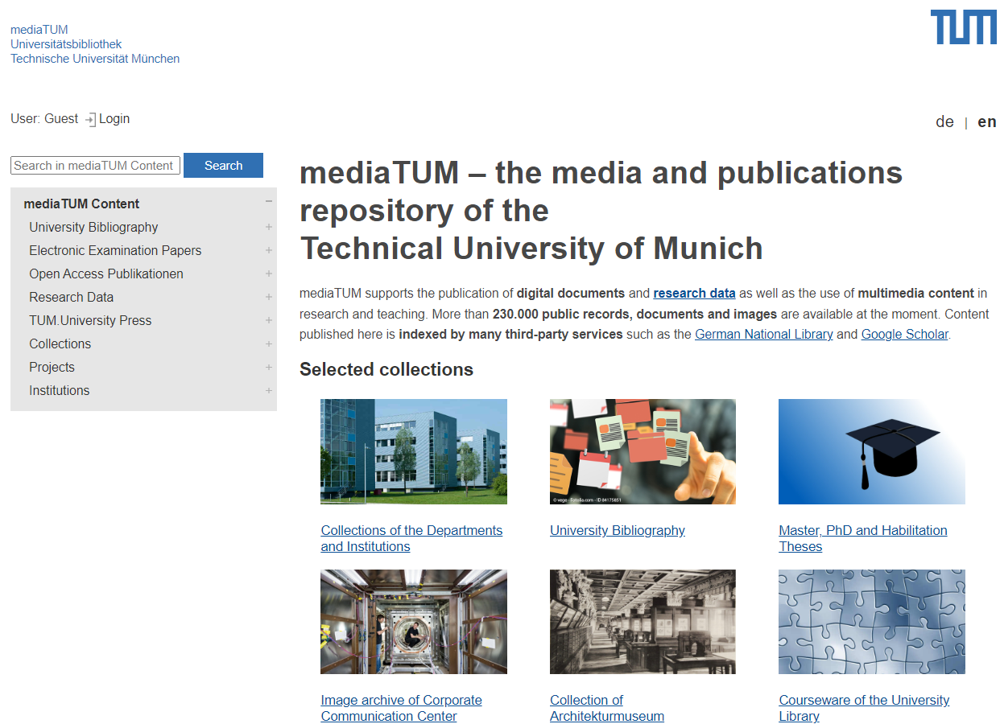
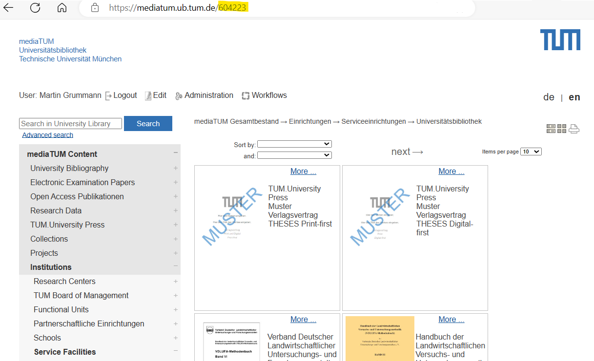
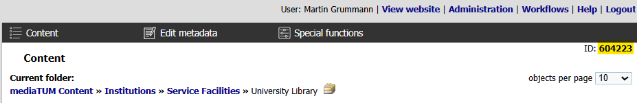
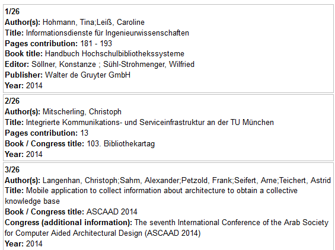

User Documentation
==================

The following sections describe functionalities of mediaTUM for which registration and login of the user is not necessary.

   

Navigation
----------

mediaTUM content is presented in a hierarchy of collections and directories. The navigation tree is located on the left-hand side of a page. 
It is hierarchically structured and provides an overview of all available content and enables the targeted call-up of individual collections. 

Some collections in mediaTUM have start pages. 
If a collection has a start page, you will first land on a start page. In order to reach the content of the collection, click subfolders on the left side. 
If a collection does not have a start page, you will see the listed content of all subdirectories. Click on a subdirectory to filter the display further. 
If you see a number next to the directory name in the navigation tree, it indicates the number of all documents in this directory. 
If you see fewer hits than the number describes, the directory contains documents that are not publicly available. 
In order to access all available documents in it, log in with an account that has appropriate permissions.

.. _Suche:

Search
------

There are two different types of search modalities in mediaTUM: general and advanced search. 
General search is possible throughout all mediaTUM collections. Advanced search must be specified by the owner of the collection. 

For general search, enter your search term in the input field on the top left of the page. 
When performing a search on mediaTUM start page, the entire mediaTUM content is searched. 
If you switch to a collection or a subdirectory, only their content will be searched. 
If an advanced search is available in the collection, follow the link "Advanced search". 
Here you can search specifically for content in individual fields. In addition to entering search terms, a selection from index lists is possible. 
The owner of the collection can determine which fields are searchable: see Setting up Search. :ref:`Suche Einrichten`.

Displaying content
------------------

.. _Default-Ansichten:

Customizing  view
^^^^^^^^^^^^^^^^^
After having carried out a search or clicking on a directory, multiple datasets may be seen on the screen. 
It is possible to customize the view of results presentation:  

* List view, text only: Compact display, as no thumbnails are shown
* List view with thumbnails: Compact display, requires some space as small thumbnails are visible.
* Thumbnail view: Similar to list view with thumbnails. But more compact, because several documents are in one line.
* Thumbnail view (large): Only thumbnails are displayed. Takes up the most space, as thumbnails are displayed larger than in other views. No metadata is displayed.

Full Display
^^^^^^^^^^^^

To see the entire content of a single item in the hitlist, click on it. The metadata of the document is displayed, which can also be exported into BibTeX format. 
If a full text is available, it can be accessed by clicking on the thumbnail.

Access to a full text can be managed via IP addresses (e.g. campus-wide) or user groups. A full text is not always available, e.g. for copyright reasons.

Permalinks
----------

A permalink - i.e. a permanent link - to a called dataset is obtained via the link "Permanent link for displayed object". 
The permalink with a scheme ``https://mediatum.ub.tum.de/<DocumentID>`` is displayed in the address line of the browser.

.. _Publikationsliste:

Publication lists
-----------------

Publication lists are lists that reflect the content in mediaTUM and can be used for representation of that content on the personal homepage. 
By using queries you can determine which content to show and how to show it in a publication list. 
Queries can output the content of collections, directories or specific areas. Read Chapter to learn how to determine a query. 
The only requirement is that datasets in mediaTUM must be publicly visible. Lists can be generated with JavaScript or the Typo3 plugin CurlContent.

JavaScript
^^^^^^^^^^^
With the JavaScript export you can create publication lists on your own homepage. 
The prerequisite is that JavaScript is allowed to be executed at the corresponding location.

**This is how you determine the ID of your directory:**

Call up a directory via the browser. 
The ID is in the address line of the browser. In the example below, the ID is 604223 (directory of the university library).

Alternatively, select your directory. Then find the ID in the Edit area.

A simple code example:

.. code:: javascript

    

    
    

Copy the text into an HTML page and replace the ID 615843 with the ID of the desired directory.

A publication list is then displayed on the web page:

Anpassungen der Publikationsliste
"""""""""""""""""""""""""""""""""

**mediatum_load**
With *mediatum_load* you can determine which content will be displayed in the publication list. 
The line *mediatum_load* is structured this way: 
*mediatum_load (id, limit, sort, query, format, language);*

Syntax: ``mediatum_load(id, limit,’ sort’, ‘query’, ‘format’, ‘language’);``

Commas separate the individual values from each other. Field definitions are described in the following table:

+----------------+----------------------------------------------------------------------------+
|id              |ID of the directory whose content is to be displayed                        |
+----------------+----------------------------------------------------------------------------+
|limit           |Limits the number of displayed documents;                                   |
|                |0 means that all documents are to be displayed                              |
+----------------+----------------------------------------------------------------------------+
|sort            |Sorts the hit list according to the content of a specific field.            |
|                |A minus sign in front of the field name reverses the order.                 |
|                |Example: year.                                                              |
|                |Descending sort: -year                                                      |
|                |Ascending sort: year                                                        |
+----------------+----------------------------------------------------------------------------+
|query           |Determines a search that restricts the search result                        |
|                |(e.g. an author name, so that the publication list                          |
|                |of the specified author will be displayed)                                  |
|                |e.g. year<=2013 or author-contrib=Meier                                     |
+----------------+----------------------------------------------------------------------------+
|format          |Remains empty                                                               |
+----------------+----------------------------------------------------------------------------+
|language        |Defines language (ge or en)                                                 |
+----------------+----------------------------------------------------------------------------+

**mediatum_config**

You can specify further settings with mediatum_config.
In the example above, mediatum_config is empty. This means basic settings will be implemented.

Determine the output format by using *output*. Choose *default* for a standard format. For the APA format, choose *apa*.

::

    'output': 'default'
    'output': 'apa'
	
#. Displaying field content
    You can determine which fields will be displayed. 
    You can also specify how to display the fields.

    .. code:: javascript

        
        
        

    Results:

    .. figure:: images/FelderAuswahl.png
        :alt: FelderAuswahl.png

    Specify the field display with *fields0*.
    After *att:* enter the field name of content that is to be displayed.
    HTML tags can be used to additionally mark up the content, e.g. <b></b> for bold formatting. 
    The general structure of fields is:

    .. code:: javascript

        'fields0':['<HTML-Tag>[att:Name des Feldes]</HTML-Tag>',
                   '<HTML-Tag>[att:Name des Feldes]</HTML-Tag>',
                   '<HTML-Tag>[att:Name des Feldes]</HTML-Tag>'
        ],

    Several publication lists can be displayed on a web page. 
    Define different displays with *fields0, fields1, fields2* etc. 
    *fields0* identifies the first list, fields1 the second list and so on. 
    To define displays, you need to know names of the fields in mediaTUM.

    .. note::

        Für Admins: field names depend on the :ref:`Sortieren`.

    If you want to include further fields in the publication list, the easiest way to identify these field names is to call up individual documents in XML format.
    You need to enter the ID of the document: 
    Example: ``https://mediatum.ub.tum.de/services/export/node/1225127`` 
    You will find the field names in each case behind the designation ``<attribute name=...``

#. Navigation elements

    A navigation and a search field can be integrated with the help of *type*.
    The subdirectories of the directory appear in the navigation. 
    With asc and desc they can be sorted alphabetically (forwards and backwards). 
    *search* integrates a search field.

    The general structure of type is:

    ``'type0':['struct','search','asc'],``

    Example:

    .. code:: javascript

        
        
        

    .. figure:: images/Navigationselemente.png
        :alt: Navigationselemente.png

    Field separator: by default, field contents are separated from each other by a line break.

#. Additional definitions

    .. code:: javascript

        
        
        

    Target: Internal: open in the same window / External: open in another window

    Style "1" (default): display hits with frames.

    .. figure:: images/MitRahmen.png
        :alt: MitRahmen.png

    Style "0": display hits without frames.

    .. figure:: images/OhneRahmen.png
         :alt: OhneRahmen.png

    - Output: desired format will be displayed: APA, BibTex, etc. It depends on which masks are available for the output.

    - Groupby: Freely selectable groupings can be set up, e.g. by year:

      - ``'groupby': 'year|substring:0,4',``

    - The predefined sorting of mediatum_load is of importance:

      - ``mediatum_load(615843, 0, 'year','', '', '');``

    - year: new publications at the top, year: oldest entries at the top and new publications at the bottom.

#. The following should be also considered:

    The JavaScript export provides CSS instructions.

    .. code:: css

        

    They can be overwritten with your own CSS instructions.

    Example:

    .. code:: css

        

    Please note that only publicly available entries/datasets are included in mediaTUM publication lists. 

Umlaut search
"""""""""""""

We recommend saving the HTML file with the *UTF-8 without BOM encoding*. You can then write terms with umlauts both with 'ü' (e. g. Müller) and with 'ue' (e.g. Mueller). Both spellings will be found.

Errors may occur in the umlaut search when using a different encoding.

In order to avoid this, specify in the file header: 

``<meta http-equiv="content-type" content="text/html; charset=utf-8">``

``<meta charset="utf-8">``

In the mediatum_load line, the query is specified as follows: 
``unescape(encodeURIComponent('Feldname=SuchbegriffMitUmlaut')),``

Example: ``mediatum_load(603843, 55, 'author.surname', unescape(encodeURIComponent('author.surname=Müller')), '', '');``

Curl Content
^^^^^^^^^^^^

https://www.typo3.tum.de/index.php?id=144

.. _Export von Trefferlisten:

Exporting hit lists 
-------------------

General Information
^^^^^^^^^^^^^^^^^^^
          
The export link is structured in the following way: 

``https://mediatum.ub.tum.de/services/export/node/ID/HIERARCHIE?format=FORMATANGABE``

- **ID:** D of the directory whose content will be exported. To identify the ID:
  with the help of navigation tree, go to the desired directory. Find the ID in the browser address field. For example:

  ``https://mediatum.ub.tum.de/604223``
      
- **Hierarchy:** What will be displayed?

    - No specification: the ID itself
    - parents: the parent element
    - children: direct child elements (without content of subfolders)
    - allchildren: all child elements (with content of subfolders)

- **Format specification:** data can be output in different formats. By default, XML is used. JSON, CSV and RSS can be chosen. 

| **Further options:**

- Restricting for file types is possible with:  ``type=[...]``

    - ``?type=directory``: lists only subfolders of an element 
    - ``?type=document``: lists only documents
    - ``?type=dt-buchbeitrag``: lists only book contributions; in this case a name of the metadata schema will be searched for

- Number of displayed elements can be specified with ``limit=[...]:`` 

    - ``?limit=5``: limit of 5 elements
    
- Restricting result of the search with ``q=[...]``

    - ``?q=regen``: the search item will be looked for in both metadata and full text 
    - ``?q=year=2016``: search item will be looked for in a metadata field (in this case: year
          Operators => (greater than or equal to) and <= (less than or equal to) can be used for numerical searches. The operators > and < cannot be implemented. 
          
- Search with regular expressions:   ``attrreg=[...]``, faster than search with ``q=[...]``

    - ``?attrreg=author-contrib=.*Lei[ß|s].*``: Search for Leiß or Leis in author field
    
- Sorting with ``sortfield=[...]``

    - ``?sortfield=-year``: descending sorting according to content of field "year"
    - ``?sortfield=year``: ascending sorting according to content of field "year"
    
- Output of content via specified export masks in field <mask> with ``mask=[...]``, name of the export mask is defined
    
    - ``mask=none``: no output
    - ``mask=default`` or ``mask=nodesmall``: short display (nodesmall)
    - ``mask=bibtex``: output in BibTeX -Format
    - ``mask=apa``: output in APA-format
    
- Specify displayed fields (for JSON format) with ``attrspec=[...]`` and ``attrlist=[...]``

    - ``attrspec=none``: display no fields 
    - ``attrspec=all``: display all fields (default)
    - ``attrspec=none&attrlist=year,author-contrib``: only display fields "year" and "author-contrib" 

**Further detailed information:**

-  List of publications with mediaTUM as a source:
   https://www.typo3.tum.de/index.php?id=144

   
Download as Excel File
^^^^^^^^^^^^^^^^^^^^^^

An export in Excel format can be reached via the link: 

``https://mediatum.ub.tum.de/services/export/node/<ID>/allchildren?format=csv&sep=;&delimiter=dquote&bom&mimetype=application/vnd.ms-excel``

In case of allchildren all child elements will be displayed (refer to Exporting hit lists). A restriction with search queries is possible. 
All fields of a specified result will be displayed. A restriction of columns is not possible.

Example of the search restriction:

``https://mediatum.ub.tum.de/services/export/node/1175037/allchildren?format=csv&sep=;&delimiter=dquote&bom&mimetype=application/vnd.ms-excel&sortfield=author&attrreg=author=.*sch.*&q=schema=dt-report``

BibTeX-Export
^^^^^^^^^^^^^

Export in BibTeX-Format
"""""""""""""""""""""""

Export for a BibTeX format has the following structure: 

``https://mediatum.ub.tum.de/services/export/node/ID/allchildren/?format=template_test&mask=bibtex&lang=de&template=$$[defaultexport]$$\n\n&mimetype=text/plain``

If necessary **ID** and **allchildren** can be changed. Refer to Exporting hit lists: :ref:`Export von Trefferlisten`

Print-Function
^^^^^^^^^^^^^^

The print function can be activated by clicking on the printer symbol in the upper right corner of the page. This function generates a list of all entries within a collection. The list is exported in a PDF format. 
